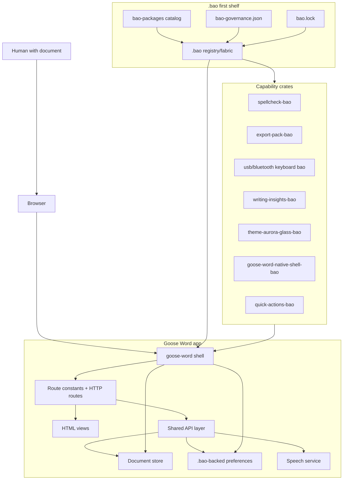
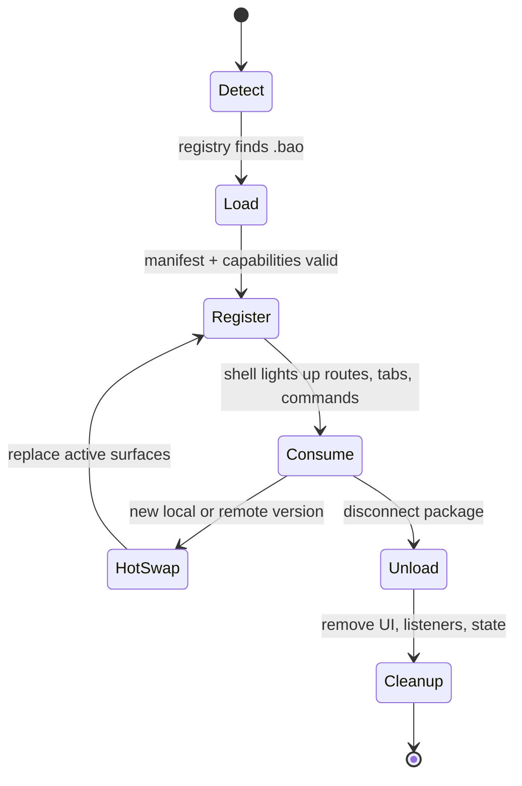
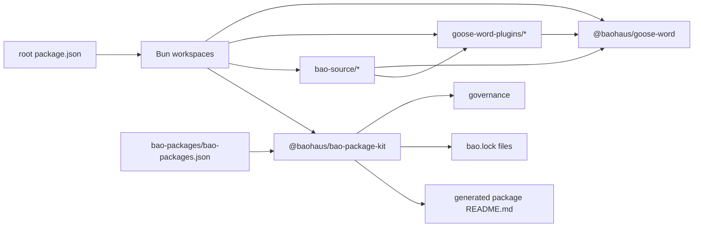
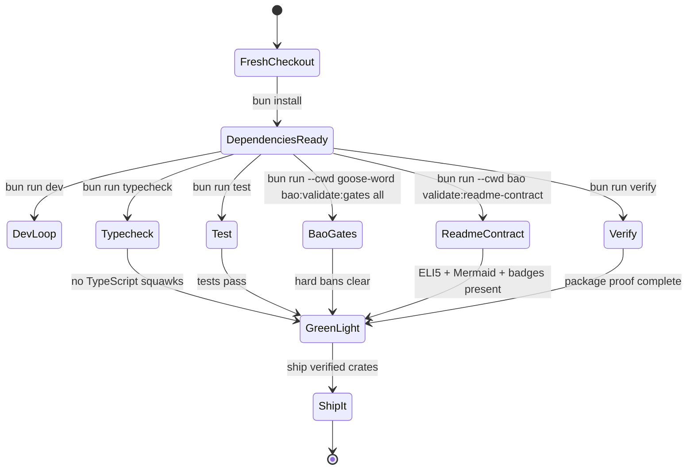

# Goose Word Bao

[](./bao)
[](https://bun.sh)
[](https://www.typescriptlang.org/)
[](https://elysiajs.com/)
[](https://mermaid.js.org/)
[](./bao)

## Explain Like I'm Five

Imagine a careful goose running a mailroom full of labeled bao crates.

Every document, plugin, mobile shell, theme, and shared helper travels in the right crate:

- **Goose Word** is the desk where people write, read, print, speak, and tidy documents.
- **`.bao` registry and fabric** are the shelf map that tells the goose which crates can load, unload, and hot-swap.
- **Baohaus packages and plugins** are reusable crates for UI, schemas, install handlers, native shells, keyboards, themes, and writing tools.

Goose Word Bao is the whole mailroom: the goose never guesses, never keeps duplicate crates, and always asks the `.bao` shelf first.

## What This Is

Goose Word Bao is a Bun and TypeScript workspace for a local-first document app plus its Baohaus `.bao` package ecosystem. The repo combines:

| Crate | What lives there | Goose job |
| --- | --- | --- |
| `goose-word/` | Main Elysia app, routes, document store, editor views, settings, speech, print flows | Serves documents through shared `.bao` contracts |
| `goose-word-plugins/` | Optional capabilities such as spellcheck, exports, keyboard input, themes, and insights | Adds focused capabilities through registry-aware packages |
| `bao/` | Package kit for build, validation, governance, manifests, gates, and README generation | Guards the shelf map and proof commands |
| `bao-source/` | Shared packages consumed by the app, plugins, native shell, and package kit | Holds reusable crates so logic stays DRY |
| `bao-packages/` | Catalog source for package cards and publication metadata | Keeps package identity coherent |

## Quick Start

```bash
bun install
bun run dev
```

Useful commands from the root:

```bash
bun run start
bun run lint
bun run lint:fix
bun run typecheck
bun run test
bun run verify
bun run bao:build
```

## `.bao` First Map



## Hot-Load Lifecycle



## Package Flight Pattern



## Validation Runway



## Repository Guide

| Path | Purpose |
| --- | --- |
| `package.json` | Root Bun workspace scripts and package wiring |
| `bun.lock` | Locked dependency graph for reproducible installs |
| `bao-packages/bao-packages.json` | Package catalog used by README cards and registry checks |
| `goose-word/src/http/` | Page and API routes |
| `goose-word/src/http/html/` | HTML views for editor, settings, print, docs list, and shell |
| `goose-word/src/services/` | Document storage, rendering, speech, and preferences |
| `goose-word/src/i18n/` | Runtime strings and catalog helpers |
| `goose-word/test/` | App-focused Bun tests |
| `goose-word-plugins/` | Installable app extensions |
| `bao/src/` | Bao package kit source |
| `bao-source/` | Shared Baohaus packages consumed by app and plugins |
| `bao-source/goose-word-native-shell-bao/` | iOS/Android native shell package |

## Goose Rules Of The Mailroom

- `.bao` loads first; registry/fabric owns package lifecycle.
- Reusable logic goes into `bao-source/` crates, not one-off app code.
- Plugins stay focused, capability-driven, and removable without stale UI.
- Tests, README contracts, and Bao gates run before release.
- No duplicate contracts, route drift, client fetch drift, or unsafe browser storage.

## Tiny Glossary

| Word | Meaning |
| --- | --- |
| Goose Word | The document app |
| `.bao` | Canonical package/archive source of truth |
| Registry/fabric | Loader that detects, registers, consumes, unloads, and hot-swaps `.bao` packages |
| Bao source | Shared local packages |
| Plugin | Focused capability crate loaded through the registry-aware path |
| Native shell | iOS/Android host for Goose Word |

## License

No license file is included yet. Add one before publishing this repository for public reuse.
