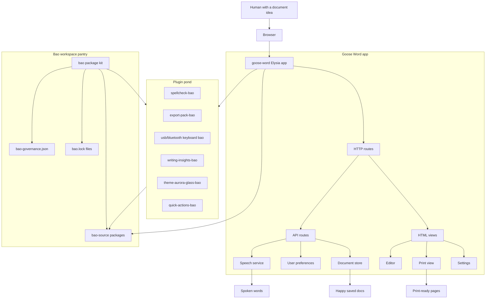
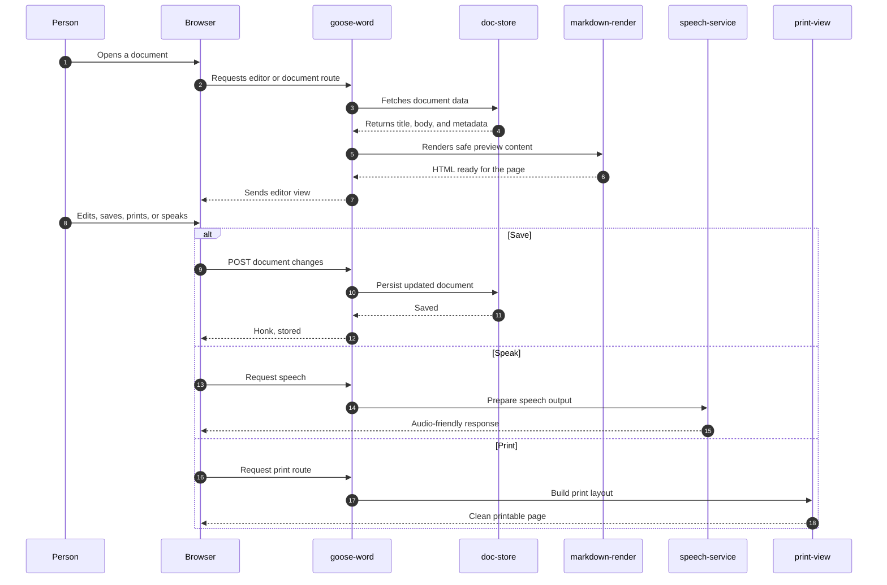
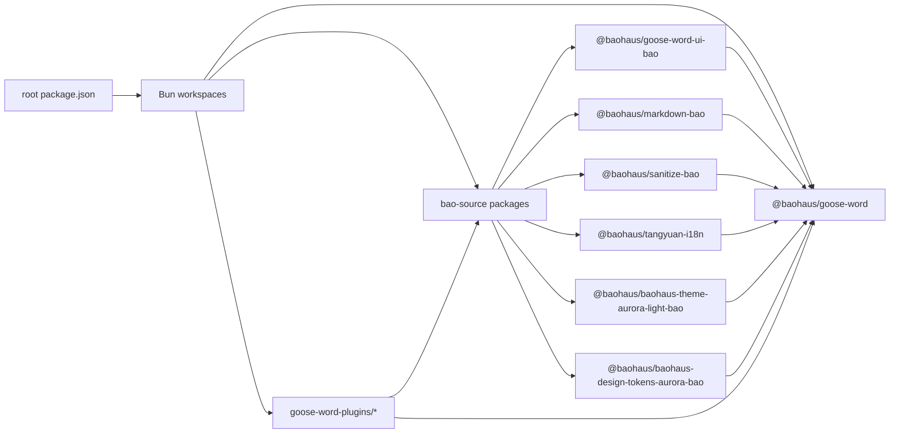
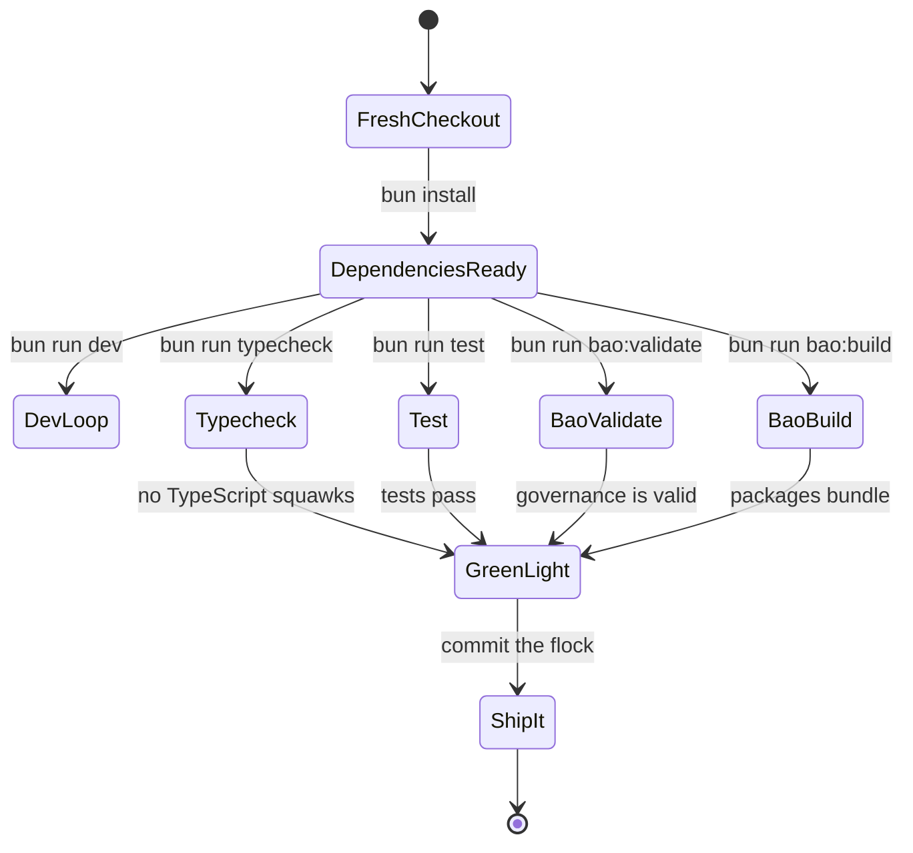

# DocDuckGoose

[](https://bun.sh)
[](https://www.typescriptlang.org/)
[](https://elysiajs.com/)
[](https://mermaid.js.org/)
[](https://github.com/d4551/docduckgoose)

## Explain Like I'm Five

Imagine a very silly goose in a tiny librarian hat.

Every time you give the goose a document, the goose waddles it to the right nest:

- The **Goose Word** nest lets people write, read, print, speak, and tidy documents.
- The **Bao** basket wraps up useful tools so the goose can carry them without dropping crumbs.
- The **plugin pond** lets extra helpers swim over, like spellcheck, export packs, keyboards, quick actions, themes, and writing insights.

So DocDuckGoose is a cozy document workshop where a goose says, "Honk, I know where that goes," and then organizes the whole flock.

## What This Is

DocDuckGoose is a Bun and TypeScript workspace for a local-first document app plus its Baohaus package ecosystem. The repo combines:

| Coop | What lives there | Goose job |
| --- | --- | --- |
| `goose-word/` | Main Elysia app, routes, document store, editor views, settings, speech, print flows | The goose that serves the documents |
| `goose-word-plugins/` | Optional capabilities such as spellcheck, exports, keyboard input, themes, and insights | The helpful geese wearing tool belts |
| `bao/` | Bao package kit for build, validation, governance, manifests, and README generation | The goose with the clipboard |
| `bao-source/` | Local workspace packages used by the app and package system | The pantry full of shared snacks |

## Quick Start

```bash
bun install
bun run dev
```

Useful commands from the root:

```bash
bun run start
bun run lint
bun run lint:fix
bun run typecheck
bun run test
bun run bao:validate
bun run bao:build
```

## The Big Goose Map



## Document Waddle



## Package Flight Pattern



## Validation Runway



## Repository Guide

| Path | Purpose |
| --- | --- |
| `package.json` | Root Bun workspace scripts and package wiring |
| `bun.lock` | Locked dependency graph for reproducible installs |
| `goose-word/src/http/` | Page and API routes |
| `goose-word/src/http/html/` | HTML views for editor, settings, print, docs list, and shell |
| `goose-word/src/services/` | Document storage, rendering, speech, and preferences |
| `goose-word/src/i18n/` | Runtime strings and catalog helpers |
| `goose-word/test/` | App-focused Bun tests |
| `goose-word-plugins/` | Installable app extensions |
| `bao/src/` | Bao package kit source |
| `bao-source/` | Shared Baohaus packages consumed by app and plugins |

## Goose Rules Of The Pond

- Keep the main app calm, readable, and document-first.
- Put reusable flock logic in `bao-source/` packages.
- Keep plugins small and purposeful so each goose knows its honk.
- Run tests and Bao validation before releasing anything from the nest.
- Prefer boring reliability over dramatic wing flapping.

## Tiny Glossary

| Word | Meaning |
| --- | --- |
| Goose Word | The document app |
| Bao | The package/governance wrapper system |
| Bao source | Shared local packages |
| Plugin | An optional helper that adds a focused capability |
| Honk | Technical term for "the system did the thing" |

## License

No license file is included yet. Add one before publishing this pond for public reuse.
