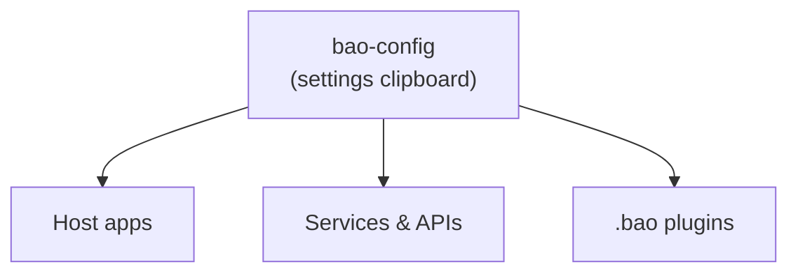

<!-- BEGIN BAOHAUS README HEADER -->
# @baohaus/bao-config

[](../../README.md)
[](https://bun.sh)
[](https://www.typescriptlang.org/)
[](./package.json)

## Explain Like I'm Five

This crate is the mailroom's settings clipboard. It tells every station what address to deliver to, which door to use, and how fast to go.

## Architecture



## Scope

| In scope | Dependencies | Out of scope |
| --- | --- | --- |
| Exported API: buildOriginFromParts, createRuntimeState, deepMerge, DEFAULT_API_BASE_PATH, mergeRuntimeState, … | @baohaus/bao-constants; @baohaus/bao-schemas; @baohaus/bao-types; @baohaus/bao-utils | Other .bao crate domains; bao-runtime host lifecycle |
<!-- END BAOHAUS README HEADER -->

<!-- BEGIN BAOHAUS PACKAGE CARD -->
# @baohaus/bao-config

Standalone package in the Baohaus monorepo.

Source at `bao-source/bao-config`.

## Public Pieces

`.`, `./bao-install-routes`, `./baodown-defaults`, `./baofire-defaults`, `./config-diff`, `./drone-training-defaults`, `./drone.defaults`, `./ecosystem-dev-defaults`, `./ecosystem-observability`, `./ecosystem-urls`, `./env`, `./env-boolean`, `./env-utils`, `./governance-overrides`, `./happydumpling-defaults`, `./help-center-content`, `./htmx-events`, `./htmx-routes`, `./local-federation-hmac`, `./local-service-token`, `./openapi`, `./package-descriptor`, `./robotics-training-defaults`, `./robotics.defaults`, `./service-ports`, `./setup-wizard-actions`

## Proof Commands

Run from `bao-source/bao-config`:

- `bun run typecheck`
- `bun run test`
- `bun run lint`
<!-- END BAOHAUS PACKAGE CARD -->

<!-- BEGIN BAOHAUS PACKAGE MANUAL -->
## Quick start

From `bao-source/bao-config`:

```bash
bun install
bun run typecheck
bun run test
bun run build
bun run lint
bun run bao:build
bun run bao:validate
bun run verify
```

## Capability

@baohaus/bao-config is a Baohaus .bao crate at `bao-source/bao-config`.

## Subpaths

| Subpath | Purpose |
| --- | --- |
| `.` | Main entry — typed surface from this .bao crate |
| `./baodown-defaults` | Baodown defaults — typed surface from this .bao crate |
| `./baofire-defaults` | Baofire defaults — typed surface from this .bao crate |
| `./drone-training-defaults` | Drone training defaults — typed surface from this .bao crate |
| `./drone.defaults` | Drone.defaults — typed surface from this .bao crate |
| `./ecosystem-dev-defaults` | Ecosystem dev defaults — typed surface from this .bao crate |
| `./ecosystem-observability` | Ecosystem observability — typed surface from this .bao crate |
| `./ecosystem-urls` | Ecosystem urls — typed surface from this .bao crate |
| `./env` | Env — typed surface from this .bao crate |
| `./env-boolean` | Env boolean — typed surface from this .bao crate |
| `./happydumpling-defaults` | Happydumpling defaults — typed surface from this .bao crate |
| `./help-center-content` | Help center content — typed surface from this .bao crate |
| _…_ | _7 more export(s) in package.json_ |

## Primary symbols

- `buildOriginFromParts`
- `createRuntimeState`
- `deepMerge`
- `DEFAULT_API_BASE_PATH`
- `mergeRuntimeState`
- `normalizeApiBasePath`
- `RuntimeBaseUrls`
- `RuntimeDatabaseSummary`
- `RuntimeEnvironment`
- `RuntimePorts`
- `RuntimeState`
- `RuntimeStateUpdate`

## Integration

Source: `bao-source/bao-config` (`src/index.ts`). Import published subpaths only; do not deep-link into `dist/`.

## Registry

Catalog id `bao-config` → OCI `baohaus/bao-config`.

## Reference

### Subpaths

| Subpath | Purpose |
| --- | --- |
| `.` | Main entry — typed surface from this .bao crate |
| `./baodown-defaults` | Baodown defaults — typed surface from this .bao crate |
| `./baofire-defaults` | Baofire defaults — typed surface from this .bao crate |
| `./drone-training-defaults` | Drone training defaults — typed surface from this .bao crate |
| `./drone.defaults` | Drone.defaults — typed surface from this .bao crate |
| `./ecosystem-dev-defaults` | Ecosystem dev defaults — typed surface from this .bao crate |
| `./ecosystem-observability` | Ecosystem observability — typed surface from this .bao crate |
| `./ecosystem-urls` | Ecosystem urls — typed surface from this .bao crate |
| `./env` | Env — typed surface from this .bao crate |
| `./env-boolean` | Env boolean — typed surface from this .bao crate |
| `./happydumpling-defaults` | Happydumpling defaults — typed surface from this .bao crate |
| `./help-center-content` | Help center content — typed surface from this .bao crate |
| _…_ | _7 more in `package.json#exports`_ |

### Symbols

- `buildOriginFromParts`
- `createRuntimeState`
- `deepMerge`
- `DEFAULT_API_BASE_PATH`
- `mergeRuntimeState`
- `normalizeApiBasePath`
- `RuntimeBaseUrls`
- `RuntimeDatabaseSummary`
- `RuntimeEnvironment`
- `RuntimePorts`
- `RuntimeState`
- `RuntimeStateUpdate`
<!-- END BAOHAUS PACKAGE MANUAL -->
