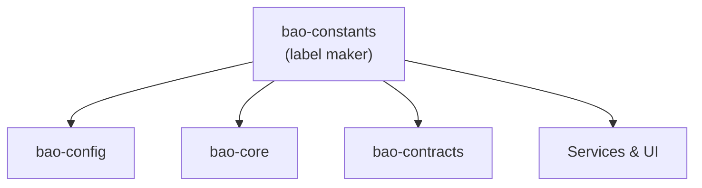

<!-- BEGIN BAOHAUS README HEADER -->
# @baohaus/bao-constants

[](../../README.md)
[](https://bun.sh)
[](https://www.typescriptlang.org/)
[](./package.json)

## Explain Like I'm Five

This crate is the mailroom's label maker. Every shared name, path, and number is printed here once so no crate writes its own crooked label.

## Architecture



## Scope

| In scope | Dependencies | Out of scope |
| --- | --- | --- |
| Shared constants for . | @baohaus/bao-schemas | Other .bao crate domains; bao-runtime host lifecycle |
<!-- END BAOHAUS README HEADER -->

<!-- BEGIN BAOHAUS PACKAGE CARD -->
# @baohaus/bao-constants

Shared constants for .bao packages — API paths, timeouts, HTTP status, time units, and more

Source at `bao-source/bao-constants`.

## Public Pieces

`./agent-artifact-owner-surfaces`, `./ai-provider-paths`, `./alignment`, `./api-explorer`, `./api-paths`, `./auth-error-codes`, `./auth-routes`, `./bao-chat-bubble-i18n`, `./bao-control-plane-bootstrap-components`, `./bao-control-plane-defaults`, `./bao-control-plane-gate-env`, `./bao-control-plane-secrets`, `./bao-control-plane-status`, `./bao-manifest-policies`, `./bao-plugin-groups`, `./bao-plugin-groups.generated`, `./bao-runtime`, `./bao-runtime-limits`, `./baodown-connection-validation`, `./browser-smoke`, `./build-paths`, `./cache`, `./capability-domain-map`, `./capability-integration`, `./capability-matrix-paths`, `./capability-ownership`, `./client-telemetry`, `./container-runtime`, `./database-defaults`, `./drone`, `./ecosystem-lexicon`, `./error-codes`, `./error-taxonomy`, `./external-endpoints`, `./htmx-error-boundary`, `./http-status`, `./imager-config`, `./infrastructure-api-paths`, `./layout`, `./loopback-hosts`, `./metrics-annotations`, `./mime-types`, `./network`, `./pagination`, `./pipeline-constraints`, `./pipeline-inputs`, `./pipeline-resources`, `./plugin-contract`, `./realtime-topics`, `./resource-labels`, `./retries`, `./rpa-defaults`, `./scanner-bunbuddy`, `./status-core`, `./status-unified`, `./streaming`, `./system-health`, `./time`, `./timeouts`, `./ui-error-classification`, `./websocket`, `./xr-experience`, `./xr-experience.options`, `./xr-share`

## Proof Commands

Run from `bao-source/bao-constants`:

- `bun run typecheck`
- `bun run test`
- `bun run lint`
<!-- END BAOHAUS PACKAGE CARD -->

<!-- BEGIN BAOHAUS PACKAGE MANUAL -->
## Quick start

From `bao-source/bao-constants`:

```bash
bun install
bun run typecheck
bun run test
bun run build
bun run lint
bun run bao:build
bun run bao:validate
bun run verify
```

## Capability

Shared constants for .bao packages — API paths, timeouts, HTTP status, time units, and more

## Subpaths

| Subpath | Purpose |
| --- | --- |
| `./agent-artifact-owner-surfaces` | Agent artifact owner surfaces — typed surface from this .bao crate |
| `./ai-provider-paths` | Ai provider paths — typed surface from this .bao crate |
| `./alignment` | Alignment — typed surface from this .bao crate |
| `./api-explorer` | Api explorer — typed surface from this .bao crate |
| `./api-paths` | Api paths — typed surface from this .bao crate |
| `./auth-error-codes` | Auth error codes — auth/session contracts |
| `./auth-routes` | Auth routes — auth/session contracts |
| `./bao-chat-bubble-i18n` | Bao chat bubble i18n — typed surface from this .bao crate |
| `./bao-control-plane-bootstrap-components` | Bao control plane bootstrap components — typed surface from this .bao crate |
| `./bao-control-plane-defaults` | Bao control plane defaults — typed surface from this .bao crate |
| `./bao-control-plane-gate-env` | Bao control plane gate env — typed surface from this .bao crate |
| `./bao-control-plane-secrets` | Bao control plane secrets — typed surface from this .bao crate |
| _…_ | _51 more export(s) in package.json_ |

## Integration

Source: `bao-source/bao-constants`. Import published subpaths only; do not deep-link into `dist/`.

## Registry

Catalog id `bao-constants` → OCI `baohaus/bao-constants`.

## Reference

### Subpaths

| Subpath | Purpose |
| --- | --- |
| `./agent-artifact-owner-surfaces` | Agent artifact owner surfaces — typed surface from this .bao crate |
| `./ai-provider-paths` | Ai provider paths — typed surface from this .bao crate |
| `./alignment` | Alignment — typed surface from this .bao crate |
| `./api-explorer` | Api explorer — typed surface from this .bao crate |
| `./api-paths` | Api paths — typed surface from this .bao crate |
| `./auth-error-codes` | Auth error codes — auth/session contracts |
| `./auth-routes` | Auth routes — auth/session contracts |
| `./bao-chat-bubble-i18n` | Bao chat bubble i18n — typed surface from this .bao crate |
| `./bao-control-plane-bootstrap-components` | Bao control plane bootstrap components — typed surface from this .bao crate |
| `./bao-control-plane-defaults` | Bao control plane defaults — typed surface from this .bao crate |
| `./bao-control-plane-gate-env` | Bao control plane gate env — typed surface from this .bao crate |
| `./bao-control-plane-secrets` | Bao control plane secrets — typed surface from this .bao crate |
| _…_ | _51 more in `package.json#exports`_ |
<!-- END BAOHAUS PACKAGE MANUAL -->
