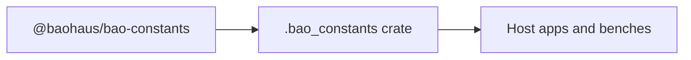

<!-- BEGIN BAOHAUS README HEADER -->
# @baohaus/bao-constants

## Explain Like I'm Five

Shared constants for .bao packages — API paths, timeouts, HTTP status, time units, and more Import subpaths like `./agent-artifact-owner-surfaces`, `./ai-provider-paths`, `./alignment`, `./api-explorer` when you wire this crate in.

## Architecture



## Scope

| In scope | Dependencies | Out of scope |
| --- | --- | --- |
| Shared constants for . | @baohaus/bao-schemas | Other workbench domains; bao-runtime host lifecycle |
<!-- END BAOHAUS README HEADER -->

<!-- BEGIN BAOHAUS PACKAGE CARD -->
# @baohaus/bao-constants

Standalone Baohaus package. Catalog identity `bao-constants`. Source at `bao-source/bao-constants`. Publishes to `baohaus/bao-constants`. Canonical archive: `bao-source/bao-constants/dist/bao/bao-constants.bao`.

Cross-app contract and the full principles list live at the repo-root [README](../../README.md#principles).

## Package Facts

| Field | Value |
| --- | --- |
| Package | `@baohaus/bao-constants` |
| Catalog id | `bao-constants` |
| Source path | `bao-source/bao-constants` |
| OCI repository | `baohaus/bao-constants` |
| Channel | `public` |
| Visibility | `public` |
| Kind | `library` |
| Runtime installable | `yes` |
| Publish gate | `standard` |

## Public Pieces

`./agent-artifact-owner-surfaces`, `./ai-provider-paths`, `./alignment`, `./api-explorer`, `./api-paths`, `./auth-error-codes`, `./auth-routes`, `./bao-chat-bubble-i18n`, `./bao-control-plane-bootstrap-components`, `./bao-control-plane-defaults`, `./bao-control-plane-gate-env`, `./bao-control-plane-secrets`, `./bao-control-plane-status`, `./bao-manifest-policies`, `./bao-plugin-groups`, `./bao-plugin-groups.generated`, `./bao-runtime`, `./bao-runtime-limits`, plus 45 more.

## Proof Commands

Run from `bao-source/bao-constants`:

- `bun run build`
- `bun run typecheck`
- `bun run test`
- `bun run lint`
- `bun run bao:build`
- `bun run bao:validate`
- `bun run verify`

## Publishing Path

`@baohaus/bao-constants` publishes to `baohaus/bao-constants` through the canonical `.bao` registry distribution path. Local overrides are development-only; installable content resolves through the registry and the checked catalog/governance/lock path.
<!-- END BAOHAUS PACKAGE CARD -->

<!-- BEGIN BAOHAUS PACKAGE MANUAL -->
## Quick start

From `bao-source/bao-constants`:

```bash
bun install
bun run typecheck
bun run test
bun run build
bun run lint
bun run bao:build
bun run bao:validate
bun run verify
```

## Capability

Shared constants for .bao packages — API paths, timeouts, HTTP status, time units, and more

## Subpaths

| Subpath | Purpose |
| --- | --- |
| `./agent-artifact-owner-surfaces` | Agent artifact owner surfaces — typed surface from this workbench |
| `./ai-provider-paths` | Ai provider paths — typed surface from this workbench |
| `./alignment` | Alignment — typed surface from this workbench |
| `./api-explorer` | Api explorer — typed surface from this workbench |
| `./api-paths` | Api paths — typed surface from this workbench |
| `./auth-error-codes` | Auth error codes — auth/session contracts |
| `./auth-routes` | Auth routes — auth/session contracts |
| `./bao-chat-bubble-i18n` | Bao chat bubble i18n — typed surface from this workbench |
| `./bao-control-plane-bootstrap-components` | Bao control plane bootstrap components — typed surface from this workbench |
| `./bao-control-plane-defaults` | Bao control plane defaults — typed surface from this workbench |
| `./bao-control-plane-gate-env` | Bao control plane gate env — typed surface from this workbench |
| `./bao-control-plane-secrets` | Bao control plane secrets — typed surface from this workbench |
| _…_ | _51 more export(s) in package.json_ |

## Integration

Source: `bao-source/bao-constants`. Import published subpaths only; do not deep-link into `dist/`.

## Registry

Catalog id `bao-constants` → OCI `baohaus/bao-constants`.

## Reference

### Subpaths

| Subpath | Purpose |
| --- | --- |
| `./agent-artifact-owner-surfaces` | Agent artifact owner surfaces — typed surface from this workbench |
| `./ai-provider-paths` | Ai provider paths — typed surface from this workbench |
| `./alignment` | Alignment — typed surface from this workbench |
| `./api-explorer` | Api explorer — typed surface from this workbench |
| `./api-paths` | Api paths — typed surface from this workbench |
| `./auth-error-codes` | Auth error codes — auth/session contracts |
| `./auth-routes` | Auth routes — auth/session contracts |
| `./bao-chat-bubble-i18n` | Bao chat bubble i18n — typed surface from this workbench |
| `./bao-control-plane-bootstrap-components` | Bao control plane bootstrap components — typed surface from this workbench |
| `./bao-control-plane-defaults` | Bao control plane defaults — typed surface from this workbench |
| `./bao-control-plane-gate-env` | Bao control plane gate env — typed surface from this workbench |
| `./bao-control-plane-secrets` | Bao control plane secrets — typed surface from this workbench |
| _…_ | _51 more in `package.json#exports`_ |
<!-- END BAOHAUS PACKAGE MANUAL -->
