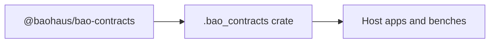

<!-- BEGIN BAOHAUS README HEADER -->
# @baohaus/bao-contracts

## Explain Like I'm Five

bao-contracts: This workbench is the shared vocabulary book. Routes, envelopes, and capability names are written once here so every app speaks the same factory language.

## Architecture



## Scope

| In scope | Dependencies | Out of scope |
| --- | --- | --- |
| Cross-service contracts; Shared route and schema identifiers | bao-schemas where typed | Runtime servers; UI templates |
<!-- END BAOHAUS README HEADER -->

<!-- BEGIN BAOHAUS PACKAGE CARD -->
# @baohaus/bao-contracts

Standalone Baohaus package. Catalog identity `bao-contracts`. Source at `bao-source/bao-contracts`. Publishes to `baohaus/bao-contracts`. Canonical archive: `bao-source/bao-contracts/dist/bao/bao-contracts.bao`.

Cross-app contract and the full principles list live at the repo-root [README](../../README.md#principles).

## Package Facts

| Field | Value |
| --- | --- |
| Package | `@baohaus/bao-contracts` |
| Catalog id | `bao-contracts` |
| Source path | `bao-source/bao-contracts` |
| OCI repository | `baohaus/bao-contracts` |
| Channel | `public` |
| Visibility | `public` |
| Kind | `library` |
| Runtime installable | `yes` |
| Publish gate | `standard` |

## Public Pieces

`.`, `./ai-bun.contract`, `./bao/bao-archive.contract`, `./bunbuddy-routing-contracts`, `./contract-catalog`, `./snapshots/schema-snapshot`, `./snapshots/v1.contracts`, `./validation`, `./versions/v1/ai-device-assist-config.contract`, `./versions/v1/ai-device-assist.contract`, `./versions/v1/ai-service-alignment.contract`, `./versions/v1/ai-text.contract`, `./versions/v1/annotation-alignment.contract`, `./versions/v1/annotation-auto-ingest.contract`, `./versions/v1/autonomy-integration.contract`, `./versions/v1/bao-install.contract`, `./versions/v1/bao-observability.contract`, `./versions/v1/bao-runtime.contract`, plus 65 more.

## Proof Commands

Run from `bao-source/bao-contracts`:

- `bun run build`
- `bun run typecheck`
- `bun run test`
- `bun run lint`
- `bun run bao:build`
- `bun run bao:validate`
- `bun run verify`

## Publishing Path

`@baohaus/bao-contracts` publishes to `baohaus/bao-contracts` through the canonical `.bao` registry distribution path. Local overrides are development-only; installable content resolves through the registry and the checked catalog/governance/lock path.
<!-- END BAOHAUS PACKAGE CARD -->

<!-- BEGIN BAOHAUS PACKAGE MANUAL -->
## Quick start

From `bao-source/bao-contracts`:

```bash
bun install
bun run typecheck
bun run test
bun run build
bun run lint
bun run bao:build
bun run bao:validate
bun run verify
```

## Capability

@baohaus/bao-contracts is a Baohaus workbench package at `bao-source/bao-contracts`.

## Subpaths

| Subpath | Purpose |
| --- | --- |
| `.` | Main entry — typed surface from this workbench |
| `./ai-bun.contract` | Ai bun.contract — typed surface from this workbench |
| `./bao/bao-archive.contract` | Bao/bao archive.contract — typed surface from this workbench |
| `./bunbuddy-routing-contracts` | Bunbuddy routing contracts — typed surface from this workbench |
| `./contract-catalog` | Contract catalog — typed surface from this workbench |
| `./snapshots/schema-snapshot` | Snapshots/schema snapshot — shared schemas |
| `./snapshots/v1.contracts` | Snapshots/v1.contracts — typed surface from this workbench |
| `./validation` | Validation — typed surface from this workbench |
| `./versions/v1/ai-device-assist-config.contract` | Versions/v1/ai device assist config.contract — typed surface from this workbench |
| `./versions/v1/ai-device-assist.contract` | Versions/v1/ai device assist.contract — typed surface from this workbench |
| `./versions/v1/ai-service-alignment.contract` | Versions/v1/ai service alignment.contract — typed surface from this workbench |
| `./versions/v1/ai-text.contract` | Versions/v1/ai text.contract — typed surface from this workbench |
| _…_ | _71 more export(s) in package.json_ |

## Integration

Source: `bao-source/bao-contracts`. Import published subpaths only; do not deep-link into `dist/`.

## Registry

Catalog id `bao-contracts` → OCI `baohaus/bao-contracts`.

## Reference

### Subpaths

| Subpath | Purpose |
| --- | --- |
| `.` | Main entry — typed surface from this workbench |
| `./ai-bun.contract` | Ai bun.contract — typed surface from this workbench |
| `./bao/bao-archive.contract` | Bao/bao archive.contract — typed surface from this workbench |
| `./bunbuddy-routing-contracts` | Bunbuddy routing contracts — typed surface from this workbench |
| `./contract-catalog` | Contract catalog — typed surface from this workbench |
| `./snapshots/schema-snapshot` | Snapshots/schema snapshot — shared schemas |
| `./snapshots/v1.contracts` | Snapshots/v1.contracts — typed surface from this workbench |
| `./validation` | Validation — typed surface from this workbench |
| `./versions/v1/ai-device-assist-config.contract` | Versions/v1/ai device assist config.contract — typed surface from this workbench |
| `./versions/v1/ai-device-assist.contract` | Versions/v1/ai device assist.contract — typed surface from this workbench |
| `./versions/v1/ai-service-alignment.contract` | Versions/v1/ai service alignment.contract — typed surface from this workbench |
| `./versions/v1/ai-text.contract` | Versions/v1/ai text.contract — typed surface from this workbench |
| _…_ | _71 more in `package.json#exports`_ |
<!-- END BAOHAUS PACKAGE MANUAL -->
