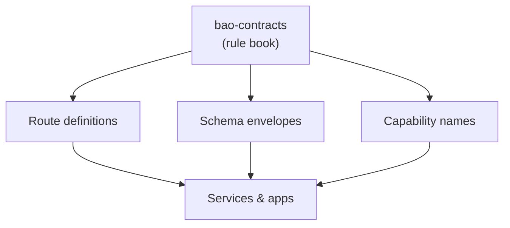

<!-- BEGIN BAOHAUS README HEADER -->
# @baohaus/bao-contracts

[](../../README.md)
[](https://bun.sh)
[](https://www.typescriptlang.org/)
[](./package.json)

## Explain Like I'm Five

This crate is the mailroom's rule book. Routes, envelopes, and capability names are written once here so every crate speaks the same language.

## Architecture



## Scope

| In scope | Dependencies | Out of scope |
| --- | --- | --- |
| Cross-service contracts; Shared route and schema identifiers | bao-schemas where typed | Runtime servers; UI templates |
<!-- END BAOHAUS README HEADER -->

<!-- BEGIN BAOHAUS PACKAGE CARD -->
# @baohaus/bao-contracts

Standalone package in the Baohaus monorepo.

Source at `bao-source/bao-contracts`.

## Public Pieces

`.`, `./ai-bun.contract`, `./bao/bao-archive.contract`, `./bunbuddy-contracts`, `./bunbuddy-routing-contracts`, `./contract-catalog`, `./contracts/bunbuddy-contracts.embed`, `./contracts/bunbuddy-workloads.embed`, `./snapshots/schema-snapshot`, `./snapshots/v1.contracts`, `./validation`, `./versions/v1/ai-device-assist-config.contract`, `./versions/v1/ai-device-assist.contract`, `./versions/v1/ai-service-alignment.contract`, `./versions/v1/ai-text.contract`, `./versions/v1/annotation-alignment.contract`, `./versions/v1/annotation-auto-ingest.contract`, `./versions/v1/autonomy-integration.contract`, `./versions/v1/bao-install.contract`, `./versions/v1/bao-observability.contract`, `./versions/v1/bao-runtime.contract`, `./versions/v1/baodown-integration.contract`, `./versions/v1/baodown-mcp.contract`, `./versions/v1/baodown/definitions`, `./versions/v1/baodown/integration`, `./versions/v1/baodown/runs`, `./versions/v1/baodown/schedules`, `./versions/v1/baodown/shared`, `./versions/v1/baodown/triggers`, `./versions/v1/baodown/versions`, `./versions/v1/baodown/webhooks`, `./versions/v1/bunbuddy-capabilities.contract`, `./versions/v1/bunbuddy-devices.contract`, `./versions/v1/bunbuddy-health.contract`, `./versions/v1/bunbuddy-routing.contract`, `./versions/v1/calibration.contract`, `./versions/v1/capability-domain-map.contract`, `./versions/v1/capability-impact.contract`, `./versions/v1/capability-ownership.contract`, `./versions/v1/capability-registry-list.contract`, `./versions/v1/capability/core`, `./versions/v1/capability/registry`, `./versions/v1/capability/routes-ai-chat`, `./versions/v1/capability/routes-hardware`, `./versions/v1/capability/routes-pipelines`, `./versions/v1/capability/routes-services`, `./versions/v1/chat-run.contract`, `./versions/v1/chat-tools.contract`, `./versions/v1/device-inventory-refresh.contract`, `./versions/v1/driver-registry.contract`, `./versions/v1/drone-capability.contract`, `./versions/v1/drone-commands.contract`, `./versions/v1/drone-history.contract`, `./versions/v1/drone-mission-planner.contract`, `./versions/v1/drone-realtime.contract`, `./versions/v1/drone-summary.contract`, `./versions/v1/drone-training-integration.contract`, `./versions/v1/error-envelope.contract`, `./versions/v1/fleet.contract`, `./versions/v1/hardware-integration.contract`, `./versions/v1/hardware-summary.contract`, `./versions/v1/imager-status.contract`, `./versions/v1/library-registry.contract`, `./versions/v1/library-route-hints`, `./versions/v1/mcp.contract`, `./versions/v1/network-discovery.contract`, `./versions/v1/rag.contract`, `./versions/v1/reports.contract`, `./versions/v1/robotics-capability.contract`, `./versions/v1/robotics-commands.contract`, `./versions/v1/robotics-devices.contract`, `./versions/v1/robotics-localization.contract`, `./versions/v1/robotics-mission.contract`, `./versions/v1/robotics-motion.contract`, `./versions/v1/robotics-policy.contract`, `./versions/v1/robotics-summary.contract`, `./versions/v1/robotics-telemetry.contract`, `./versions/v1/robotics-training-integration.contract`, `./versions/v1/rpa-training.contract`, `./versions/v1/setup-wizard.contract`, `./versions/v1/training-jobs.contract`, `./versions/v1/usd-annotations.contract`, `./versions/v1/usd-assets.contract`, `./versions/v1/user-self-service.contract`, `./versions/v1/users.contract`, `./versions/v1/xr.contract`

## Proof Commands

Run from `bao-source/bao-contracts`:

- `bun run typecheck`
- `bun run test`
- `bun run lint`
<!-- END BAOHAUS PACKAGE CARD -->

<!-- BEGIN BAOHAUS PACKAGE MANUAL -->
## Quick start

From `bao-source/bao-contracts`:

```bash
bun install
bun run typecheck
bun run test
bun run build
bun run lint
bun run bao:build
bun run bao:validate
bun run verify
```

## Capability

@baohaus/bao-contracts is a Baohaus .bao crate at `bao-source/bao-contracts`.

## Subpaths

| Subpath | Purpose |
| --- | --- |
| `.` | Main entry — typed surface from this .bao crate |
| `./ai-bun.contract` | Ai bun.contract — typed surface from this .bao crate |
| `./bao/bao-archive.contract` | Bao/bao archive.contract — typed surface from this .bao crate |
| `./bunbuddy-routing-contracts` | Bunbuddy routing contracts — typed surface from this .bao crate |
| `./contract-catalog` | Contract catalog — typed surface from this .bao crate |
| `./snapshots/schema-snapshot` | Snapshots/schema snapshot — shared schemas |
| `./snapshots/v1.contracts` | Snapshots/v1.contracts — typed surface from this .bao crate |
| `./validation` | Validation — typed surface from this .bao crate |
| `./versions/v1/ai-device-assist-config.contract` | Versions/v1/ai device assist config.contract — typed surface from this .bao crate |
| `./versions/v1/ai-device-assist.contract` | Versions/v1/ai device assist.contract — typed surface from this .bao crate |
| `./versions/v1/ai-service-alignment.contract` | Versions/v1/ai service alignment.contract — typed surface from this .bao crate |
| `./versions/v1/ai-text.contract` | Versions/v1/ai text.contract — typed surface from this .bao crate |
| _…_ | _71 more export(s) in package.json_ |

## Integration

Source: `bao-source/bao-contracts`. Import published subpaths only; do not deep-link into `dist/`.

## Registry

Catalog id `bao-contracts` → OCI `baohaus/bao-contracts`.

## Reference

### Subpaths

| Subpath | Purpose |
| --- | --- |
| `.` | Main entry — typed surface from this .bao crate |
| `./ai-bun.contract` | Ai bun.contract — typed surface from this .bao crate |
| `./bao/bao-archive.contract` | Bao/bao archive.contract — typed surface from this .bao crate |
| `./bunbuddy-routing-contracts` | Bunbuddy routing contracts — typed surface from this .bao crate |
| `./contract-catalog` | Contract catalog — typed surface from this .bao crate |
| `./snapshots/schema-snapshot` | Snapshots/schema snapshot — shared schemas |
| `./snapshots/v1.contracts` | Snapshots/v1.contracts — typed surface from this .bao crate |
| `./validation` | Validation — typed surface from this .bao crate |
| `./versions/v1/ai-device-assist-config.contract` | Versions/v1/ai device assist config.contract — typed surface from this .bao crate |
| `./versions/v1/ai-device-assist.contract` | Versions/v1/ai device assist.contract — typed surface from this .bao crate |
| `./versions/v1/ai-service-alignment.contract` | Versions/v1/ai service alignment.contract — typed surface from this .bao crate |
| `./versions/v1/ai-text.contract` | Versions/v1/ai text.contract — typed surface from this .bao crate |
| _…_ | _71 more in `package.json#exports`_ |
<!-- END BAOHAUS PACKAGE MANUAL -->
