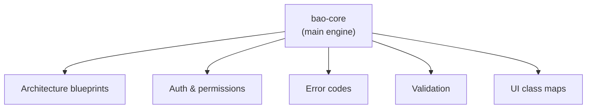

<!-- BEGIN BAOHAUS README HEADER -->
# @baohaus/bao-core

[](../../README.md)
[](https://bun.sh)
[](https://www.typescriptlang.org/)
[](./package.json)

## Explain Like I'm Five

This crate is the mailroom's main engine. Architecture blueprints, error codes, auth rules, validation, and UI class maps all live in this one big filing cabinet.

## Architecture



## Scope

| In scope | Dependencies | Out of scope |
| --- | --- | --- |
| Public contract for `@baohaus/bao-core` | @baohaus/bao-config; @baohaus/bao-constants; @baohaus/bao-contracts; @baohaus/bao-schemas; @baohaus/bao-spec; @baohaus/bao-types | Other .bao crate domains; bao-runtime host lifecycle |
<!-- END BAOHAUS README HEADER -->

<!-- BEGIN BAOHAUS PACKAGE CARD -->
# @baohaus/bao-core

Standalone package in the Baohaus monorepo.

Source at `bao-source/bao-core`.

## Public Pieces

`.`, `./architecture/bunbuddy-contract-integration`, `./architecture/capability-registry`, `./architecture/domain-module.contract`, `./architecture/domain-service-definitions`, `./architecture/graph-violation`, `./architecture/module-contract-registry`, `./architecture/module-host`, `./auth/drone-permissions`, `./auth/error-codes`, `./auth/error-messages`, `./auth/permissions`, `./auth/session`, `./bao-composer/addons/secure-mcp-provider`, `./bao-composer/bao-composer-api-contracts`, `./bao-composer/bao-composer-builder`, `./bao-composer/bao-composer-context`, `./bao-composer/bao-composer-drafts-messages`, `./bao-composer/bao-composer-fragments-catalog`, `./bao-composer/bao-composer-identity`, `./bao-composer/bao-composer-improvement`, `./bao-composer/bao-composer-preview-execution`, `./bao-composer/bao-composer-registry`, `./bao-composer/bao-composer-request`, `./bao-composer/bao-composer-standalone-profile`, `./bao-composer/composer/catalog`, `./bao-composer/composer/compose`, `./bao-composer/composer/constants`, `./bao-composer/composer/output-policy`, `./bao-composer/composer/recipes`, `./bao-composer/composer/state`, `./bao-composer/composer/types`, `./bao-composer/composer/utils`, `./bao-composer/composer/validate-relations`, `./bao-composer/composer/warnings`, `./bao-composer/examples/better-auth-extension`, `./bao-composer/examples/elysia-plugin`, `./bao-composer/examples/htmx-extension`, `./bao-composer/examples/prisma-extension`, `./bao-composer/examples/secure-mcp-provider`, `./bao-control-plane-build-policy.types`, `./bao-control-plane-image-specs`, `./bao-control-plane/component-inventory.reader`, `./bao-control-plane/provider-state-parser`, `./bao-control-plane/provider-state.types`, `./bao-control-plane/remote-build-session-projection`, `./bao-control-plane/remote-build-session-summary.reader`, `./bao/bao-archive.contract`, `./baodown/baodown-graph-contract`, `./baodown/native-editor`, `./errors`, `./errors/api-error-codes`, `./errors/bunbuddy-error-codes`, `./errors/error-codes`, `./errors/error-taxonomy`, `./errors/index`, `./errors/ui-error-classification`, `./flatbuffers/compile-schema`, `./generated/flatbuffers/baohaus/ai/chat/v1`, `./generated/flatbuffers/baohaus/ai/chat/v1/ai-chat-stream-batch-v1`, `./generated/flatbuffers/baohaus/ai/chat/v1/ai-chat-stream-event-v1`, `./generated/flatbuffers/baohaus/ai/chat/v1/ai-provider-v1`, `./generated/flatbuffers/baohaus/ai/chat/v1/citation-v1`, `./generated/flatbuffers/baohaus/ai/chat/v1/finish-reason-v1`, `./generated/flatbuffers/baohaus/ai/chat/v1/stream-event-v1`, `./generated/flatbuffers/baohaus/ai/chat/v1/tool-call-v1`, `./generated/flatbuffers/baohaus/ai/chat/v1/usage-stats-v1`, `./generated/flatbuffers/baohaus/baodown/v1`, `./generated/flatbuffers/baohaus/baodown/v1/bao-down-payload-union`, `./generated/flatbuffers/baohaus/baodown/v1/bao-down-run-event-kind-v1`, `./generated/flatbuffers/baohaus/baodown/v1/bao-down-run-event-v1`, `./generated/flatbuffers/baohaus/baodown/v1/log-payload`, `./generated/flatbuffers/baohaus/baodown/v1/node-output-payload`, `./generated/flatbuffers/baohaus/baodown/v1/run-metadata-payload`, `./generated/flatbuffers/baohaus/baoinstall/v1`, `./generated/flatbuffers/baohaus/baoinstall/v1/bao-dependency-graph-v1`, `./generated/flatbuffers/baohaus/baoinstall/v1/bao-hardware-requirement-v1`, `./generated/flatbuffers/baohaus/baoinstall/v1/bao-install-manifest-v1`, `./generated/flatbuffers/baohaus/baoinstall/v1/bao-install-target-v1`, `./generated/flatbuffers/baohaus/baoinstall/v1/bao-lifecycle-hooks-v1`, `./generated/flatbuffers/baohaus/baoinstall/v1/bao-permission-scope`, `./generated/flatbuffers/baohaus/baoinstall/v1/bao-permission-v1`, `./generated/flatbuffers/baohaus/baoinstall/v1/dependency-edge-v1`, `./generated/flatbuffers/baohaus/baoinstall/v1/dependency-node-v1`, `./generated/flatbuffers/baohaus/baoinstall/v1/dependency-status-v1`, `./generated/flatbuffers/baohaus/baoinstall/v1/dependency-type-v1`, `./generated/flatbuffers/baohaus/cache/v1`, `./generated/flatbuffers/baohaus/cache/v1/bao-install-event-v1`, `./generated/flatbuffers/baohaus/cache/v1/bun-buddy-probe-event-v1`, `./generated/flatbuffers/baohaus/cache/v1/cache-envelope-v1`, `./generated/flatbuffers/baohaus/cache/v1/cache-value-format-v1`, `./generated/flatbuffers/baohaus/cache/v1/git-ops-sync-event-v1`, `./generated/flatbuffers/baohaus/cache/v1/module-lifecycle-event-v1`, `./generated/flatbuffers/baohaus/cache/v1/package-event-v1`, `./generated/flatbuffers/baohaus/observability/v1`, `./generated/flatbuffers/baohaus/observability/v1/observability-batch-v1`, `./generated/flatbuffers/baohaus/observability/v1/span-v1`, `./generated/flatbuffers/baohaus/onnx/v1`, `./generated/flatbuffers/baohaus/onnx/v1/batch-item-result-v1`, `./generated/flatbuffers/baohaus/onnx/v1/batch-item-v1`, `./generated/flatbuffers/baohaus/onnx/v1/execution-provider-v1`, `./generated/flatbuffers/baohaus/onnx/v1/inference-status-v1`, `./generated/flatbuffers/baohaus/onnx/v1/onnx-batch-request-v1`, `./generated/flatbuffers/baohaus/onnx/v1/onnx-batch-response-v1`, `./generated/flatbuffers/baohaus/onnx/v1/tensor-type-v1`, `./generated/flatbuffers/baohaus/onnx/v1/tensor-v1`, `./generated/flatbuffers/baohaus/perception/v1`, `./generated/flatbuffers/baohaus/perception/v1/mesh-v1`, `./generated/flatbuffers/baohaus/perception/v1/point-cloud-v1`, `./generated/flatbuffers/baohaus/rag/v1`, `./generated/flatbuffers/baohaus/rag/v1/rag-chunk-match-v1`, `./generated/flatbuffers/baohaus/rag/v1/rag-match-strategy-v1`, `./generated/flatbuffers/baohaus/rag/v1/rag-retrieval-query-v1`, `./generated/flatbuffers/baohaus/rag/v1/rag-retrieval-response-v1`, `./generated/flatbuffers/baohaus/rag/v1/rag-source-ref-v1`, `./generated/flatbuffers/baohaus/rag/v1/rag-source-summary-v1`, `./generated/flatbuffers/baohaus/rag/v1/rag-source-type-v1`, `./generated/flatbuffers/baohaus/realtime/v1`, `./generated/flatbuffers/baohaus/realtime/v1/attitude`, `./generated/flatbuffers/baohaus/realtime/v1/battery-status`, `./generated/flatbuffers/baohaus/realtime/v1/device-event-v1`, `./generated/flatbuffers/baohaus/realtime/v1/drone-realtime-v1`, `./generated/flatbuffers/baohaus/realtime/v1/gimbal-event-v1`, `./generated/flatbuffers/baohaus/realtime/v1/hardware-event-kind-v1`, `./generated/flatbuffers/baohaus/realtime/v1/hardware-state-event-v1`, `./generated/flatbuffers/baohaus/realtime/v1/position3-d`, `./generated/flatbuffers/baohaus/realtime/v1/realtime-payload-kind-v1`, `./generated/flatbuffers/baohaus/realtime/v1/scanner-progress-v1`, `./generated/flatbuffers/baohaus/realtime/v1/telemetry-payload-v1`, `./generated/flatbuffers/baohaus/realtime/v1/velocity3-d`, `./generated/flatbuffers/baohaus/realtime/v1/ws-envelope-v1`, `./generated/flatbuffers/baohaus/training/v1`, `./generated/flatbuffers/baohaus/training/v1/epoch-metrics-v1`, `./generated/flatbuffers/baohaus/training/v1/hardware-snapshot-v1`, `./generated/flatbuffers/baohaus/training/v1/loss-type-v1`, `./generated/flatbuffers/baohaus/training/v1/training-progress-batch-v1`, `./generated/flatbuffers/baohaus/training/v1/training-progress-v1`, `./generated/flatbuffers/baohaus/training/v1/training-stage-v1`, `./logger`, `./logger/browser`, `./logger/index`, `./ports/port-contracts`, `./prisma/query-policy`, `./protocols/realtime-flatbuffers`, `./server/bunbuddy-app`, `./server/services/bao-install/bao-canonical-trust`, `./server/services/bao-install/bao-install-validation.types`, `./server/services/bao-install/bao-install-validator-targets`, `./server/services/bao-install/bao-install-validator.service`, `./server/services/bao-install/bao-manifest-trust.service`, `./server/services/bao-install/target-validators`, `./ui/class-maps/badge-maps`, `./ui/class-maps/button-maps`, `./ui/class-maps/card-maps`, `./ui/class-maps/input-maps`, `./ui/class-maps/layout-maps`, `./ui/class-maps/modal-maps`, `./ui/class-maps/status-maps-aggregate`, `./ui/class-maps/status-maps-bao-control-plane`, `./ui/class-maps/status-maps-core`, `./ui/class-maps/status-maps-enterprise`, `./ui/class-maps/status-maps-presence`, `./ui/class-maps/status-maps-thresholds`, `./ui/class-maps/table-maps`, `./validation`, `./validation/index`, `./validation/integration`, `./validation/reports`, `./validation/schema`, `./validation/schemas`, `./validation/ui`

## Proof Commands

Run from `bao-source/bao-core`:

- `bun run typecheck`
- `bun run test`
- `bun run lint`
<!-- END BAOHAUS PACKAGE CARD -->

<!-- BEGIN BAOHAUS PACKAGE MANUAL -->
## Quick start

From `bao-source/bao-core`:

```bash
bun install
bun run typecheck
bun run test
bun run build
bun run lint
bun run bao:build
bun run bao:validate
bun run verify
```

## Capability

@baohaus/bao-core is a Baohaus .bao crate at `bao-source/bao-core`.

## Subpaths

| Subpath | Purpose |
| --- | --- |
| `.` | Main entry — typed surface from this .bao crate |
| `./architecture/bunbuddy-contract-integration` | Architecture/bunbuddy contract integration — typed surface from this .bao crate |
| `./architecture/capability-registry` | Architecture/capability registry — typed surface from this .bao crate |
| `./architecture/domain-module.contract` | Architecture/domain module.contract — typed surface from this .bao crate |
| `./architecture/domain-service-definitions` | Architecture/domain service definitions — typed surface from this .bao crate |
| `./architecture/graph-violation` | Architecture/graph violation — typed surface from this .bao crate |
| `./architecture/module-contract-registry` | Architecture/module contract registry — typed surface from this .bao crate |
| `./architecture/module-host` | Architecture/module host — typed surface from this .bao crate |
| `./auth/drone-permissions` | Auth/drone permissions — auth/session contracts |
| `./auth/error-codes` | Auth/error codes — auth/session contracts |
| `./auth/error-messages` | Auth/error messages — auth/session contracts |
| `./auth/permissions` | Auth/permissions — auth/session contracts |
| _…_ | _158 more export(s) in package.json_ |

## Integration

Source: `bao-source/bao-core`. Import published subpaths only; do not deep-link into `dist/`.

## Registry

Catalog id `bao-core` → OCI `baohaus/bao-core`.

## Reference

### Subpaths

| Subpath | Purpose |
| --- | --- |
| `.` | Main entry — typed surface from this .bao crate |
| `./architecture/bunbuddy-contract-integration` | Architecture/bunbuddy contract integration — typed surface from this .bao crate |
| `./architecture/capability-registry` | Architecture/capability registry — typed surface from this .bao crate |
| `./architecture/domain-module.contract` | Architecture/domain module.contract — typed surface from this .bao crate |
| `./architecture/domain-service-definitions` | Architecture/domain service definitions — typed surface from this .bao crate |
| `./architecture/graph-violation` | Architecture/graph violation — typed surface from this .bao crate |
| `./architecture/module-contract-registry` | Architecture/module contract registry — typed surface from this .bao crate |
| `./architecture/module-host` | Architecture/module host — typed surface from this .bao crate |
| `./auth/drone-permissions` | Auth/drone permissions — auth/session contracts |
| `./auth/error-codes` | Auth/error codes — auth/session contracts |
| `./auth/error-messages` | Auth/error messages — auth/session contracts |
| `./auth/permissions` | Auth/permissions — auth/session contracts |
| _…_ | _158 more in `package.json#exports`_ |
<!-- END BAOHAUS PACKAGE MANUAL -->
