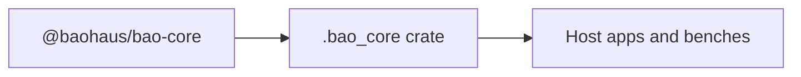

<!-- BEGIN BAOHAUS README HEADER -->
# @baohaus/bao-core

## Explain Like I'm Five

This crate is `@baohaus/bao-core` at `bao-source/bao-core`. Import subpaths like `./architecture/bunbuddy-contract-integration`, `./architecture/capability-registry`, `./architecture/domain-module.contract`, `./architecture/domain-service-definitions` when you wire this crate in.

## Architecture



## Scope

| In scope | Dependencies | Out of scope |
| --- | --- | --- |
| Public contract for `@baohaus/bao-core` | @baohaus/bao-config; @baohaus/bao-constants; @baohaus/bao-contracts; @baohaus/bao-schemas; @baohaus/bao-spec; @baohaus/bao-types | Other workbench domains; bao-runtime host lifecycle |
<!-- END BAOHAUS README HEADER -->

<!-- BEGIN BAOHAUS PACKAGE CARD -->
# @baohaus/bao-core

Standalone Baohaus package. Catalog identity `bao-core`. Source at `bao-source/bao-core`. Publishes to `baohaus/bao-core`. Canonical archive: `bao-source/bao-core/dist/bao/bao-core.bao`.

Cross-app contract and the full principles list live at the repo-root [README](../../README.md#principles).

## Package Facts

| Field | Value |
| --- | --- |
| Package | `@baohaus/bao-core` |
| Catalog id | `bao-core` |
| Source path | `bao-source/bao-core` |
| OCI repository | `baohaus/bao-core` |
| Channel | `public` |
| Visibility | `public` |
| Kind | `library` |
| Runtime installable | `yes` |
| Publish gate | `standard` |

## Public Pieces

`.`, `./architecture/bunbuddy-contract-integration`, `./architecture/capability-registry`, `./architecture/domain-module.contract`, `./architecture/domain-service-definitions`, `./architecture/graph-violation`, `./architecture/module-contract-registry`, `./architecture/module-host`, `./auth/drone-permissions`, `./auth/error-codes`, `./auth/error-messages`, `./auth/permissions`, `./auth/session`, `./bao-control-plane-build-policy.types`, `./bao-control-plane-image-specs`, `./bao-control-plane/component-inventory.reader`, `./bao-control-plane/provider-state-parser`, `./bao-control-plane/provider-state.types`, plus 152 more.

## Proof Commands

Run from `bao-source/bao-core`:

- `bun run build`
- `bun run typecheck`
- `bun run test`
- `bun run lint`
- `bun run bao:build`
- `bun run bao:validate`
- `bun run verify`

## Publishing Path

`@baohaus/bao-core` publishes to `baohaus/bao-core` through the canonical `.bao` registry distribution path. Local overrides are development-only; installable content resolves through the registry and the checked catalog/governance/lock path.
<!-- END BAOHAUS PACKAGE CARD -->

<!-- BEGIN BAOHAUS PACKAGE MANUAL -->
## Quick start

From `bao-source/bao-core`:

```bash
bun install
bun run typecheck
bun run test
bun run build
bun run lint
bun run bao:build
bun run bao:validate
bun run verify
```

## Capability

@baohaus/bao-core is a Baohaus workbench package at `bao-source/bao-core`.

## Subpaths

| Subpath | Purpose |
| --- | --- |
| `.` | Main entry — typed surface from this workbench |
| `./architecture/bunbuddy-contract-integration` | Architecture/bunbuddy contract integration — typed surface from this workbench |
| `./architecture/capability-registry` | Architecture/capability registry — typed surface from this workbench |
| `./architecture/domain-module.contract` | Architecture/domain module.contract — typed surface from this workbench |
| `./architecture/domain-service-definitions` | Architecture/domain service definitions — typed surface from this workbench |
| `./architecture/graph-violation` | Architecture/graph violation — typed surface from this workbench |
| `./architecture/module-contract-registry` | Architecture/module contract registry — typed surface from this workbench |
| `./architecture/module-host` | Architecture/module host — typed surface from this workbench |
| `./auth/drone-permissions` | Auth/drone permissions — auth/session contracts |
| `./auth/error-codes` | Auth/error codes — auth/session contracts |
| `./auth/error-messages` | Auth/error messages — auth/session contracts |
| `./auth/permissions` | Auth/permissions — auth/session contracts |
| _…_ | _158 more export(s) in package.json_ |

## Integration

Source: `bao-source/bao-core`. Import published subpaths only; do not deep-link into `dist/`.

## Registry

Catalog id `bao-core` → OCI `baohaus/bao-core`.

## Reference

### Subpaths

| Subpath | Purpose |
| --- | --- |
| `.` | Main entry — typed surface from this workbench |
| `./architecture/bunbuddy-contract-integration` | Architecture/bunbuddy contract integration — typed surface from this workbench |
| `./architecture/capability-registry` | Architecture/capability registry — typed surface from this workbench |
| `./architecture/domain-module.contract` | Architecture/domain module.contract — typed surface from this workbench |
| `./architecture/domain-service-definitions` | Architecture/domain service definitions — typed surface from this workbench |
| `./architecture/graph-violation` | Architecture/graph violation — typed surface from this workbench |
| `./architecture/module-contract-registry` | Architecture/module contract registry — typed surface from this workbench |
| `./architecture/module-host` | Architecture/module host — typed surface from this workbench |
| `./auth/drone-permissions` | Auth/drone permissions — auth/session contracts |
| `./auth/error-codes` | Auth/error codes — auth/session contracts |
| `./auth/error-messages` | Auth/error messages — auth/session contracts |
| `./auth/permissions` | Auth/permissions — auth/session contracts |
| _…_ | _158 more in `package.json#exports`_ |
<!-- END BAOHAUS PACKAGE MANUAL -->
