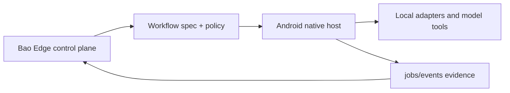

# Google AI Edge Gallery (Android)

## Explain Like I'm Five

Imagine the same careful goose carrying a bao crate onto an Android phone. This crate keeps local sessions, model calls, and device logs lined up with the Bao Edge control plane so the phone reports exactly what happened.

> 🌏 本页为中英双语。中文内容紧随对应英文段落。
> This page is bilingual. Chinese follows each English section.

The Android client is the native execution side of Bao Edge: it hosts session lifecycles, adapter callbacks, and model/tool call logging on local devices. This document ensures that behavior from UI through workflow entry, session management, and event persistence stays aligned with the control-plane.

中文

Android 客户端是 Bao Edge 的原生执行侧：在本地设备上托管会话生命周期、适配器回传与模型/工具调用日志。本文档用于确保从 UI 到工作流入口、再到会话管理与事件持久化的行为与控制平面保持一致。

中文

- **Picture:** Android 是 Bao Edge 的设备侧助手。
- **Pieces:** 它处理原生会话、适配器回调、模型/工具日志、工作流启动和状态回传。
- **Place:** 它遵循控制平面下发的规范，并回填证据。
- **Proof:** 本地日志、jobs/events 记录和服务端审计条目应保持一致。
- **Principle:** Android、iOS、CLI 和控制平面行为必须保持对齐。

## Goals and responsibilities

- Unify workflow launch, model switching, and runtime state visualization on the Android side.
- Align with the control-plane event contract, including job status, error codes, and audit metadata.
- Maintain behavioral parity with iOS and CLI to prevent platform-specific divergence.

中文

- 在 Android 端统一工作流启动、模型切换与运行时状态可视化。
- 与控制平面的事件合约对齐，包括任务状态、错误码和审计元数据。
- 与 iOS 和 CLI 保持行为一致，防止端侧行为分歧。

## Data and control flow

- **Trigger**: Workflows are initiated via HTMX/browser-side events or native entry points.
- **Control**: The control-plane returns executable specs and policies.
- **Execution**: The Android-side scheduler, state machine, and local adapters run according to the spec and report status back.

中文

- **触发**：通过 HTMX/浏览器端事件或原生入口触发工作流。
- **控制**：控制平面返回可执行规范与策略。
- **执行**：Android 侧调度器、状态机与本地适配器按规范运行，并回填状态。

## Verification

- Confirm that key fields are reported back to jobs/events tables.
- Compare local logs against server-side audit entries to verify end-to-end traceability.

中文

- 确认关键字段已回传到 jobs/events 表。
- 对比本地日志与服务端审计条目，验证端到端的可追溯性。

