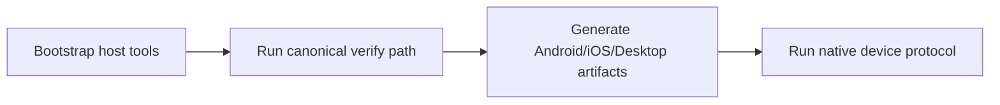
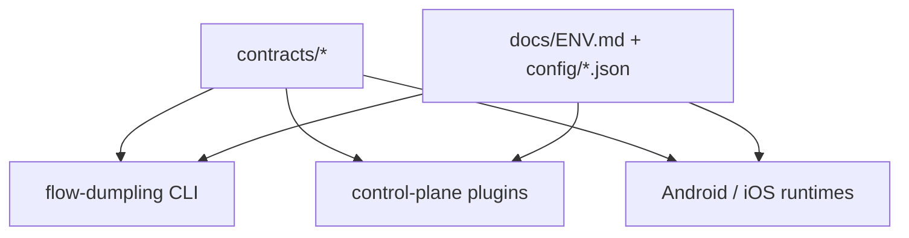

# Development Guide

> 🌏 本页为中英双语。中文内容紧随对应英文段落。
> This page is bilingual. Chinese follows each English section.

Last updated: 2026-03-06

This file is the developer runbook for local setup, verification, and platform prerequisites.
It does not duplicate service architecture or env catalogs. Those remain in:

- [docs/README.md](docs/README.md)
- [docs/VERSION_MATRIX.md](docs/VERSION_MATRIX.md) -- dependency ownership and upgrade targets
- [docs/MODERNIZATION_LEDGER.md](docs/MODERNIZATION_LEDGER.md) -- package upgrades and convention decisions
- [docs/FLOW_REFERENCE.md](docs/FLOW_REFERENCE.md)
- [docs/ENV.md](docs/ENV.md)
- [docs/CAPABILITY_AUDIT.md](docs/CAPABILITY_AUDIT.md)

<details>
<summary>中文</summary>

本文件是本地环境搭建、验证和平台依赖的开发者操作手册。
它不重复服务架构或环境变量目录的内容。这些信息请参见：

- [docs/README.md](docs/README.md) — 文档中心
- [docs/VERSION_MATRIX.md](docs/VERSION_MATRIX.md) — 依赖归属与升级目标
- [docs/MODERNIZATION_LEDGER.md](docs/MODERNIZATION_LEDGER.md) — 包升级与约定决策
- [docs/FLOW_REFERENCE.md](docs/FLOW_REFERENCE.md) — 流程参考
- [docs/ENV.md](docs/ENV.md) — 环境变量
- [docs/CAPABILITY_AUDIT.md](docs/CAPABILITY_AUDIT.md) — 能力审计

</details>

## Local workflow



<details>
<summary>中文</summary>

本地开发流程：引导安装宿主工具 -> 运行标准验证路径 -> 生成 Android/iOS/Desktop 构建产物 -> 运行原生设备协议。

</details>

## Canonical commands

### Bootstrap

Use the repo bootstrap and doctor paths instead of ad-hoc setup:

```bash
bun run doctor
bun run bootstrap
bun run control-plane:dev
```

The typed Bun CLI owns bootstrap; the shell wrapper is convenience only:

```bash
bun run bootstrap
```

<details>
<summary>中文</summary>

### 引导安装

使用仓库自带的 bootstrap 和 doctor 路径，不要自行拼装：

```bash
bun run doctor
bun run bootstrap
bun run control-plane:dev
```

Bun CLI 拥有 bootstrap 的实现；shell 脚本只是快捷入口：

```bash
bun run bootstrap
```

</details>

### Verify

The typed Bun CLI is the single owner for repo-wide verification:

```bash
bun run --cwd tooling/flow-dumpling src/cli.ts verify all
```

`verify all` now fails when the control-plane database contains plaintext provider credentials, unreadable encrypted credentials, or encrypted credentials without a valid `BAO_EDGE_ENCRYPTION_KEY`.

Root owner:

```bash
bun run verify:all
```

<details>
<summary>中文</summary>

### 验证

Bun CLI 是仓库级验证的唯一入口：

```bash
bun run --cwd tooling/flow-dumpling src/cli.ts verify all
```

`verify all` 现在会在以下情况下失败：控制平面数据库中存在明文 Provider 凭据、不可读的加密凭据、或加密凭据缺少有效的 `BAO_EDGE_ENCRYPTION_KEY`。

顶层入口：

```bash
bun run verify:all
```

</details>

### Audit provider credential integrity

```bash
bun run --cwd tooling/flow-dumpling src/cli.ts audit provider-credentials
```

<details>
<summary>中文</summary>

### 审计 Provider 凭据完整性

```bash
bun run --cwd tooling/flow-dumpling src/cli.ts audit provider-credentials
```

</details>

### Build application artifacts

```bash
bun run --cwd tooling/flow-dumpling src/cli.ts build matrix
```

Root owner:

```bash
bun run build:matrix
```

The canonical matrix now emits Android, iOS, and desktop results from one typed report.

<details>
<summary>中文</summary>

### 构建应用产物

```bash
bun run --cwd tooling/flow-dumpling src/cli.ts build matrix
```

顶层入口：

```bash
bun run build:matrix
```

构建矩阵现在从一个类型化报告中输出 Android、iOS 和 desktop 的结果。

</details>

### Download the pinned device-AI model

```bash
bun run --cwd tooling/flow-dumpling src/cli.ts device-ai download-model
```

Root owner:

```bash
bun run device-ai:download-model
```

<details>
<summary>中文</summary>

### 下载锁定版本的 device-AI 模型

```bash
bun run --cwd tooling/flow-dumpling src/cli.ts device-ai download-model
```

顶层入口：

```bash
bun run device-ai:download-model
```

</details>

### Run the native device protocol

```bash
bun run --cwd tooling/flow-dumpling src/cli.ts device-ai run-protocol
```

Root owner:

```bash
bun run device-ai:run-protocol
```

Or as part of full verification:

```bash
BAO_EDGE_VERIFY_DEVICE_AI_PROTOCOL=1 \
  bun run --cwd tooling/flow-dumpling src/cli.ts verify all
```

The full Android+iOS device gate requires a macOS host with simulator/device targets available.
When `BAO_EDGE_VERIFY_DEVICE_AI_PROTOCOL=1` is set, the verifier now fails fast before the long pipeline if required host prerequisites are missing, including:

- `HF_TOKEN` or `HUGGINGFACE_HUB_TOKEN`
- `adb` for the Android protocol (resolved from `PATH` or Android SDK roots such as `ANDROID_SDK_ROOT/platform-tools/adb`)
- `xcrun` and `xcrun simctl` on macOS for the iOS protocol

The native device protocol now installs the latest canonical Android/iOS build artifacts from `.artifacts/app-builds/latest.json` before launching the native runners, so preinstalling the generated apps is no longer the expected workflow.

<details>
<summary>中文</summary>

### 运行原生设备协议

```bash
bun run --cwd tooling/flow-dumpling src/cli.ts device-ai run-protocol
```

顶层入口：

```bash
bun run device-ai:run-protocol
```

或作为完整验证的一部分：

```bash
BAO_EDGE_VERIFY_DEVICE_AI_PROTOCOL=1 \
  bun run --cwd tooling/flow-dumpling src/cli.ts verify all
```

完整的 Android+iOS 设备门禁需要 macOS 宿主机并安装模拟器/设备目标。
当设置 `BAO_EDGE_VERIFY_DEVICE_AI_PROTOCOL=1` 时，验证器会在长流水线开始前快速失败（如果缺少必要的宿主前置条件），包括：

- `HF_TOKEN` 或 `HUGGINGFACE_HUB_TOKEN`
- Android 协议需要 `adb`（从 `PATH` 或 `ANDROID_SDK_ROOT/platform-tools/adb` 等 Android SDK 路径解析）
- macOS 上 iOS 协议需要 `xcrun` 和 `xcrun simctl`

原生设备协议现在会在启动原生运行器之前，自动从 `.artifacts/app-builds/latest.json` 安装最新的 Android/iOS 构建产物，因此不再需要手动预装生成的应用。

</details>

## Platform requirements

### Bun / TypeScript

- Bun `1.3.*`
- strict TypeScript

### Android

- Android Gradle JVM: Java 17
- Android SDK with:
  - `platform-tools`
  - `platforms;android-35`
  - `build-tools;35.0.0`

The repo scripts resolve the supported Android Gradle JVM and Android SDK through:

- [shared/host-tooling.ts](shared/host-tooling.ts)

`flow-dumpling build android` is now the canonical Android build owner. It includes one automatic recovery retry for known Kotlin/Gradle incremental cache corruption signatures, clears Kotlin build caches before retrying, and uses the repo-standard KSP-backed Android build path; the root owner is `bun run build:android`.
`flow-dumpling build ios` is now the canonical iOS build owner. It resolves Xcode toolchains, validates shared schemes and destinations, builds the host app or SwiftPM package, packages the artifact as ZIP, and emits typed artifact metadata; the root owner is `bun run build:ios`.

### iOS

- macOS host
- Xcode installed
- required iOS simulator/device runtimes installed

Native iOS app packaging cannot be completed on Linux or Windows. Those hosts can still run the shared verification subset and Android paths.

<details>
<summary>中文</summary>

### Bun / TypeScript

- Bun `1.3.*`
- 严格模式 TypeScript

### Android

- Android Gradle JVM：Java 17
- Android SDK 需要：
  - `platform-tools`
  - `platforms;android-35`
  - `build-tools;35.0.0`

仓库脚本通过 [shared/host-tooling.ts](shared/host-tooling.ts) 解析支持的 Android Gradle JVM 和 Android SDK。

`flow-dumpling build android` 是 Android 构建的标准入口。它包含一次针对已知 Kotlin/Gradle 增量缓存损坏特征的自动恢复重试，重试前清除 Kotlin 构建缓存，并使用仓库标准的 KSP Android 构建路径；顶层入口为 `bun run build:android`。
`flow-dumpling build ios` 是 iOS 构建的标准入口。它解析 Xcode 工具链、验证共享 scheme 和 destination、构建宿主应用或 SwiftPM 包、将产物打包为 ZIP 并输出类型化的产物元数据；顶层入口为 `bun run build:ios`。

### iOS

- macOS 宿主机
- 已安装 Xcode
- 已安装所需的 iOS 模拟器/设备运行时

原生 iOS 应用打包无法在 Linux 或 Windows 上完成。这些宿主机仍然可以运行共享验证子集和 Android 构建路径。

</details>

## Hugging Face OAuth and model access

Android OAuth setup uses a Hugging Face developer app.

1. Create an OAuth app in [Hugging Face settings](https://huggingface.co/settings/applications).
2. Set redirect URL to `combaohausbaoedge://callback` unless your local branding overrides it.
3. Put the client ID in `Android/src/bao-edge.local.properties`:
   - `BAO_EDGE_HF_CLIENT_ID=...`
4. Ensure the redirect values match:
   - `BAO_EDGE_HF_REDIRECT_URI=combaohausbaoedge://callback`
   - `BAO_EDGE_HF_REDIRECT_SCHEME=combaohausbaoedge`

Public Hugging Face model metadata and public artifacts can be reached without a token. For gated, private, or higher-rate authenticated downloads, set one of:

- `HF_TOKEN`
- `HUGGINGFACE_HUB_TOKEN`

<details>
<summary>中文</summary>

Android OAuth 使用 Hugging Face 开发者应用。

1. 在 [Hugging Face 设置](https://huggingface.co/settings/applications) 中创建 OAuth 应用。
2. 将重定向 URL 设为 `combaohausbaoedge://callback`（除非本地品牌配置覆盖了它）。
3. 将 client ID 写入 `Android/src/bao-edge.local.properties`：
   - `BAO_EDGE_HF_CLIENT_ID=...`
4. 确保重定向值一致：
   - `BAO_EDGE_HF_REDIRECT_URI=combaohausbaoedge://callback`
   - `BAO_EDGE_HF_REDIRECT_SCHEME=combaohausbaoedge`

公开的 Hugging Face 模型元数据和公开产物无需 token 即可访问。对于受限、私有或需要更高速率的认证下载，请设置以下之一：

- `HF_TOKEN`
- `HUGGINGFACE_HUB_TOKEN`

</details>

## Platform-specific entrypoints

### Android

```bash
bun run android:gradle -- :app:assembleDebug
bun run android:gradle -- :app:installDebug
bun run android:gradle -- :app:testDebugUnitTest
```

### iOS

```bash
cd iOS/BaoEdge
swift test
open BaoEdge.xcworkspace
```

The checked-in `BaoEdgeHost` app is the runnable shell. XCTest-backed automation remains isolated in `BaoEdgeDriverXCTest`.

<details>
<summary>中文</summary>

### Android

```bash
bun run android:gradle -- :app:assembleDebug
bun run android:gradle -- :app:installDebug
bun run android:gradle -- :app:testDebugUnitTest
```

### iOS

```bash
cd iOS/BaoEdge
swift test
open BaoEdge.xcworkspace
```

已提交的 `BaoEdgeHost` 应用是可运行的外壳。XCTest 自动化测试隔离在 `BaoEdgeDriverXCTest` 中。

</details>

## Contracts and single sources of truth



Treat these as the canonical sources of truth:

- contracts:
  - [contracts/flow-contracts.ts](contracts/flow-contracts.ts)
  - [contracts/device-ai-protocol.ts](contracts/device-ai-protocol.ts)
- control-plane route schemas:
  - [command-bao/src/contracts/http.ts](command-bao/src/contracts/http.ts)
- runtime config:
  - [command-bao/src/config.ts](command-bao/src/config.ts)
  - [command-bao/src/config/env.ts](command-bao/src/config/env.ts)
  - [command-bao/src/config/device-ai-profile.ts](command-bao/src/config/device-ai-profile.ts)
  - [command-bao/config/device-ai-profile.json](command-bao/config/device-ai-profile.json)

<details>
<summary>中文</summary>

以下是权威数据源：

- 合约：
  - [contracts/flow-contracts.ts](contracts/flow-contracts.ts)
  - [contracts/device-ai-protocol.ts](contracts/device-ai-protocol.ts)
- 控制平面路由 schema：
  - [command-bao/src/contracts/http.ts](command-bao/src/contracts/http.ts)
- 运行时配置：
  - [command-bao/src/config.ts](command-bao/src/config.ts)
  - [command-bao/src/config/env.ts](command-bao/src/config/env.ts)
  - [command-bao/src/config/device-ai-profile.ts](command-bao/src/config/device-ai-profile.ts)
  - [command-bao/config/device-ai-profile.json](command-bao/config/device-ai-profile.json)

</details>

## Documentation usage rules

- Update route/capability coverage in [docs/CAPABILITY_AUDIT.md](docs/CAPABILITY_AUDIT.md) when behavior changes.
- Update API and flow behavior in [docs/FLOW_REFERENCE.md](docs/FLOW_REFERENCE.md).
- Update environment variables in [docs/ENV.md](docs/ENV.md).

<details>
<summary>中文</summary>

- 行为变更时更新 [docs/CAPABILITY_AUDIT.md](docs/CAPABILITY_AUDIT.md) 中的路由/能力覆盖。
- 更新 [docs/FLOW_REFERENCE.md](docs/FLOW_REFERENCE.md) 中的 API 和流程行为。
- 更新 [docs/ENV.md](docs/ENV.md) 中的环境变量。

</details>

## Documentation verification tools

- **Context7 MCP**: Use `resolve-library-id` (query + libraryName) then `query-docs` for Prisma, Elysia, Bun, HTMX, daisyUI before changing architecture.
- **DaisyUI Blueprint MCP**: Use `daisyUI-Snippets` before changing control-plane component structure or interaction patterns.
- **llms-stack-refresh**: See [github.com/d4551/llms-stack-refresh](https://github.com/d4551/llms-stack-refresh) for curated llms.txt files. Official llms.txt: [Prisma](https://www.prisma.io/docs/llms.txt), [Bun](https://bun.com/llms.txt), [daisyUI](https://daisyui.com/llms.txt), [Elysia](https://elysiajs.com/llms.txt). Cursor rules: `.cursor/rules/llms-stack.mdc`.

<details>
<summary>中文</summary>

- **Context7 MCP**：变更架构前，先用 `resolve-library-id`（query + libraryName）和 `query-docs` 查阅 Prisma、Elysia、Bun、HTMX、daisyUI 的文档。
- **DaisyUI Blueprint MCP**：变更控制平面组件结构或交互模式前，先用 `daisyUI-Snippets` 查阅。
- **llms-stack-refresh**：参见 [github.com/d4551/llms-stack-refresh](https://github.com/d4551/llms-stack-refresh) 获取整理好的 llms.txt 文件。官方 llms.txt：[Prisma](https://www.prisma.io/docs/llms.txt)、[Bun](https://bun.com/llms.txt)、[daisyUI](https://daisyui.com/llms.txt)、[Elysia](https://elysiajs.com/llms.txt)。Cursor rules：`.cursor/rules/llms-stack.mdc`。

</details>

## Minimum local acceptance bar

Before handing off work, run:

```bash
bun run typecheck
bun run lint
bun run test
bun run audit:code-practices
bun run audit:capability-gaps
```

If the task touches build/distribution paths, also run:

```bash
bun run --cwd tooling/flow-dumpling src/cli.ts verify all
```

<details>
<summary>中文</summary>

提交工作前，运行以下命令：

```bash
bun run typecheck
bun run lint
bun run test
bun run audit:code-practices
bun run audit:capability-gaps
```

如果改动涉及构建/分发路径，还需运行：

```bash
bun run --cwd tooling/flow-dumpling src/cli.ts verify all
```

</details>
