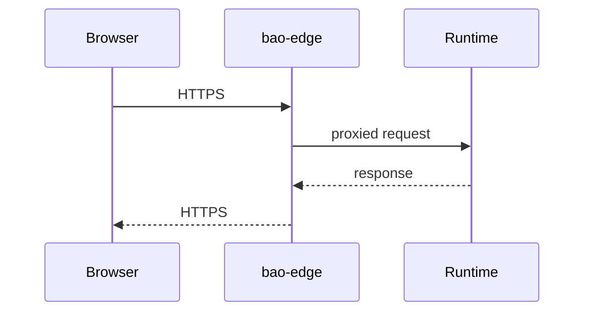

<!-- BEGIN BAOHAUS README HEADER -->
# @baohaus/bao-edge

## Explain Like I'm Five

This workbench is the front door turnstile. It terminates TLS, applies edge policy, and forwards clean requests to inner factory floors.

## Architecture



## Scope

| In scope | Dependencies | Out of scope |
| --- | --- | --- |
| Edge routing; TLS termination policy | auth-bao; Shared route constants | Business databases; Desktop shell UI |
<!-- END BAOHAUS README HEADER -->

<!-- BEGIN BAOHAUS PACKAGE CARD -->
# @baohaus/bao-edge

Standalone Baohaus package. Catalog identity `bao-edge`. Source at `bao-source/bao-edge`. Publishes to `baohaus/bao-edge`. Canonical archive: `bao-source/bao-edge/dist/bao/bao-edge.bao`.

Cross-app contract and the full principles list live at the repo-root [README](../../README.md#principles).

## Package Facts

| Field | Value |
| --- | --- |
| Package | `@baohaus/bao-edge` |
| Catalog id | `bao-edge` |
| Source path | `bao-source/bao-edge` |
| OCI repository | `baohaus/bao-edge` |
| Channel | `public` |
| Visibility | `public` |
| Kind | `library` |
| Runtime installable | `yes` |
| Publish gate | `standard` |

## Public Pieces

`.`, `./package-descriptor`, `./services/bao-install/bao-install-config.service`, `./services/bao-install/bao-install-validator.service`, `./services/bao-install/bao-install.plugin`, `./services/bao-install/bao-manifest-paths.service`, `./services/bao-install/bao-manifest-trust.service`, `./services/bao-install/bao-target-handler-registry`, `./services/bao-install/target-handlers/ai-model.handler`, `./services/bao-install/target-handlers/bao-package.handler`, `./services/bao-install/target-handlers/bao-runtime-workload.handler`, `./services/bao-install/target-handlers/baodown-flow.handler`, `./services/bao-install/target-handlers/baodown-node.handler`, `./services/bao-install/target-handlers/better-auth-extension.handler`, `./services/bao-install/target-handlers/bun-plugin.handler`, `./services/bao-install/target-handlers/bunbuddy-contract.handler`, `./services/bao-install/target-handlers/config-overlay.handler`, `./services/bao-install/target-handlers/elysia-plugin.handler`, plus 9 more.

## Proof Commands

Run from `bao-source/bao-edge`:

- `bun run build`
- `bun run typecheck`
- `bun run test`
- `bun run lint`
- `bun run bao:build`
- `bun run bao:validate`
- `bun run verify`

## Publishing Path

`@baohaus/bao-edge` publishes to `baohaus/bao-edge` through the canonical `.bao` registry distribution path. Local overrides are development-only; installable content resolves through the registry and the checked catalog/governance/lock path.
<!-- END BAOHAUS PACKAGE CARD -->

<!-- BEGIN BAOHAUS PACKAGE MANUAL -->
## Quick start

From `bao-source/bao-edge`:

```bash
bun install
bun run typecheck
bun run test
bun run build
bun run lint
bun run bao:build
bun run bao:validate
bun run verify
```

## Capability

@baohaus/bao-edge is a Baohaus workbench package at `bao-source/bao-edge`.

## Subpaths

| Subpath | Purpose |
| --- | --- |
| `.` | Main entry — typed surface from this workbench |
| `./package-descriptor` | Package descriptor — typed surface from this workbench |
| `./services/bao-install/bao-install-config.service` | Services/bao install/bao install config.service — typed surface from this workbench |
| `./services/bao-install/bao-install-validator.service` | Services/bao install/bao install validator.service — typed surface from this workbench |
| `./services/bao-install/bao-install.plugin` | Services/bao install/bao install.plugin — typed surface from this workbench |
| `./services/bao-install/bao-manifest-paths.service` | Services/bao install/bao manifest paths.service — typed surface from this workbench |
| `./services/bao-install/bao-manifest-trust.service` | Services/bao install/bao manifest trust.service — typed surface from this workbench |
| `./services/bao-install/bao-target-handler-registry` | Services/bao install/bao target handler registry — typed surface from this workbench |
| `./services/bao-install/target-handlers/ai-model.handler` | Services/bao install/target handlers/ai model.handler — typed surface from this workbench |
| `./services/bao-install/target-handlers/bao-package.handler` | Services/bao install/target handlers/bao package.handler — typed surface from this workbench |
| `./services/bao-install/target-handlers/bao-runtime-workload.handler` | Services/bao install/target handlers/bao runtime workload.handler — typed surface from this workbench |
| `./services/bao-install/target-handlers/baodown-flow.handler` | Services/bao install/target handlers/baodown flow.handler — typed surface from this workbench |
| _…_ | _15 more export(s) in package.json_ |

## Primary symbols

- `packageDescriptor`
- `PackageDescriptor`

## Integration

Source: `bao-source/bao-edge` (`src/index.ts`). Import published subpaths only; do not deep-link into `dist/`.

## Registry

Catalog id `bao-edge` → OCI `baohaus/bao-edge`.

## Reference

### Subpaths

| Subpath | Purpose |
| --- | --- |
| `.` | Main entry — typed surface from this workbench |
| `./package-descriptor` | Package descriptor — typed surface from this workbench |
| `./services/bao-install/bao-install-config.service` | Services/bao install/bao install config.service — typed surface from this workbench |
| `./services/bao-install/bao-install-validator.service` | Services/bao install/bao install validator.service — typed surface from this workbench |
| `./services/bao-install/bao-install.plugin` | Services/bao install/bao install.plugin — typed surface from this workbench |
| `./services/bao-install/bao-manifest-paths.service` | Services/bao install/bao manifest paths.service — typed surface from this workbench |
| `./services/bao-install/bao-manifest-trust.service` | Services/bao install/bao manifest trust.service — typed surface from this workbench |
| `./services/bao-install/bao-target-handler-registry` | Services/bao install/bao target handler registry — .bao install target handlers |
| `./services/bao-install/target-handlers/ai-model.handler` | Services/bao install/target handlers/ai model.handler — .bao install target handlers |
| `./services/bao-install/target-handlers/bao-package.handler` | Services/bao install/target handlers/bao package.handler — .bao install target handlers |
| `./services/bao-install/target-handlers/bao-runtime-workload.handler` | Services/bao install/target handlers/bao runtime workload.handler — .bao install target handlers |
| `./services/bao-install/target-handlers/baodown-flow.handler` | Services/bao install/target handlers/baodown flow.handler — .bao install target handlers |
| _…_ | _15 more in `package.json#exports`_ |

### Symbols

- `packageDescriptor`
- `PackageDescriptor`
<!-- END BAOHAUS PACKAGE MANUAL -->
