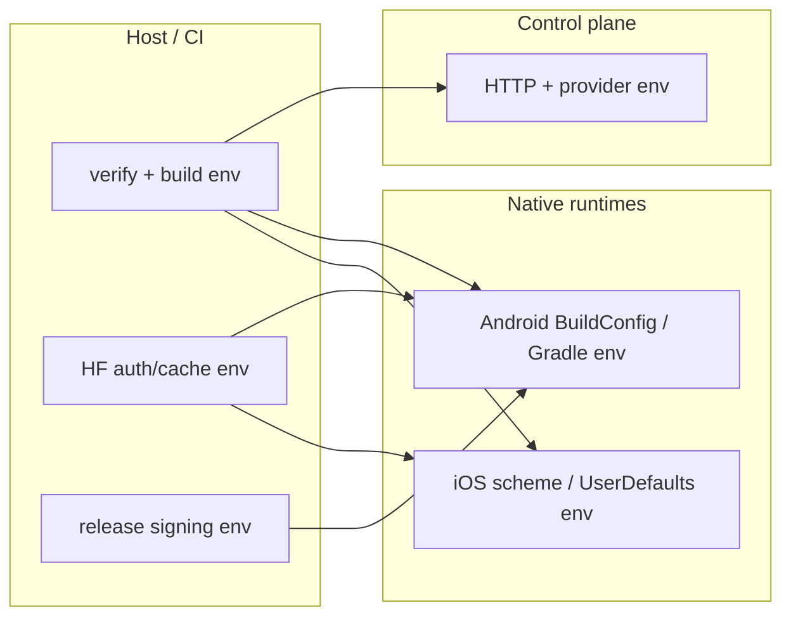

# Environment Variables

> This page is bilingual. Chinese follows each English section.
> 本页为中英双语。中文内容紧随对应英文段落。

Last updated: 2026-03-09

中文

上方流程图展示了环境变量在主机/CI、控制平面和原生运行时之间的流动关系。验证和构建环境变量同时流向控制平面和 Android/iOS 原生运行时；Hugging Face 认证/缓存环境变量流向 Android 和 iOS；发布签名环境变量仅流向 Android。

## Control-plane

- `CONTROL_PLANE_PORT` or `PORT`: HTTP server port. Default comes from `CONTROL_PLANE_DEFAULT_PORT` in `command-bao/src/config.ts`; env parsing is centrally owned by `command-bao/src/config/env.ts`.
- `MODEL_SOURCE_REGISTRY_JSON`: Optional JSON override for `command-bao/config/model-sources.json`. Must remain an object with `defaultSource?` plus a non-empty `sources` array; legacy top-level array payloads are rejected.
- `MODEL_PULL_SOURCES`: Optional comma-separated/JSON list used by pull forms.
- `DEFAULT_MODEL_SOURCE`: Optional default source id used when pull payload omits source.
- `MODEL_PULL_PRESETS`: Optional pull preset list (comma-separated or JSON array).
- `MODEL_PULL_MODEL_REF_PLACEHOLDER`: Optional global model-ref placeholder override.
- `MODEL_PULL_TIMEOUT_MAX_MS`: Max allowed pull timeout.
- `AI_PROVIDER_REGISTRY_JSON`: Optional JSON override for `command-bao/config/providers.json`. Must remain a non-empty provider array with unique `id` values.
- `DEFAULT_CHAT_MODEL`: Optional explicit default chat model override. If unset, startup resolves the default from the canonical provider registry + model-source default and fails closed when no provider declares a default model.
- `BAO_EDGE_ENCRYPTION_KEY`: Required to persist cloud-provider API keys. Must decode to exactly 32 bytes (64-char hex or base64).
- `AI_PROVIDER_REQUEST_TIMEOUT_MS`: Provider model-list/chat timeout. Defaults to `30000` so local/cloud chat completions have the same baseline budget as the native client polling path.
- `AI_CHAT_MAX_TOKENS`: Max tokens for chat completion requests.
- `UCP_DISCOVERY_TIMEOUT_MS`: Timeout for UCP discovery calls.
- `BAO_EDGE_ANDROID_SERIAL` or `ANDROID_SERIAL`: Optional explicit Android target serial used by control-plane RPA when more than one device/emulator is connected.
- `BAO_EDGE_IOS_SIMULATOR_UDID` or `IOS_SIMULATOR_UDID`: Optional explicit iOS simulator UDID used by control-plane RPA when more than one simulator is booted.

Checked-in config files under `command-bao/config/` are canonical required inputs. The control-plane no longer carries embedded fallback registries or preset payloads when those files are malformed or missing.

中文

控制平面环境变量：

- `CONTROL_PLANE_PORT` 或 `PORT` — HTTP 服务端口。默认值来自 `command-bao/src/config.ts` 中的 `CONTROL_PLANE_DEFAULT_PORT`；环境变量解析由 `command-bao/src/config/env.ts` 统一管理。
- `MODEL_SOURCE_REGISTRY_JSON` — 可选，覆盖 `command-bao/config/model-sources.json` 的 JSON。必须为包含 `defaultSource?` 和非空 `sources` 数组的对象；拒绝旧版顶级数组格式。
- `MODEL_PULL_SOURCES` — 可选，拉取表单使用的逗号分隔/JSON 列表。
- `DEFAULT_MODEL_SOURCE` — 可选，当拉取请求未指定 source 时使用的默认 source id。
- `MODEL_PULL_PRESETS` — 可选，拉取预设列表（逗号分隔或 JSON 数组）。
- `MODEL_PULL_MODEL_REF_PLACEHOLDER` — 可选，全局 model-ref 占位符覆盖。
- `MODEL_PULL_TIMEOUT_MAX_MS` — 最大拉取超时时间。
- `AI_PROVIDER_REGISTRY_JSON` — 可选，覆盖 `command-bao/config/providers.json` 的 JSON。必须为非空的 provider 数组且 `id` 值唯一。
- `DEFAULT_CHAT_MODEL` — 可选，显式默认聊天模型覆盖。未设置时，启动时从规范 provider 注册表 + model-source 默认值解析，无 provider 声明默认模型时 fail closed。
- `BAO_EDGE_ENCRYPTION_KEY` — 持久化云 provider API key 必需。必须解码为正好 32 字节（64 字符 hex 或 base64）。
- `AI_PROVIDER_REQUEST_TIMEOUT_MS` — Provider 模型列表/聊天超时，默认 `30000`。
- `AI_CHAT_MAX_TOKENS` — 聊天补全请求的最大 token 数。
- `UCP_DISCOVERY_TIMEOUT_MS` — UCP 发现调用超时。
- `BAO_EDGE_ANDROID_SERIAL` 或 `ANDROID_SERIAL` — 可选，多台 Android 设备/模拟器同时连接时为控制平面 RPA 指定目标 serial。
- `BAO_EDGE_IOS_SIMULATOR_UDID` 或 `IOS_SIMULATOR_UDID` — 可选，多台 iOS 模拟器同时启动时为控制平面 RPA 指定目标 UDID。

`command-bao/config/` 下的签入配置文件是规范的必需输入。当这些文件格式错误或缺失时，控制平面不再携带内嵌的回退注册表或预设。

## Verify / build orchestration

- `BAO_EDGE_VERIFY_DEVICE_AI_PROTOCOL`: Set to `1` to run the full native Android+iOS device protocol during `flow-dumpling verify all`.
- `BAO_EDGE_IOS_BUILD_MODE`: Host policy for iOS builds. Use `delegate` to rely on the remote/macOS CI builder.
- `BAO_EDGE_REQUIRED_MODEL_REF`: Override the required Hugging Face model ref for the device-AI protocol.
- `BAO_EDGE_REQUIRED_MODEL_REVISION`: Override the required Hugging Face revision for the device-AI protocol.
- `BAO_EDGE_REQUIRED_MODEL_FILE`: Override the exact required Hugging Face artifact file name.
- `BAO_EDGE_REQUIRED_MODEL_SHA256`: Override the expected SHA-256 for the required Hugging Face artifact.
- `BAO_EDGE_DEVICE_AI_PROTOCOL_TIMEOUT_MS`: Overall timeout for device-AI protocol execution.
- `BAO_EDGE_DEVICE_AI_REPORT_MAX_AGE_MINUTES`: Freshness bound for `device-readiness` audit reports.

中文

验证/构建编排环境变量：

- `BAO_EDGE_VERIFY_DEVICE_AI_PROTOCOL` — 设为 `1` 可在 `flow-dumpling verify all` 期间执行完整的原生 Android+iOS 设备协议。
- `BAO_EDGE_IOS_BUILD_MODE` — iOS 构建的主机策略。设为 `delegate` 可依赖远程/macOS CI 构建器。
- `BAO_EDGE_REQUIRED_MODEL_REF` — 覆盖设备 AI 协议所需的 Hugging Face 模型引用。
- `BAO_EDGE_REQUIRED_MODEL_REVISION` — 覆盖所需的 Hugging Face 修订版本。
- `BAO_EDGE_REQUIRED_MODEL_FILE` — 覆盖所需的确切 Hugging Face 产物文件名。
- `BAO_EDGE_REQUIRED_MODEL_SHA256` — 覆盖所需 Hugging Face 产物的预期 SHA-256。
- `BAO_EDGE_DEVICE_AI_PROTOCOL_TIMEOUT_MS` — 设备 AI 协议执行的整体超时。
- `BAO_EDGE_DEVICE_AI_REPORT_MAX_AGE_MINUTES` — `device-readiness` 审计报告的新鲜度上限。

## Hugging Face / model acquisition

- `HF_TOKEN` or `HUGGINGFACE_HUB_TOKEN`: Optional Hugging Face auth token. Required for gated/private model access and recommended for higher-rate authenticated CLI/native download flows; public model metadata and public artifacts can be reached without it.
- `HF_HOME`: Hugging Face local state root.
- `HF_HUB_CACHE`: Hugging Face artifact cache root.
- `BAO_EDGE_HF_CLIENT_ID`: Hugging Face OAuth client ID used by Android runtime flows.

中文

Hugging Face / 模型获取环境变量：

- `HF_TOKEN` 或 `HUGGINGFACE_HUB_TOKEN` — 可选的 Hugging Face 认证 token。访问 gated/private 模型时必需，推荐用于更高速率的认证 CLI/原生下载流程；公开模型元数据和公开产物无需此 token。
- `HF_HOME` — Hugging Face 本地状态根目录。
- `HF_HUB_CACHE` — Hugging Face 产物缓存根目录。
- `BAO_EDGE_HF_CLIENT_ID` — Android 运行时流程使用的 Hugging Face OAuth client ID。

## Android (Gradle / BuildConfig)

Set via `Android/src/bao-edge.local.properties` or shell env:
- `BAO_EDGE_CONTROL_PLANE_BASE_URL`
- `BAO_EDGE_CONTROL_PLANE_CONNECT_TIMEOUT_MS`
- `BAO_EDGE_CONTROL_PLANE_READ_TIMEOUT_MS`
- `BAO_EDGE_CONTROL_PLANE_POLL_INTERVAL_MS`
- `BAO_EDGE_CONTROL_PLANE_POLL_ATTEMPTS`
- `BAO_EDGE_CONTROL_PLANE_DEFAULT_PULL_TIMEOUT_MS`
- `BAO_EDGE_CONTROL_PLANE_DEFAULT_MODEL_SOURCE` (optional; if unset/blank, the source registry default is used)
- `BAO_EDGE_CONTROL_PLANE_MODEL_STATE_ID_PREFIX`
- `BAO_EDGE_REQUIRED_MODEL_REF`
- `BAO_EDGE_REQUIRED_MODEL_REVISION`
- `BAO_EDGE_REQUIRED_MODEL_FILE`
- `BAO_EDGE_REQUIRED_MODEL_SHA256`
- `BAO_EDGE_DEVICE_AI_MODEL_DIRECTORY`
- `BAO_EDGE_DEVICE_AI_PROTOCOL_TIMEOUT_MS`
- `BAO_EDGE_DEVICE_AI_REPORT_MAX_AGE_MINUTES`
- `BAO_EDGE_DEVICE_AI_DOWNLOAD_MAX_ATTEMPTS`
- `BAO_EDGE_DEVICE_AI_HF_TOKEN`
- `BAO_EDGE_TINY_GARDEN_ASSET_BASE_URL`
- `BAO_EDGE_TINY_GARDEN_ASSET_PATH`
- `BAO_EDGE_HF_CLIENT_ID`

中文

Android 环境变量通过 `Android/src/bao-edge.local.properties` 或 shell 环境变量设置，注入到 Gradle BuildConfig 中：

- **控制平面连接** — `BAO_EDGE_CONTROL_PLANE_BASE_URL`、`*_CONNECT_TIMEOUT_MS`、`*_READ_TIMEOUT_MS`、`*_POLL_INTERVAL_MS`、`*_POLL_ATTEMPTS`、`*_DEFAULT_PULL_TIMEOUT_MS` 控制与控制平面的 HTTP 通信参数。
- **模型来源** — `BAO_EDGE_CONTROL_PLANE_DEFAULT_MODEL_SOURCE`（可选，未设置时使用 source registry 默认值）和 `*_MODEL_STATE_ID_PREFIX`。
- **设备 AI 模型** — `BAO_EDGE_REQUIRED_MODEL_REF`、`*_REVISION`、`*_FILE`、`*_SHA256` 定义固定的模型身份契约。`BAO_EDGE_DEVICE_AI_MODEL_DIRECTORY` 指定模型存储目录。
- **设备 AI 协议** — `*_PROTOCOL_TIMEOUT_MS`、`*_REPORT_MAX_AGE_MINUTES`、`*_DOWNLOAD_MAX_ATTEMPTS` 控制协议执行行为。
- **认证** — `BAO_EDGE_DEVICE_AI_HF_TOKEN` 和 `BAO_EDGE_HF_CLIENT_ID` 用于 Hugging Face 认证。
- **资产** — `BAO_EDGE_TINY_GARDEN_ASSET_BASE_URL` 和 `*_ASSET_PATH` 用于 Tiny Garden WebView 资产。

## Android release signing

- `BAO_EDGE_RELEASE_KEYSTORE_FILE`
- `BAO_EDGE_RELEASE_KEYSTORE_PASSWORD`
- `BAO_EDGE_RELEASE_KEY_ALIAS`
- `BAO_EDGE_RELEASE_KEY_PASSWORD`

中文

Android 发布签名环境变量：

- `BAO_EDGE_RELEASE_KEYSTORE_FILE` — keystore 文件路径。
- `BAO_EDGE_RELEASE_KEYSTORE_PASSWORD` — keystore 密码。
- `BAO_EDGE_RELEASE_KEY_ALIAS` — 密钥别名。
- `BAO_EDGE_RELEASE_KEY_PASSWORD` — 密钥密码。

这些变量仅在生成签名的发布 APK 时需要。开发和调试构建不需要配置这些变量。

## iOS (runtime)

Set via Xcode scheme env vars or `UserDefaults`:
- `BAO_EDGE_CONTROL_PLANE_BASE_URL`
- `BAO_EDGE_CONTROL_PLANE_POLL_INTERVAL_MS`
- `BAO_EDGE_CONTROL_PLANE_POLL_ATTEMPTS`
- `BAO_EDGE_CONTROL_PLANE_DEFAULT_PULL_TIMEOUT_MS`
- `BAO_EDGE_CONTROL_PLANE_DEFAULT_MODEL_SOURCE` (optional override of control-plane registry default)
- `BAO_EDGE_CONTROL_PLANE_REQUEST_TIMEOUT_SECONDS`
- `BAO_EDGE_CONTROL_PLANE_MODEL_STATE_ID_PREFIX`
- `BAO_EDGE_REQUIRED_MODEL_REF`
- `BAO_EDGE_REQUIRED_MODEL_REVISION`
- `BAO_EDGE_REQUIRED_MODEL_FILE`
- `BAO_EDGE_REQUIRED_MODEL_SHA256`
- `BAO_EDGE_DEVICE_AI_MODEL_DIRECTORY`
- `BAO_EDGE_DEVICE_AI_REPORT_DIRECTORY`
- `BAO_EDGE_DEVICE_AI_PROTOCOL_TIMEOUT_MS`
- `BAO_EDGE_DEVICE_AI_REPORT_MAX_AGE_MINUTES`
- `BAO_EDGE_DEVICE_AI_DOWNLOAD_MAX_ATTEMPTS`
- `BAO_EDGE_DEVICE_AI_HF_TOKEN`

中文

iOS 运行时环境变量通过 Xcode scheme 环境变量或 `UserDefaults` 设置：

- **控制平面连接** — `BAO_EDGE_CONTROL_PLANE_BASE_URL`、`*_POLL_INTERVAL_MS`、`*_POLL_ATTEMPTS`、`*_DEFAULT_PULL_TIMEOUT_MS`、`*_REQUEST_TIMEOUT_SECONDS` 控制与控制平面的通信参数。
- **模型来源** — `BAO_EDGE_CONTROL_PLANE_DEFAULT_MODEL_SOURCE`（可选，覆盖控制平面注册表默认值）和 `*_MODEL_STATE_ID_PREFIX`。
- **设备 AI 模型** — `BAO_EDGE_REQUIRED_MODEL_REF`、`*_REVISION`、`*_FILE`、`*_SHA256` 定义固定的模型身份契约。`BAO_EDGE_DEVICE_AI_MODEL_DIRECTORY` 和 `*_REPORT_DIRECTORY` 指定模型和报告存储目录。
- **设备 AI 协议** — `*_PROTOCOL_TIMEOUT_MS`、`*_REPORT_MAX_AGE_MINUTES`、`*_DOWNLOAD_MAX_ATTEMPTS` 控制协议执行行为。
- **认证** — `BAO_EDGE_DEVICE_AI_HF_TOKEN` 用于 Hugging Face 认证。

