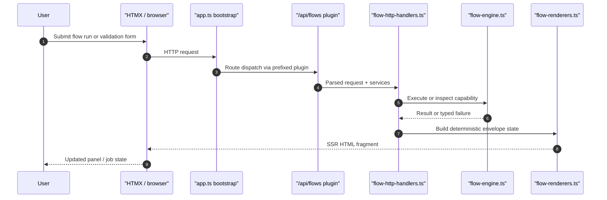
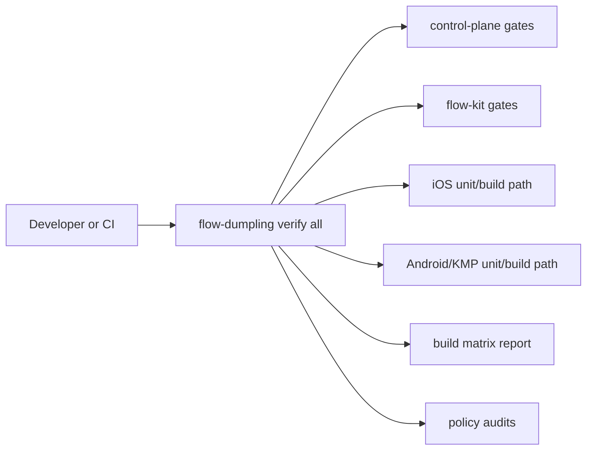

# Flow Reference

> This page is bilingual. Chinese follows each English section.
> 本页为中英双语。中文内容紧随对应英文段落。

Last updated: 2026-03-07

## Supported commands

- `launchApp`
- `tapOn`
- `inputText`
- `assertVisible`
- `assertNotVisible`
- `assertText`
- `selectOption`
- `scroll`
- `swipe`
- `screenshot`
- `clipboardRead`
- `clipboardWrite`
- `windowFocus`
- `hideKeyboard`
- `waitForAnimation`
- `readVisibleState`

中文

以上是 Bao Edge 流程引擎支持的全部命令。每个命令对应一种自动化操作：

- `launchApp` — 启动目标应用
- `tapOn` — 点击指定位置或元素
- `inputText` — 向输入框填入文本
- `assertVisible` / `assertNotVisible` — 断言元素可见或不可见
- `assertText` — 断言元素包含指定文本
- `selectOption` — 选择下拉菜单选项
- `scroll` / `swipe` — 滚动或滑动操作
- `screenshot` — 截屏
- `clipboardRead` / `clipboardWrite` — 读取或写入剪贴板
- `windowFocus` — 聚焦指定窗口
- `hideKeyboard` — 隐藏软键盘
- `waitForAnimation` — 等待动画完成
- `readVisibleState` — 捕获当前界面的结构化可见状态证据

## Per-platform command support

Not all commands are available on every target platform. The matrix below shows which
commands are implemented in the control-plane adapters and the native RPA drivers.

| Command | Android | iOS | Desktop (macOS/Linux/Windows) |
| --- | --- | --- | --- |
| `launchApp` | yes | yes | yes |
| `tapOn` | yes (x/y coordinates) | yes (x/y coordinates) | no |
| `inputText` | yes | yes | no |
| `assertVisible` | yes | no | no |
| `assertNotVisible` | yes | no | no |
| `assertText` | yes | no | no |
| `selectOption` | yes | no | no |
| `scroll` | yes | no | no |
| `swipe` | yes | no | no |
| `screenshot` | yes | yes | yes |
| `clipboardRead` | no | no | yes |
| `clipboardWrite` | no | no | yes |
| `windowFocus` | no | no | yes |
| `hideKeyboard` | yes | no | no |
| `waitForAnimation` | yes | yes | yes |
| `readVisibleState` | yes | yes | no |

### Notes

- **Android adapter** uses `adb` for all commands. `tapOn` requires x/y coordinates;
  the native Android RPA driver (`bao-edge-android-rpa`) supports text/resourceId/contentDescription selectors.
- **iOS adapter** in the control-plane supports 5 commands via `xcrun simctl` when running locally.
  Full command parity (assertVisible, assertText, scroll, swipe, selectOption, hideKeyboard, clipboardWrite)
  is available when `IOS_REMOTE_AGENT_URL` is configured (remote agent mode). The matrix above reflects
  local xcrun execution. The app-linked `BaoEdgeDriver` module now exposes build-safe report types
  and a default adapter only. The broader `IosXcTestDriver` implementation lives in the separate
  `BaoEdgeDriverXCTest` module so XCUITest stays outside the generated iOS app bundle.
- **Desktop adapter** supports clipboard and window management commands via platform-native
  tools (`pbcopy`/`pbpaste` on macOS, `xclip`/`wmctrl` on Linux, PowerShell on Windows).

中文

并非所有命令在每个平台上都可用。上方矩阵列出了控制平面适配器和原生 RPA 驱动中各命令的实现情况。

**各平台说明：**

- **Android 适配器** 通过 `adb` 执行所有命令。`tapOn` 需要 x/y 坐标；原生 Android RPA 驱动（`bao-edge-android-rpa`）支持基于 text/resourceId/contentDescription 的选择器。
- **iOS 适配器** 在本地运行时通过 `xcrun simctl` 支持 5 个命令。配置 `IOS_REMOTE_AGENT_URL`（远程代理模式）后可获得完整命令支持（assertVisible、assertText、scroll、swipe、selectOption、hideKeyboard、clipboardWrite）。上表反映的是本地 xcrun 执行能力。应用内链接的 `BaoEdgeDriver` 模块仅暴露构建安全的报告类型和默认适配器。完整的 `IosXcTestDriver` 实现位于独立的 `BaoEdgeDriverXCTest` 模块中，以保证 XCUITest 不进入生成的 iOS app bundle。
- **Desktop 适配器** 通过平台原生工具支持剪贴板和窗口管理命令（macOS 上为 `pbcopy`/`pbpaste`，Linux 上为 `xclip`/`wmctrl`，Windows 上为 PowerShell）。

## API routes

- `/api/health`
- `/api/flows/validate`
- `/api/flows/validate/automation`
- `/api/flows/capabilities`
- `/api/flows/run`
- `/api/flows/trigger`
- `/api/flows/runs`
- `/api/flows/runs/:runId`
- `/api/flows/runs/:runId/cancel`
- `/api/flows/runs/:runId/pause`
- `/api/flows/runs/:runId/resume`
- `/api/flows/runs/:runId/replay-step`
- `/api/flows/runs/:runId/logs`
- `/api/models/pull`
- `/api/models/pull/:jobId`
- `/api/models/sources`
- `/api/apps/build`
- `/api/apps/build/:jobId`
- `/api/device-ai/readiness`
- `/api/ai/workflows/run`
- `/api/ai/workflows/jobs/:jobId`
- `/api/ai/workflows/jobs/:jobId/logs`
- `/api/ai/workflows/capabilities`
- `/api/ai/workflows/model-assignment`
- `/api/ai/workflows/model-assignment/:mode`
- `/api/ai/providers/validate`

中文

以上列出了控制平面暴露的全部 API 路由，按功能分组如下：

- **流程管理** (`/api/flows/*`) — YAML 验证、自动化兼容性验证、能力矩阵查询、流程运行/触发/取消/暂停/恢复/重放/日志。
- **模型管理** (`/api/models/*`) — 模型拉取、拉取任务状态轮询、模型来源列表。
- **应用构建** (`/api/apps/build*`) — 提交构建任务、轮询构建状态。
- **设备 AI 就绪** (`/api/device-ai/readiness`) — 查询主机/设备就绪状态和最新构建产物。
- **AI 工作流** (`/api/ai/workflows/*`) — 工作流运行、任务轮询/日志、能力查询、模型绑定。
- **AI Provider 验证** (`/api/ai/providers/validate`) — Provider 连接/配置验证。

## Request flow

中文

上方时序图展示了一次流程请求的完整数据路径：

1. **用户** 在浏览器中提交流程运行或验证表单。
2. **HTMX/浏览器** 发送 HTTP 请求到控制平面。
3. **app.ts bootstrap** 通过前缀插件将请求路由到 `/api/flows` 插件。
4. **插件** 将解析后的请求和服务依赖传递给 `flow-http-handlers.ts`。
5. **处理器** 调用 `flow-engine.ts` 执行命令或检查能力。
6. 引擎返回结果或类型化的失败信息。
7. 处理器将结果传递给 `flow-renderers.ts` 构建确定性信封状态。
8. 渲染器返回 SSR HTML 片段给浏览器。
9. 浏览器更新面板/任务状态。

## Control-plane route composition

- Route groups with stable ownership should be defined as prefixed Elysia plugins and composed into the app with `.use()`.
- `/api/models` is owned by `command-bao/src/plugins/model-management.plugin.ts`.
- `/api/apps/build` is owned by `command-bao/src/plugins/app-build.plugin.ts`.
- `/api/device-ai/readiness` is owned by `command-bao/src/plugins/device-readiness.plugin.ts`.
- `/api/flows` is owned by `command-bao/src/plugins/flow-routes.plugin.ts`.
- `/api/ai/workflows` is owned by `command-bao/src/plugins/ai-workflows.plugin.ts`.
- `/api/ai` provider/config routes are owned by `command-bao/src/plugins/ai-provider-management.plugin.ts`.
- `/api/prefs` is owned by `command-bao/src/plugins/preferences.plugin.ts`.
- `/api/ucp` is owned by `command-bao/src/plugins/ucp-discovery.plugin.ts`.
- `command-bao/src/app.ts` is now primarily the bootstrap owner for shared config, locale bootstrap state, and plugin composition.
- `command-bao/src/middleware/error-handler.ts` is the single owner for root Elysia error registration and deterministic envelope mapping.
- `command-bao/src/http-helpers.ts` is the shared owner for request normalization, content negotiation, and log-query parsing helpers used by the plugins and the bootstrap.
- `command-bao/src/contracts/http.ts` is the shared owner for route-level flow and AI body/query schemas used by both the app bootstrap and pluginized route modules.
- `command-bao/src/flow-automation.ts` is the shared owner for preflight flow-automation YAML parsing and compatibility analysis.
- `command-bao/src/flow-http-handlers.ts` is the shared owner for flow run execution, YAML validation, automation validation, and capability-matrix route handlers consumed by the `/api/flows` plugin.
- `command-bao/src/flow-renderers.ts` is the shared owner for flow SSR fragments: run state, async job lifecycle, validation, and capability matrix views.
- `command-bao/src/ai-renderers.ts` is the shared owner for AI workflow, provider validation, and provider model-selection SSR fragments.
- `command-bao/src/request-parsers.ts` is the shared owner for capability-safe request/body coercion used by flow, model, app-build, and provider validation routes.
- `command-bao/src/model-build-renderers.ts` is the shared owner for model-pull, model-search, and app-build SSR fragments.
- `command-bao/src/device-readiness-renderers.ts` is the shared owner for the device-AI readiness HTMX fragment rendered in the build section.
- `command-bao/src/device-ai-readiness.ts` is the shared owner for host/runtime readiness evaluation + latest build-artifact summary used by `/api/device-ai/readiness`.
- `command-bao/src/job-log-stream.ts` is the shared owner for live job-log table rendering and SSE tailing.
- `command-bao/src/capability-errors.ts` is the shared owner for capability-error normalization across model/build/flow/workflow route surfaces.
- `command-bao/src/provider-validation.ts` is the shared owner for provider connectivity/configuration validation used by `/api/ai/providers/validate`.

中文

控制平面的路由采用前缀 Elysia 插件模式组织，通过 `.use()` 组合到应用中。每个路由组都有明确的所有者：

- `/api/models` → `model-management.plugin.ts`
- `/api/apps/build` → `app-build.plugin.ts`
- `/api/device-ai/readiness` → `device-readiness.plugin.ts`
- `/api/flows` → `flow-routes.plugin.ts`
- `/api/ai/workflows` → `ai-workflows.plugin.ts`
- `/api/ai` provider/config → `ai-provider-management.plugin.ts`
- `/api/prefs` → `preferences.plugin.ts`
- `/api/ucp` → `ucp-discovery.plugin.ts`

**共享基础设施所有者：**

- `app.ts` — 引导启动、共享配置、locale 初始化、插件组合。
- `middleware/error-handler.ts` — 根级 Elysia 错误注册和确定性信封映射。
- `http-helpers.ts` — 请求规范化、内容协商、日志查询解析。
- `contracts/http.ts` — 路由级 flow 和 AI body/query schema。
- `flow-automation.ts` — 流程自动化 YAML 预检解析和兼容性分析。
- `flow-http-handlers.ts` — 流程运行执行、YAML 验证、自动化验证和能力矩阵路由处理器。
- `flow-renderers.ts` — 流程 SSR 片段：运行状态、异步任务生命周期、验证和能力矩阵视图。
- `ai-renderers.ts` — AI 工作流、provider 验证和模型选择 SSR 片段。
- `request-parsers.ts` — 能力安全的请求/body 强制转换。
- `model-build-renderers.ts` — 模型拉取、模型搜索和应用构建 SSR 片段。
- `device-readiness-renderers.ts` — 设备 AI 就绪 HTMX 片段。
- `device-ai-readiness.ts` — 主机/运行时就绪评估和最新构建产物摘要。
- `job-log-stream.ts` — 实时任务日志表渲染和 SSE 流。
- `capability-errors.ts` — 跨模型/构建/流程/工作流的能力错误规范化。
- `provider-validation.ts` — Provider 连接/配置验证。

## Verification flow

中文

验证流程图展示了 `flow-dumpling verify all` 的完整执行路径。开发者或 CI 触发验证后，依次执行：

- **control-plane gates** — 控制平面类型检查、lint 和测试。
- **flow-kit gates** — 流程工具集 schema/flow 验证。
- **iOS unit/build path** — iOS 单元测试和构建路径（仅 macOS）。
- **Android/KMP unit/build path** — Android 和 Kotlin Multiplatform 单元测试/构建路径。
- **build matrix report** — 跨平台构建矩阵报告。
- **policy audits** — 仓库策略审计。

## AI workflow composer

- The floating AI workflow composer is SSR-first and HTMX-driven.
- Mode-specific workflow fields are rendered inline by the SSR dashboard shell instead of being toggled by client-only DOM logic or fetched from a legacy fragment route.
- Capability status is hydrated from `/api/ai/workflows/capabilities` whenever mode, provider, or model changes.
- Model pinning uses `/api/ai/workflows/model-assignment` and `/api/ai/workflows/model-assignment/:mode`, keeping selection state server-owned.
- Pending workflow jobs self-poll with HTMX until they reach a terminal state; operators still retain an explicit refresh control.
- Composer copy and ARIA labels are sourced from `command-bao/src/locales/*.json`; do not add hardcoded strings to the modal shell.

中文

浮动 AI 工作流编辑器采用 SSR 优先和 HTMX 驱动的架构：

- 模式相关的工作流字段直接由 SSR 仪表板外壳内联渲染，而不是通过遗留片段路由或客户端 DOM 切换获取。
- 能力状态在模式、provider 或模型变化时通过 `/api/ai/workflows/capabilities` 水合。
- 模型绑定通过 `/api/ai/workflows/model-assignment` 和 `/api/ai/workflows/model-assignment/:mode` 保持服务端持有的选择状态。
- 待处理的工作流任务通过 HTMX 自动轮询，直到任务达到终态；操作者仍保留手动刷新控制。
- 编辑器的文案和 ARIA 标签来源于 `command-bao/src/locales/*.json`，禁止向 modal 外壳添加硬编码字符串。

## Dashboard shell

- The main dashboard is SSR-first and organized as a staged operator flow:
  - `#section-chat`
  - `#section-automations`
  - `#section-models`
  - `#section-settings`
- `command-bao/src/pages.ts` owns the page-level information architecture and section layout, while individual cards remain responsible only for their local form/status content.
- The build section now pairs application generation with a separate native device-readiness card, so operators can see build output and host/device gating in one place before attempting automation.
- The shell uses HTMX-compatible progressive enhancement and DaisyUI-native `drawer`, `menu`, `card`, `chat`, `button`, and `dialog` patterns so navigation, loading states, and section hierarchy stay coherent without client-side layout state.
- Shell locale/theme selectors and the system preferences card now share the same `/api/prefs` form contract, with real form fallback and server-owned `HX-Refresh` behavior for page-level locale/theme mutations.

中文

主仪表盘采用 SSR 优先的架构，按操作者流程阶段组织为四个区块：

- `#section-chat` — 聊天/对话界面
- `#section-automations` — 自动化管理
- `#section-models` — 模型管理
- `#section-settings` — 系统设置

`command-bao/src/pages.ts` 拥有页面级信息架构和区块布局的所有权，各卡片仅负责自身的表单/状态内容。构建区块将应用生成与独立的设备就绪卡片配对，操作者可在同一位置查看构建输出和主机/设备门控状态。

外壳使用 HTMX 兼容的渐进增强和 DaisyUI 原生的 `drawer`、`menu`、`card`、`chat`、`button`、`dialog` 模式，确保导航、加载状态和区块层次在无客户端布局状态下保持一致。

locale/主题选择器和系统偏好设置卡片共享同一个 `/api/prefs` 表单契约，页面级的 locale/主题变更通过服务端的 `HX-Refresh` 行为处理，并提供真实表单回退。

## Build host policy

- Android, Bun tooling, and the control-plane build on macOS and Linux hosts with the repo build scripts.
- Windows developers should use WSL2 for the Bun/Android script path; native iOS builds are not available on Windows.
- iOS app builds require a macOS host with Xcode and simulator/device runtimes installed.
- `flow-dumpling build ios` is the canonical iOS app-build owner. It resolves a working Xcode toolchain, validates shared schemes and destinations through the typed preflight, builds the host app when an Xcode project/workspace exists, falls back to SwiftPM only when no host app project exists, packages the artifact as ZIP, and emits typed artifact metadata. The root owner is `bun run build:ios`.
- `flow-dumpling ios-build preflight` is the canonical typed Xcode destination probe. The shell build path calls that command and fails closed instead of mutating the host with `xcodebuild -downloadPlatform iOS`.
- `flow-dumpling verify all` is the canonical host-aware verification entrypoint. The root owner is `bun run verify:all`.
- The verification flow runs the policy audits first, then continues serially through control-plane type/lint/test, flow-kit checks, control-plane boot smoke, Android/iOS unit tests for the active host policy, the canonical app build matrix, and finally the live device protocol gate.
- `flow-dumpling doctor` is the canonical typed host-readiness owner. It now reports Bun/Swift/Brew availability, the supported Android Gradle JVM resolution, Android SDK/`sdkmanager`/`adb` readiness, device-AI protocol readiness rows (`device_ai_protocol`, `hf_access`, `ios_macos_host`, `ios_xcrun`, `ios_simctl`), required contract files, and fails when the control-plane database contains plaintext provider credentials, encrypted credentials without a valid `BAO_EDGE_ENCRYPTION_KEY`, or encrypted rows that cannot be decrypted with the configured key. The root owner is `bun run doctor`.
- The control-plane device-readiness card uses the same shared readiness owners as `flow-dumpling doctor` and `flow-dumpling verify all`: `shared/device-ai-readiness.ts` for policy and `shared/host-tooling.ts` for `adb` / `xcrun simctl` discovery. SSR readiness can no longer disagree with the verifier when `adb` is only reachable through `ANDROID_SDK_ROOT` / `ANDROID_HOME` or when `DEVELOPER_DIR` overrides the active Xcode toolchain.
- The verification policy runs shared checks everywhere, runs iOS package/app builds on macOS, and leaves the full Android+iOS device AI protocol gate to macOS CI or an explicit local run with `BAO_EDGE_VERIFY_DEVICE_AI_PROTOCOL=1`.
- When the full device gate is explicitly requested, `flow-dumpling verify all` now performs a fast typed preflight for required protocol prerequisites (`hf_access`, `adb`, `xcrun`, and `xcrun simctl` on macOS) before spending time on the full verification pipeline. `hf_access` is validated by probing the required model reference directly, so public repositories work without a token while gated/private repositories still require configured authentication. The `adb` check resolves from `PATH` and known Android SDK roots (`ANDROID_SDK_ROOT` / `ANDROID_HOME` / Homebrew SDK defaults).
- `flow-dumpling bootstrap` is the canonical repo bootstrap entrypoint. The root owner is `bun run bootstrap`.
- `flow-dumpling verify smoke-command-bao` is the canonical control-plane boot smoke test for targeted smoke runs outside the full verification path.
- `flow-dumpling build matrix` is the canonical platform-agnostic app-build entrypoint and now emits Android, iOS, and desktop results from one typed report. The root owner is `bun run build:matrix`.
- The app-build matrix report now carries typed `failureCode` / `failureMessage` fields for structured platform failures. The control-plane readiness surface and app-build polling envelope reuse those fields instead of forcing operators to inspect raw logs for iOS preflight failures.
- The matrix report schema, `latest.json` path resolution, and latest-report parser now live in `shared/app-build-matrix-report.ts`. Flow-kit writes the canonical report, the device-AI protocol installs from the same typed reader, and the control-plane SSR readiness card consumes the exact same parser instead of shadowing the report shape locally.
- The control-plane `/api/apps/build` route now uses the same typed app-build failure taxonomy for pre-queue validation failures and queued job failures. Operators see localized SSR failure labels for invalid `outputDir`, unsupported host/tooling, missing schemes, and other deterministic build-start failures without opening logs.
- `flow-dumpling build android` is the canonical Android app-build owner. It resolves/provisions the supported Android Gradle JVM and Android SDK packages through the shared typed host-tooling owner in `shared/host-tooling.ts`, writes `Android/src/local.properties`, uses the repo-standard KSP-backed Android build path, and performs one automatic clean-cache retry for known Kotlin/Gradle incremental cache corruption signatures. The root owner is `bun run build:android`.
- The control-plane `/api/apps/build` pre-queue validation path uses that same shared host-tooling owner for Java, Bun, and Xcode/scheme readiness so request-time validation cannot drift from `flow-dumpling doctor`, `flow-dumpling build *`, or `flow-dumpling verify all`.
- `flow-dumpling build ios` is the canonical iOS app-build owner. The root owner is `bun run build:ios`.
- `flow-dumpling build desktop` is the canonical desktop app-build owner. The root owner is `bun run build:desktop`.
- `command-bao/src/runtime-constants.ts` owns the repo-relative flow-kit workdir/CLI paths used by background app-build jobs so the control-plane runner and repository audits share the same entrypoint contract.
- `tooling/flow-dumpling/src/orchestration/artifact-metadata.ts` owns artifact SHA-256 + metadata parsing, with Android, iOS, and desktop build execution owned by their named modules under `tooling/flow-dumpling/src/orchestration/`.
- Set `BAO_EDGE_IOS_BUILD_MODE=delegate` when a macOS developer intentionally wants to skip the native Apple build and rely on the remote/macOS CI builder instead.

中文

构建主机策略定义了各平台的构建要求和工具链所有权：

**平台支持：**
- Android、Bun 工具和控制平面在 macOS 和 Linux 上通过仓库构建脚本构建。
- Windows 开发者应使用 WSL2 运行 Bun/Android 脚本路径；Windows 上无法进行原生 iOS 构建。
- iOS 应用构建需要安装了 Xcode 和模拟器/设备运行时的 macOS 主机。

**规范构建入口：**
- `flow-dumpling build ios`（`bun run build:ios`）— iOS 构建所有者。解析 Xcode 工具链，通过类型化预检验证 shared scheme 和 destination，构建宿主应用或回退到 SwiftPM，打包为 ZIP 并发射产物元数据。
- `flow-dumpling build android`（`bun run build:android`）— Android 构建所有者。通过 `shared/host-tooling.ts` 解析/配置 Gradle JVM 和 Android SDK，使用 KSP 构建路径，对已知的 Kotlin/Gradle 缓存损坏自动执行一次 clean-cache 重试。
- `flow-dumpling build desktop`（`bun run build:desktop`）— Desktop 构建所有者。
- `flow-dumpling build matrix`（`bun run build:matrix`）— 跨平台构建矩阵入口，一次发射 Android/iOS/Desktop 结果。

**验证和诊断：**
- `flow-dumpling verify all`（`bun run verify:all`）— 主机感知的验证入口，依次执行策略审计、控制平面类型检查/lint/测试、flow-kit 检查、控制平面启动烟雾测试、Android/iOS 单元测试、构建矩阵和设备协议门控。
- `flow-dumpling doctor`（`bun run doctor`）— 主机就绪检查，报告 Bun/Swift/Brew 可用性、Android SDK/JVM/adb 就绪状态、设备 AI 协议就绪行、必需契约文件以及 provider credential 完整性。
- `flow-dumpling bootstrap`（`bun run bootstrap`）— 仓库引导入口。

**构建失败可见性：**
- 构建矩阵报告携带类型化的 `failureCode` / `failureMessage` 字段。控制平面就绪表面和应用构建轮询信封复用这些字段，操作者无需查看原始日志即可了解 iOS 预检失败原因。
- 设置 `BAO_EDGE_IOS_BUILD_MODE=delegate` 可跳过本地 Apple 构建，依赖远程/macOS CI 构建器。

## Device AI model acquisition

- `flow-dumpling device-ai download-model` is the canonical pinned Hugging Face model download entrypoint.
- The command resolves the exact model identity from `command-bao/config/device-ai-profile.json`, downloads the pinned revision/file, verifies the SHA-256 digest, and writes a deterministic report to `.artifacts/model-downloads`.
- The root owner is `bun run device-ai:download-model`.

中文

设备 AI 模型获取的规范入口是 `flow-dumpling device-ai download-model`（`bun run device-ai:download-model`）：

- 从 `command-bao/config/device-ai-profile.json` 解析确切的模型身份信息（ref + revision + file + sha256）。
- 下载固定版本的文件。
- 验证 SHA-256 摘要。
- 将确定性报告写入 `.artifacts/model-downloads`。

## Native device protocol

- `flow-dumpling device-ai run-protocol` is the canonical Android+iOS native smoke runner.
- The root owner is `bun run device-ai:run-protocol`.
- The protocol now consumes the latest canonical app-build report from `.artifacts/app-builds/latest.json`.
- Before launching native Android/iOS protocol runners, it installs the latest Android APK onto the connected device and installs the latest iOS app artifact onto the selected simulator when those artifacts are available.
- The protocol auto-selects a connected Android target, auto-boots an available iOS simulator on macOS when needed, emits stage-level progress, and writes a validated report with `schemaVersion`, `progress`, and `provenance` (`profileHash`, `appBuildCorrelation`, `runtimeProbeSignature`) before promoting it to `.artifacts/device-ai/latest.json`.
- This removes the earlier assumption that the target apps were already preinstalled before the device protocol started.

中文

原生设备协议的规范入口是 `flow-dumpling device-ai run-protocol`（`bun run device-ai:run-protocol`）：

- 从 `.artifacts/app-builds/latest.json` 消费最新的规范应用构建报告。
- 在启动原生 Android/iOS 协议运行器之前，将最新 Android APK 安装到已连接设备，将最新 iOS 应用产物安装到选定的模拟器。
- 自动选择已连接的 Android 目标设备，在 macOS 上按需自动启动可用的 iOS 模拟器。
- 发射阶段级进度，并写入包含 `schemaVersion`、`progress` 和 `provenance`（`profileHash`、`appBuildCorrelation`、`runtimeProbeSignature`）的已验证报告，然后提升至 `.artifacts/device-ai/latest.json`。
- 消除了之前要求目标应用在设备协议启动前已预装的假设。

