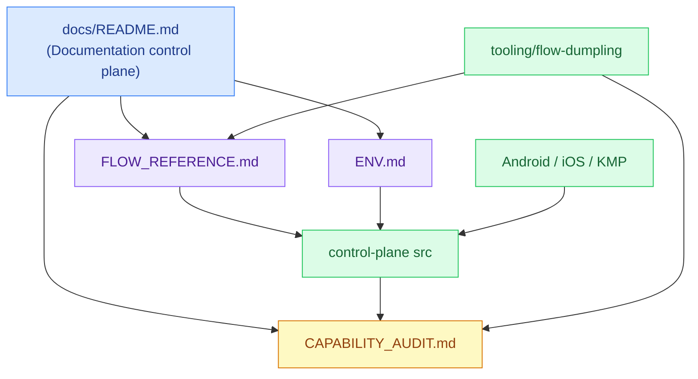
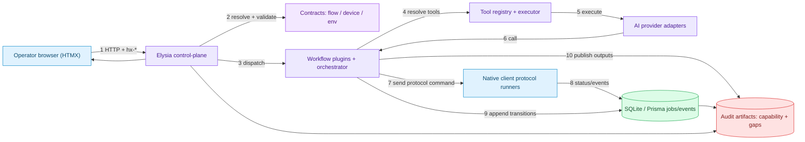
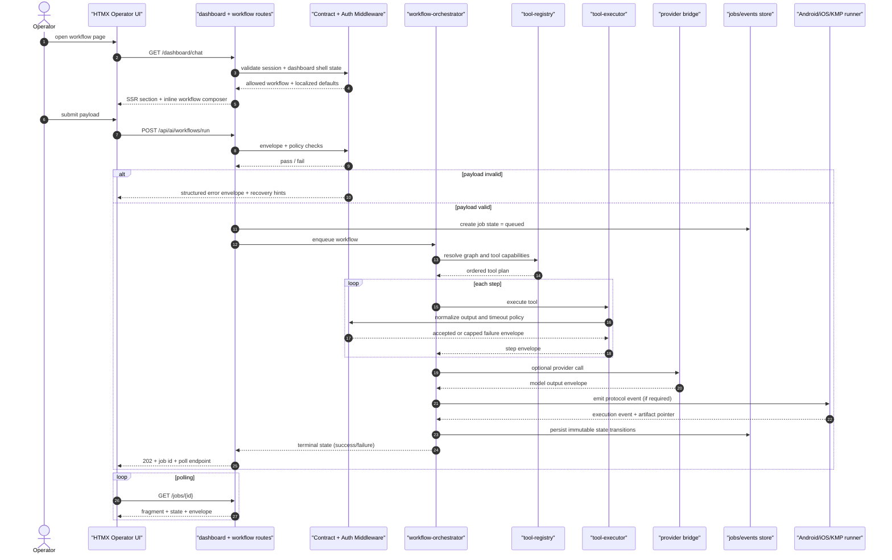
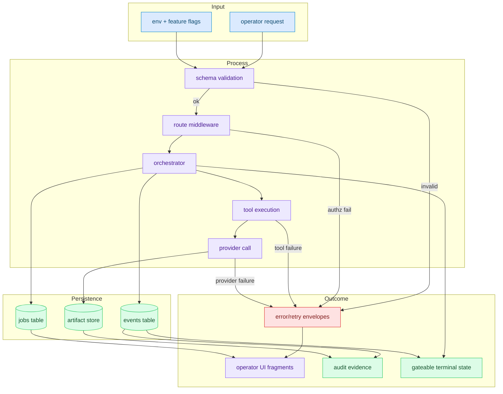
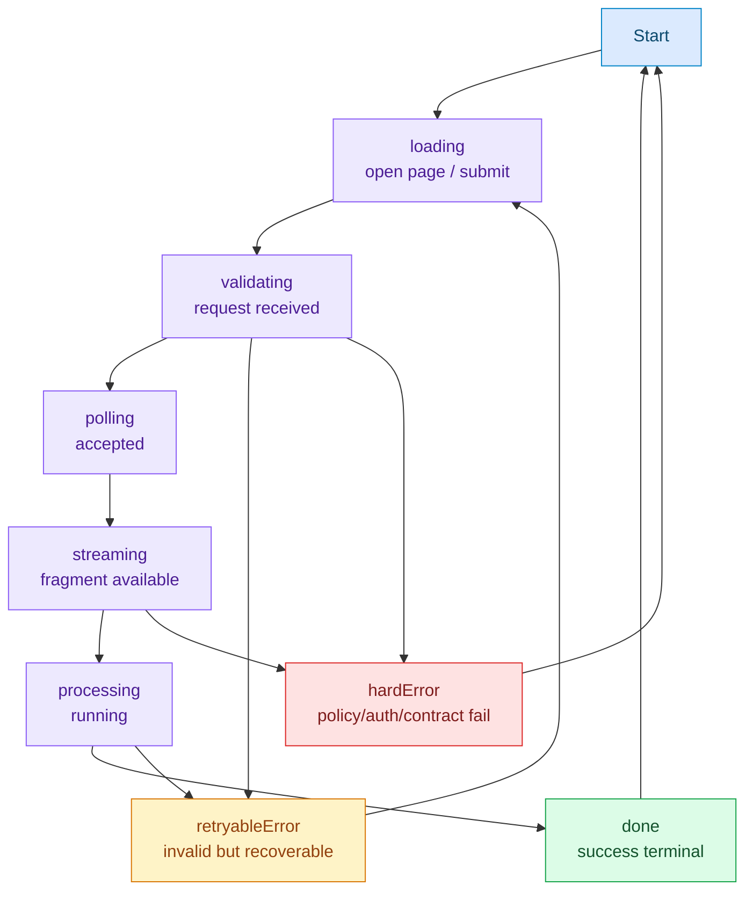

# Bao Edge Documentation Hub

[](../README.md)
[](./README.md)
[](https://mermaid.js.org/)

## Explain Like I'm Five

Imagine the goose mailroom has one wall map for every bao crate. This docs hub is that map: it points to contracts, runtime code, platform clients, and proof so changes never drift.

> 🌏 本页为中英双语。中文内容紧随对应英文段落。
> This page is bilingual. Chinese follows each English section.

This documentation hub is the **operational control plane for documentation**. It defines how the team owns, changes, and verifies the runtime. Every functional change should be traceable from this page to a contract file, a runtime location, and an evidence artifact.

<details>
<summary>中文</summary>

本页是 Bao Edge 的**文档管控中心**。它定义了团队如何管理、变更和验证运行时。每次功能变更都应当能从本页追溯到合约文件、运行时位置和证据产物。

</details>

<details>
<summary>中文</summary>

- **Picture:** 本页是 Bao Edge 的文档地图。
- **Pieces:** 它连接合约、配置、能力证据、运行时代码、CLI 工具链和原生客户端。
- **Place:** 当变更涉及文档、合约、验证证据或平台行为时，应从这里开始。
- **Proof:** 每次变更都应指向对应合约、运行时负责人和证据产物。
- **Principle:** 文档属于控制平面；这里漂移会变成运行时风险。

</details>

## Why this page exists

- The system is contract-first and evidence-based.
- Multiple runtimes share logic across control-plane, CLI, and native clients.
- Most operational risk comes from drift: contract drift, config drift, or audit debt.
- This hub gives a deterministic route so that every change is documented, validated, and linked.

<details>
<summary>中文</summary>

- 系统以合约为先、证据为本。
- 多个运行时在控制平面、CLI 和原生客户端间共享逻辑。
- 大部分运维风险来自漂移：合约漂移、配置漂移或审计欠债。
- 本文档中心提供确定性路径，确保每次变更都有文档记录、经过验证并相互关联。

</details>

## Ownership zones and authoritative sources

| Zone | Responsibility | Canonical docs |
|---|---|---|
| Control-plane runtime | SSR routes, middleware, orchestration and state mutation | `command-bao/src` |
| Workflow contracts | request/response schema, workflow grammar, provider tool shape | [`FLOW_REFERENCE.md`](FLOW_REFERENCE.md), `contracts/flow-contracts.ts` |
| Environment & policy | environment loading, precedence, allowlist policy, runtime assumptions | [`ENV.md`](ENV.md), `command-bao/src/config.ts` |
| Capability evidence | what exists, what is missing, what changed | [`CAPABILITY_AUDIT.md`](CAPABILITY_AUDIT.md), `command-bao/test` |

<details>
<summary>中文</summary>

| 区域 | 职责 | 权威文件 |
|---|---|---|
| 控制平面运行时 | SSR 路由、中间件、编排与状态变更 | `command-bao/src` |
| 工作流合约 | 请求/响应 schema、workflow 语义、Provider 工具格式 | [`FLOW_REFERENCE.md`](FLOW_REFERENCE.md)、`contracts/flow-contracts.ts` |
| 环境与策略 | 环境变量加载、优先级、allowlist 规则、运行时假设 | [`ENV.md`](ENV.md)、`command-bao/src/config.ts` |
| 能力证据 | 已有能力、缺失项、变更记录 | [`CAPABILITY_AUDIT.md`](CAPABILITY_AUDIT.md)、`command-bao/test` |

</details>

## System dependency graph



<details>
<summary>中文</summary>

依赖关系图展示了文档中心（docs/README.md）如何连接到流程参考、环境配置等合约文档，以及能力审计等证据文档。运行时代码（控制平面、CLI 工具链、原生端）依赖合约定义并产出证据。

</details>

## Installation and bootstrap playbook (recommended run order)

All setup steps are expected to be deterministic for CI/local consistency.

<details>
<summary>中文</summary>

所有安装步骤应具有确定性，以保证 CI 和本地环境一致。

</details>

### Step 0. Host prerequisites

1. Bun >= `1.3.x`
2. Git
3. SQLite CLI (for local DB inspection)
4. Optional native verification dependencies:
   - Android: Android Studio, `adb`
   - iOS: Xcode and `xcrun simctl`

```bash
bun --version
git --version
sqlite3 --version
adb --version
xcrun --find simctl
```

<details>
<summary>中文</summary>

### 步骤 0. 宿主机前置条件

1. Bun >= `1.3.x`
2. Git
3. SQLite CLI（用于本地数据库检查）
4. 可选的原生验证依赖：
   - Android：Android Studio、`adb`
   - iOS：Xcode 和 `xcrun simctl`

```bash
bun --version
git --version
sqlite3 --version
adb --version
xcrun --find simctl
```

</details>

### Step 1. Install dependencies

```bash
git clone https://github.com/d4551/baohaus.git
cd baohaus/bao-source/bao-edge
bun install
```

<details>
<summary>中文</summary>

### 步骤 1. 安装依赖

```bash
git clone https://github.com/d4551/baohaus.git
cd baohaus/bao-source/bao-edge
bun install
```

</details>

### Step 2. Configure environment

Use `.env.example` as the base and `docs/ENV.md` as the authority.

```bash
cp .env.example .env
# minimum runtime baseline
export NODE_ENV=development
export APP_URL="http://127.0.0.1:3000"
export PORT=3000
export DATABASE_URL="file:./control-plane/bao-edge.sqlite"
export BAO_EDGE_SECRET="replace-with-strong-secret"
```

<details>
<summary>中文</summary>

### 步骤 2. 环境配置

以 `.env.example` 为基础，以 `docs/ENV.md` 为权威参考。

```bash
cp .env.example .env
# minimum runtime baseline
export NODE_ENV=development
export APP_URL="http://127.0.0.1:3000"
export PORT=3000
export DATABASE_URL="file:./control-plane/bao-edge.sqlite"
export BAO_EDGE_SECRET="replace-with-strong-secret"
```

</details>

### Step 3. Control-plane readiness checks

```bash
bun run doctor
bun run bootstrap
bun run verify:all
bun run typecheck
bun run lint
```

If any of these fail, inspect the reported failing script before moving on.

<details>
<summary>中文</summary>

### 步骤 3. 控制平面就绪检查

```bash
bun run doctor
bun run bootstrap
bun run verify:all
bun run typecheck
bun run lint
```

如果任何步骤失败，先检查报告中指出的脚本再继续。

</details>

### Step 4. Start control-plane

```bash
bun run control-plane:dev
```

Open `http://127.0.0.1:3000`.

<details>
<summary>中文</summary>

### 步骤 4. 启动控制平面

```bash
bun run control-plane:dev
```

打开 `http://127.0.0.1:3000`。

</details>

### Step 5. Model and CLI gates

```bash
bun run --cwd tooling/flow-dumpling src/cli.ts verify all
bun run --cwd tooling/flow-dumpling src/cli.ts build matrix
bun run --cwd tooling/flow-dumpling src/cli.ts device-ai download-model
BAO_EDGE_VERIFY_DEVICE_AI_PROTOCOL=1 bun run --cwd tooling/flow-dumpling src/cli.ts verify all
```

<details>
<summary>中文</summary>

### 步骤 5. 模型和 CLI 门禁

```bash
bun run --cwd tooling/flow-dumpling src/cli.ts verify all
bun run --cwd tooling/flow-dumpling src/cli.ts build matrix
bun run --cwd tooling/flow-dumpling src/cli.ts device-ai download-model
BAO_EDGE_VERIFY_DEVICE_AI_PROTOCOL=1 bun run --cwd tooling/flow-dumpling src/cli.ts verify all
```

</details>

### Step 6. Evidence + verification matrix

```bash
bun run audit:code-practices
bun run audit:capability-gaps
bun run audit:device-readiness
bun run audit:version-freshness
bun run test
```

<details>
<summary>中文</summary>

### 步骤 6. 证据与验证矩阵

```bash
bun run audit:code-practices
bun run audit:capability-gaps
bun run audit:device-readiness
bun run audit:version-freshness
bun run test
```

</details>

## How the system works (architecture + runtime flow)

### High-level topology



<details>
<summary>中文</summary>

高层拓扑展示了系统的核心组件交互：操作员浏览器（HTMX）通过 HTTP + hx-* 访问 Elysia 控制平面 -> 控制平面解析并校验合约 -> 调度工作流插件和编排器 -> 解析工具注册表 -> 执行 AI Provider 适配器 -> 向原生客户端发送协议命令 -> 原生端回传状态和事件到 SQLite/Prisma -> 工作流追加状态转换 -> 产出审计产物。

</details>

### End-to-end workflow execution



<details>
<summary>中文</summary>

端到端工作流执行时序：操作员打开工作流页面 -> UI 请求 `/dashboard/chat` 获得带内联工作流编辑器的 SSR 片段 -> 中间件校验会话和仪表板状态 -> 操作员提交 payload 到 `/api/ai/workflows/run` -> 中间件进行信封+策略检查 -> 非法请求返回带恢复提示的错误信封 -> 合法请求创建 queued 状态 job -> 编排器入队 -> 解析工具图和能力 -> 逐步执行工具 -> 可选的 Provider 调用 -> 可选的原生协议事件 -> 持久化不可变状态转换 -> 返回 jobId 和轮询端点 -> UI 轮询获取状态更新。

</details>

### Data flow with state boundaries



<details>
<summary>中文</summary>

数据流与状态边界图分为四个区域：输入（操作员请求、环境变量和特性开关）-> 处理（schema 校验、路由中间件、编排器、工具执行、Provider 调用）-> 持久化（jobs 表、events 表、产物存储）-> 结果（操作员 UI 片段、审计证据、可门控的终态、错误/重试信封）。每个处理阶段的失败都会产出结构化错误信封。

</details>

### Model lifecycle and readiness pipeline

```mermaid
flowchart LR
  classDef policy fill:#dbeafe,stroke:#0284c7,color:#0c4a6e
  classDef pipeline fill:#fef3c7,stroke:#d97706,color:#92400e
  classDef state fill:#dcfce7,stroke:#16a34a,color:#14532d

  source["manifest + allowlist files"]:::policy
  cliPull["tooling/flow-dumpling device-ai download-model"]:::pipeline
  pullAPI["/api/models/pull"]:::pipeline
  pullJob["/api/models/pull/:jobId"]:::pipeline
  smoke["smoke and protocol readiness"]:::pipeline
  publish["control-plane model registry"]:::state

  source --> cliPull
  cliPull --> pullAPI
  pullAPI --> pullJob
  pullJob --> smoke
  smoke --> publish
```



<details>
<summary>中文</summary>

模型生命周期与就绪流水线：清单+白名单文件 -> flow-dumpling CLI 下载模型 -> `/api/models/pull` 接口 -> 通过 jobId 跟踪进度 -> 冒烟测试和协议就绪检查 -> 控制平面模型注册。

</details>

## Error model and API state machine



<details>
<summary>中文</summary>

错误模型与 API 状态机：开始 -> 加载中（打开页面/提交）-> 验证中（收到请求）-> 轮询中（已接受）或可重试错误（无效但可恢复）或硬错误（策略/鉴权/合约失败）-> 流式更新（片段可用）-> 处理中（运行中）-> 完成（成功终态）。可重试错误回到加载中；硬错误回到开始；成功回到开始。

</details>

## Change procedures (route change / workflow change / tooling change)

### If workflow contract changes

1. Update `FLOW_REFERENCE.md` first.
2. Update shared contracts and validators under `contracts/` and `command-bao/src`.
3. Add/adjust corresponding fixtures and examples.
4. Run gates:
   - `bun run verify:all`
   - `bun run audit:capability-gaps`
   - `bun run audit:code-practices`

### If native protocol behavior changes

1. Re-run protocol verification and readiness checks.

```bash
bun run audit:device-readiness
bun run --cwd tooling/flow-dumpling src/cli.ts verify all
```

<details>
<summary>中文</summary>

### 当工作流合约变更时

1. 先更新 `FLOW_REFERENCE.md`。
2. 更新 `contracts/` 和 `command-bao/src` 下的共享合约与校验器。
3. 添加或调整对应的 fixture 和示例。
4. 运行门禁：
   - `bun run verify:all`
   - `bun run audit:capability-gaps`
   - `bun run audit:code-practices`

### 当原生协议行为变更时

1. 重新运行协议验证和就绪检查。

```bash
bun run audit:device-readiness
bun run --cwd tooling/flow-dumpling src/cli.ts verify all
```

</details>

## Canonical references

- [`FLOW_REFERENCE.md`](FLOW_REFERENCE.md)
- [`ENV.md`](ENV.md)
- [`CAPABILITY_AUDIT.md`](CAPABILITY_AUDIT.md)
- [`../DEVELOPMENT.md`](../DEVELOPMENT.md)

<details>
<summary>中文</summary>

- [`FLOW_REFERENCE.md`](FLOW_REFERENCE.md) — 流程参考
- [`ENV.md`](ENV.md) — 环境变量
- [`CAPABILITY_AUDIT.md`](CAPABILITY_AUDIT.md) — 能力审计
- [`../DEVELOPMENT.md`](../DEVELOPMENT.md) — 开发指南

</details>

Last updated: 2026-03-10
