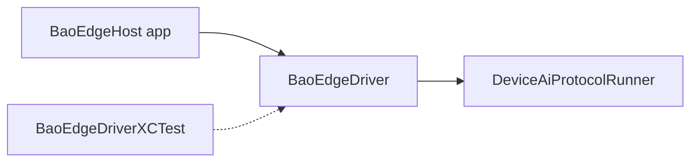

# Bao Edge iOS Host

> 🌏 本页为中英双语。中文内容紧随对应英文段落。
> This page is bilingual. Chinese follows each English section.

Chat-first Bao Edge operator host built with SwiftUI and XCTest-backed runtime validation.

<details>
<summary>中文</summary>

基于 SwiftUI 构建的聊天优先 Bao Edge 操作员宿主应用，通过 XCTest 进行运行时验证。

</details>

<details>
<summary>中文</summary>

- **Picture:** iOS 是 Bao Edge 的 Apple 侧操作员外壳。
- **Pieces:** 它承载 SwiftUI 界面、driver 接线、XCTest 自动化和设备协议检查。
- **Place:** 它运行在 macOS/Xcode 环境，并与 Linux/Windows 的共享验证路径分开。
- **Proof:** `swift test`、模拟器启动和 XCUITest 流程验证应用外壳。
- **Principle:** XCTest 支持应留在测试/driver 代码中，不应泄漏到生产应用产物。

</details>

## Host requirements

- iOS builds require macOS with Xcode installed.
- Linux and Windows hosts cannot produce native iOS app binaries; use the shared repo verification path there and rely on the macOS CI/device protocol gate for Apple-platform validation.

<details>
<summary>中文</summary>

- iOS 构建需要安装了 Xcode 的 macOS。
- Linux 和 Windows 宿主机无法生成原生 iOS 应用二进制文件；这些平台请使用仓库的共享验证路径，并依赖 macOS CI/设备协议门禁来完成 Apple 平台验证。

</details>

## Build and test

```bash
cd iOS/BaoEdge
swift test
```

<details>
<summary>中文</summary>

```bash
cd iOS/BaoEdge
swift test
```

</details>

## Xcode workspace

Open the checked-in host app workspace to run on simulator/device and attach XCUITest flows.

```bash
open BaoEdge.xcworkspace
```

For deterministic simulator audits of the top-level operator tabs, launch the host app with
`SIMCTL_CHILD_BAO_EDGE_OPERATOR_INITIAL_AREA` set to one of `chat`, `automations`, `models`, or
`settings` before `xcrun simctl launch`.

<details>
<summary>中文</summary>

打开已提交的宿主应用 workspace，在模拟器/设备上运行并附加 XCUITest 流程。

```bash
open BaoEdge.xcworkspace
```

要对顶层操作员 Tab 进行确定性的模拟器审计，在 `xcrun simctl launch` 前将 `SIMCTL_CHILD_BAO_EDGE_OPERATOR_INITIAL_AREA` 设为 `chat`、`automations`、`models` 或 `settings` 之一。

</details>

## Architecture



The checked-in `BaoEdgeHost` app target is the runnable shell used by `flow-dumpling build ios`.
The production app bundle links `BaoEdgeDriver` only. The XCUITest-backed automation
implementation lives in `Sources/BaoEdgeDriverXCTest/IosXcTestDriver.swift` so XCTest
does not leak into generated iOS application artifacts.

<details>
<summary>中文</summary>

生成的 `BaoEdgeHost` 应用目标是 `flow-dumpling build ios` 使用的可运行外壳。生产应用包仅链接 `BaoEdgeDriver`。XCUITest 自动化实现位于 `Sources/BaoEdgeDriverXCTest/IosXcTestDriver.swift`，确保 XCTest 不会泄漏到生成的 iOS 应用产物中。

</details>

## Quick start

1. Confirm prerequisites (Xcode, Swift, Ruby).
2. Run `swift test`.
3. Generate the `BaoEdgeHost` workspace and open it.
4. Launch the desired operator tab (`chat` / `automations` / `models` / `settings`) for verification.

<details>
<summary>中文</summary>

1. 确认前置条件（Xcode、Swift、Ruby）。
2. 运行 `swift test`。
3. 生成 `BaoEdgeHost` workspace 并打开。
4. 启动所需的操作员 Tab（`chat` / `automations` / `models` / `settings`）进行验证。

</details>
