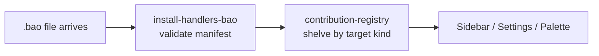

<!-- BEGIN BAOHAUS README HEADER -->
# @baohaus/bao-install-handlers-bao

[](../../README.md)
[](https://bun.sh)
[](https://www.typescriptlang.org/)
[](./package.json)

## Explain Like I'm Five

This crate is the mailroom's unboxing station. When a new crate arrives, the goose checks the packing slip, opens the lid, and shelves it properly.

## Architecture



## Scope

| In scope | Dependencies | Out of scope |
| --- | --- | --- |
| Canonical Class A install-target handler implementations + asset-pack registry. | @baohaus/bao-schemas; @baohaus/bao-sdk; @baohaus/bao-types; @baohaus/bao-utils; @baohaus/baobox; @baohaus/contribution-registry-bao | Other .bao crate domains; bao-runtime host lifecycle |
<!-- END BAOHAUS README HEADER -->

<!-- BEGIN BAOHAUS PACKAGE CARD -->
# @baohaus/bao-install-handlers-bao

Canonical Class A install-target handler implementations + asset-pack registry. Generic-runtime install handlers that depend only on @baohaus/bao-sdk + @baohaus/bao-schemas + @baohaus/contribution-registry-bao surfaces. Per-app handlers (Class B) stay in their consuming app. Resolves the previously-duplicated handler interfaces across registry, bao-runtime, forge, .bao AI Gateway.

Source at `bao-source/bao-install-handlers-bao`.

## Public Pieces

`./api-group`, `./asset-pack-kinds`, `./asset-pack-registry`, `./density-preset`, `./design-tokens`, `./htmx-extension`, `./motion-preset`, `./native-mobile-shell`, `./native-mobile-shell-registry`, `./palette-entry-group`, `./registry-factory`, `./settings-tab`, `./sidebar`, `./theme-pack`, `./tile-group`, `./topbar`, `./ui-component-kit`

## Proof Commands

Run from `bao-source/bao-install-handlers-bao`:

- `bun run typecheck`
- `bun run test`
- `bun run lint`
<!-- END BAOHAUS PACKAGE CARD -->

<!-- BEGIN BAOHAUS PACKAGE MANUAL -->
## Quick start

From `bao-source/bao-install-handlers-bao`:

```bash
bun install
bun run typecheck
bun run test
bun run build
bun run lint
bun run bao:build
bun run bao:validate
bun run verify
```

## Capability

Canonical Class A install-target handler implementations + asset-pack registry. Generic-runtime install handlers that depend only on @baohaus/bao-sdk + @baohaus/bao-schemas + @baohaus/contribution-registry-bao surfaces. Per-app handlers (Class B) stay in their consuming app. Resolves the previously-duplicated handler interfaces across registry, bao-runtime, forge, .bao AI Gateway.

## Integration

Source lives at `bao-source/bao-install-handlers-bao`. Import through the package exports; do not deep-link into `dist/` or private paths.

## Registry

Catalog id `bao-install-handlers-bao` publishes to `baohaus/bao-install-handlers-bao`.

## Subpaths

| Subpath | Purpose |
| --- | --- |
| `./api-group` | Api group — typed surface from this .bao crate |
| `./asset-pack-kinds` | Asset pack kinds — typed surface from this .bao crate |
| `./asset-pack-registry` | Asset pack registry — typed surface from this .bao crate |
| `./density-preset` | Density preset — typed surface from this .bao crate |
| `./design-tokens` | Design tokens — typed surface from this .bao crate |
| `./htmx-extension` | Htmx extension — typed surface from this .bao crate |
| `./motion-preset` | Motion preset — typed surface from this .bao crate |
| `./palette-entry-group` | Palette entry group — host UI registration surface |
| `./registry-factory` | Registry factory — typed surface from this .bao crate |
| `./settings-tab` | Settings tab — host UI registration surface |
| `./sidebar` | Sidebar — host UI registration surface |
| `./theme-pack` | Theme pack — typed surface from this .bao crate |
| _…_ | _2 more export(s) in package.json_ |

## Reference

### Subpaths

| Subpath | Purpose |
| --- | --- |
| `./api-group` | Api group — typed surface from this .bao crate |
| `./asset-pack-kinds` | Asset pack kinds — typed surface from this .bao crate |
| `./asset-pack-registry` | Asset pack registry — typed surface from this .bao crate |
| `./density-preset` | Density preset — typed surface from this .bao crate |
| `./design-tokens` | Design tokens — typed surface from this .bao crate |
| `./htmx-extension` | Htmx extension — typed surface from this .bao crate |
| `./motion-preset` | Motion preset — typed surface from this .bao crate |
| `./palette-entry-group` | Palette entry group — host UI registration surface |
| `./registry-factory` | Registry factory — typed surface from this .bao crate |
| `./settings-tab` | Settings tab — host UI registration surface |
| `./sidebar` | Sidebar — host UI registration surface |
| `./theme-pack` | Theme pack — typed surface from this .bao crate |
| _…_ | _2 more in `package.json#exports`_ |
<!-- END BAOHAUS PACKAGE MANUAL -->
