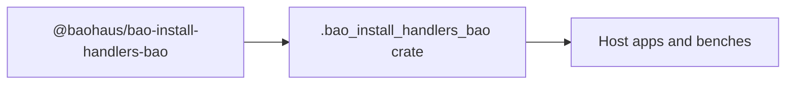

<!-- BEGIN BAOHAUS README HEADER -->
# @baohaus/bao-install-handlers-bao

## Explain Like I'm Five

Canonical Class A install-target handler implementations + asset-pack registry. Generic-runtime install handlers that depend only on @baohaus/bao-sdk + @baohaus/bao-schemas + @baohaus/contribution-registry-bao surfaces. Import subpaths like `./api-group`, `./asset-pack-kinds`, `./asset-pack-registry`, `./density-preset` when you wire this crate in.

## Architecture



## Scope

| In scope | Dependencies | Out of scope |
| --- | --- | --- |
| Canonical Class A install-target handler implementations + asset-pack registry. | @baohaus/bao-schemas; @baohaus/bao-sdk; @baohaus/bao-types; @baohaus/bao-utils; @baohaus/baobox; @baohaus/contribution-registry-bao | Other workbench domains; bao-runtime host lifecycle |
<!-- END BAOHAUS README HEADER -->

<!-- BEGIN BAOHAUS PACKAGE CARD -->
# @baohaus/bao-install-handlers-bao

Standalone Baohaus package. Catalog identity `bao-install-handlers-bao`. Source at `bao-source/bao-install-handlers-bao`. Publishes to `baohaus/bao-install-handlers-bao`. Canonical archive: `bao-source/bao-install-handlers-bao/dist/bao/bao-install-handlers-bao.bao`.

Cross-app contract and the full principles list live at the repo-root [README](../../README.md#principles).

## Package Facts

| Field | Value |
| --- | --- |
| Package | `@baohaus/bao-install-handlers-bao` |
| Catalog id | `bao-install-handlers-bao` |
| Source path | `bao-source/bao-install-handlers-bao` |
| OCI repository | `baohaus/bao-install-handlers-bao` |
| Channel | `public` |
| Visibility | `public` |
| Kind | `library` |
| Runtime installable | `yes` |
| Publish gate | `standard` |

## Public Pieces

`./api-group`, `./asset-pack-kinds`, `./asset-pack-registry`, `./density-preset`, `./design-tokens`, `./htmx-extension`, `./motion-preset`, `./palette-entry-group`, `./registry-factory`, `./settings-tab`, `./sidebar`, `./theme-pack`, `./tile-group`, `./ui-component-kit`.

## Proof Commands

Run from `bao-source/bao-install-handlers-bao`:

- `bun run build`
- `bun run typecheck`
- `bun run test`
- `bun run lint`
- `bun run bao:build`
- `bun run bao:validate`
- `bun run verify`

## Publishing Path

`@baohaus/bao-install-handlers-bao` publishes to `baohaus/bao-install-handlers-bao` through the canonical `.bao` registry distribution path. Local overrides are development-only; installable content resolves through the registry and the checked catalog/governance/lock path.
<!-- END BAOHAUS PACKAGE CARD -->

<!-- BEGIN BAOHAUS PACKAGE MANUAL -->
## Quick start

From `bao-source/bao-install-handlers-bao`:

```bash
bun install
bun run typecheck
bun run test
bun run build
bun run lint
bun run bao:build
bun run bao:validate
bun run verify
```

## Capability

Canonical Class A install-target handler implementations + asset-pack registry. Generic-runtime install handlers that depend only on @baohaus/bao-sdk + @baohaus/bao-schemas + @baohaus/contribution-registry-bao surfaces. Per-app handlers (Class B) stay in their consuming app. Resolves the previously-duplicated handler interfaces across registry, bao-runtime, forge, .bao AI Gateway.

## Integration

Source lives at `bao-source/bao-install-handlers-bao`. Import through the package exports; do not deep-link into `dist/` or private paths.

## Registry

Catalog id `bao-install-handlers-bao` publishes to `baohaus/bao-install-handlers-bao`.

## Subpaths

| Subpath | Purpose |
| --- | --- |
| `./api-group` | Api group — typed surface from this workbench |
| `./asset-pack-kinds` | Asset pack kinds — typed surface from this workbench |
| `./asset-pack-registry` | Asset pack registry — typed surface from this workbench |
| `./density-preset` | Density preset — typed surface from this workbench |
| `./design-tokens` | Design tokens — typed surface from this workbench |
| `./htmx-extension` | Htmx extension — typed surface from this workbench |
| `./motion-preset` | Motion preset — typed surface from this workbench |
| `./palette-entry-group` | Palette entry group — host UI registration surface |
| `./registry-factory` | Registry factory — typed surface from this workbench |
| `./settings-tab` | Settings tab — host UI registration surface |
| `./sidebar` | Sidebar — host UI registration surface |
| `./theme-pack` | Theme pack — typed surface from this workbench |
| _…_ | _2 more export(s) in package.json_ |

## Reference

### Subpaths

| Subpath | Purpose |
| --- | --- |
| `./api-group` | Api group — typed surface from this workbench |
| `./asset-pack-kinds` | Asset pack kinds — typed surface from this workbench |
| `./asset-pack-registry` | Asset pack registry — typed surface from this workbench |
| `./density-preset` | Density preset — typed surface from this workbench |
| `./design-tokens` | Design tokens — typed surface from this workbench |
| `./htmx-extension` | Htmx extension — typed surface from this workbench |
| `./motion-preset` | Motion preset — typed surface from this workbench |
| `./palette-entry-group` | Palette entry group — host UI registration surface |
| `./registry-factory` | Registry factory — typed surface from this workbench |
| `./settings-tab` | Settings tab — host UI registration surface |
| `./sidebar` | Sidebar — host UI registration surface |
| `./theme-pack` | Theme pack — typed surface from this workbench |
| _…_ | _2 more in `package.json#exports`_ |
<!-- END BAOHAUS PACKAGE MANUAL -->
