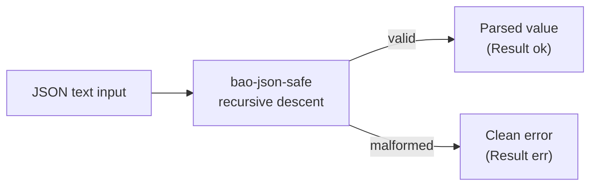

<!-- BEGIN BAOHAUS README HEADER -->
# @baohaus/bao-json-safe

[](../../README.md)
[](https://bun.sh)
[](https://www.typescriptlang.org/)
[](./package.json)

## Explain Like I'm Five

This crate is the mailroom's careful letter opener. It reads JSON notes without ever panicking -- if a note is crumpled, it just says "nope" instead of dropping everything.

## Architecture



## Scope

| In scope | Dependencies | Out of scope |
| --- | --- | --- |
| Non-throwing JSON parser.; Exported API: isPlainObject, parseJsonObjectFromText, parseJsonSafe, parseJsonTextToValue, readStringField, … | Shared @baohaus contracts | Other .bao crate domains; bao-runtime host lifecycle |
<!-- END BAOHAUS README HEADER -->

<!-- BEGIN BAOHAUS PACKAGE CARD -->
# @baohaus/bao-json-safe

Non-throwing JSON parser. Pure-TS recursive descent. Returns Result envelopes — no exceptions.

Source at `bao-source/bao-json-safe`.

## Public Pieces

`.`, `./json-helpers`, `./package-descriptor`, `./parse`

## Proof Commands

Run from `bao-source/bao-json-safe`:

- `bun run typecheck`
- `bun run test`
- `bun run lint`
<!-- END BAOHAUS PACKAGE CARD -->

<!-- BEGIN BAOHAUS PACKAGE MANUAL -->
## Quick start

From `bao-source/bao-json-safe`:

```bash
bun install
bun run typecheck
bun run test
bun run build
bun run lint
bun run bao:build
bun run bao:validate
bun run verify
```

## Capability

Non-throwing JSON parser. Pure-TS recursive descent. Returns Result envelopes — no exceptions.

## Subpaths

| Subpath | Purpose |
| --- | --- |
| `./package-descriptor` | Package descriptor — typed surface from this .bao crate |
| `./parse` | Parse — typed surface from this .bao crate |

## Primary symbols

- `isPlainObject`
- `parseJsonObjectFromText`
- `parseJsonSafe`
- `parseJsonTextToValue`
- `readStringField`
- `settle`
- `type JsonObject`
- `type JsonValue`
- `type ParseOutcome`
- `type Settled`

## Integration

Source: `bao-source/bao-json-safe` (`src/index.ts`). Import published subpaths only; do not deep-link into `dist/`.

## Registry

Catalog id `bao-json-safe` → OCI `baohaus/bao-json-safe`.

## Reference

### Subpaths

| Subpath | Purpose |
| --- | --- |
| `./package-descriptor` | Package descriptor — typed surface from this .bao crate |
| `./parse` | Parse — typed surface from this .bao crate |

### Symbols

- `isPlainObject`
- `parseJsonObjectFromText`
- `parseJsonSafe`
- `parseJsonTextToValue`
- `readStringField`
- `settle`
- `type JsonObject`
- `type JsonValue`
- `type ParseOutcome`
- `type Settled`
<!-- END BAOHAUS PACKAGE MANUAL -->
