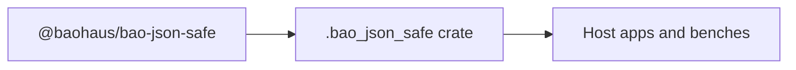

<!-- BEGIN BAOHAUS README HEADER -->
# @baohaus/bao-json-safe

## Explain Like I'm Five

Non-throwing JSON parser. Pure-TS recursive descent. Apps use exports such as `isPlainObject`, `parseJsonObjectFromText`, `parseJsonSafe` from `@baohaus/bao-json-safe`.

## Architecture



## Scope

| In scope | Dependencies | Out of scope |
| --- | --- | --- |
| Non-throwing JSON parser.; Exported API: isPlainObject, parseJsonObjectFromText, parseJsonSafe, parseJsonTextToValue, readStringField, … | bao-governance.json; bao.lock; catalog row | Other workbench domains; bao-runtime host lifecycle |
<!-- END BAOHAUS README HEADER -->

<!-- BEGIN BAOHAUS PACKAGE CARD -->
# @baohaus/bao-json-safe

Standalone Baohaus package. Catalog identity `bao-json-safe`. Source at `bao-source/bao-json-safe`. Publishes to `baohaus/bao-json-safe`. Canonical archive: `bao-source/bao-json-safe/dist/bao/bao-json-safe.bao`.

Cross-app contract and the full principles list live at the repo-root [README](../../README.md#principles).

## Package Facts

| Field | Value |
| --- | --- |
| Package | `@baohaus/bao-json-safe` |
| Catalog id | `bao-json-safe` |
| Source path | `bao-source/bao-json-safe` |
| OCI repository | `baohaus/bao-json-safe` |
| Channel | `public` |
| Visibility | `public` |
| Kind | `library` |
| Runtime installable | `yes` |
| Publish gate | `standard` |

## Public Pieces

`./package-descriptor`, `./parse`.

## Proof Commands

Run from `bao-source/bao-json-safe`:

- `bun run build`
- `bun run typecheck`
- `bun run test`
- `bun run lint`
- `bun run bao:build`
- `bun run bao:validate`
- `bun run verify`

## Publishing Path

`@baohaus/bao-json-safe` publishes to `baohaus/bao-json-safe` through the canonical `.bao` registry distribution path. Local overrides are development-only; installable content resolves through the registry and the checked catalog/governance/lock path.
<!-- END BAOHAUS PACKAGE CARD -->

<!-- BEGIN BAOHAUS PACKAGE MANUAL -->
## Quick start

From `bao-source/bao-json-safe`:

```bash
bun install
bun run typecheck
bun run test
bun run build
bun run lint
bun run bao:build
bun run bao:validate
bun run verify
```

## Capability

Non-throwing JSON parser. Pure-TS recursive descent. Returns Result envelopes — no exceptions.

## Subpaths

| Subpath | Purpose |
| --- | --- |
| `./package-descriptor` | Package descriptor — typed surface from this workbench |
| `./parse` | Parse — typed surface from this workbench |

## Primary symbols

- `isPlainObject`
- `parseJsonObjectFromText`
- `parseJsonSafe`
- `parseJsonTextToValue`
- `readStringField`
- `settle`
- `type JsonObject`
- `type JsonValue`
- `type ParseOutcome`
- `type Settled`

## Integration

Source: `bao-source/bao-json-safe` (`src/index.ts`). Import published subpaths only; do not deep-link into `dist/`.

## Registry

Catalog id `bao-json-safe` → OCI `baohaus/bao-json-safe`.

## Reference

### Subpaths

| Subpath | Purpose |
| --- | --- |
| `./package-descriptor` | Package descriptor — typed surface from this workbench |
| `./parse` | Parse — typed surface from this workbench |

### Symbols

- `isPlainObject`
- `parseJsonObjectFromText`
- `parseJsonSafe`
- `parseJsonTextToValue`
- `readStringField`
- `settle`
- `type JsonObject`
- `type JsonValue`
- `type ParseOutcome`
- `type Settled`
<!-- END BAOHAUS PACKAGE MANUAL -->
