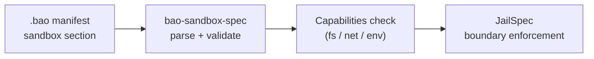

<!-- BEGIN BAOHAUS README HEADER -->
# @baohaus/bao-sandbox-spec

[](../../README.md)
[](https://bun.sh)
[](https://www.typescriptlang.org/)
[](./package.json)

## Explain Like I'm Five

This crate is the mailroom's safety manual. It writes down exactly what each crate is allowed to touch so nothing escapes its play area.

## Architecture



## Scope

| In scope | Dependencies | Out of scope |
| --- | --- | --- |
| Canonical . | @baohaus/bao-bpf; @baohaus/bao-cgroup; @baohaus/bao-constants; @baohaus/bao-landlock | Other .bao crate domains; bao-runtime host lifecycle |
<!-- END BAOHAUS README HEADER -->

<!-- BEGIN BAOHAUS PACKAGE CARD -->
# @baohaus/bao-sandbox-spec

Canonical .bao sandbox manifest schema, TypeScript shape, and validator → JailSpec compiler.

Source at `bao-source/bao-sandbox-spec`.

## Public Pieces

`./canonical-json`, `./capabilities`, `./cluster`, `./compile`, `./computer-use`, `./event-bus`, `./events`, `./grant-signer`, `./grants`, `./matrix`, `./negotiate`, `./package-descriptor`, `./resources`, `./scheduler`, `./schema`, `./usage`, `./validate`, `./wire-resize`

## Proof Commands

Run from `bao-source/bao-sandbox-spec`:

- `bun run typecheck`
- `bun run test`
- `bun run lint`
<!-- END BAOHAUS PACKAGE CARD -->

<!-- BEGIN BAOHAUS PACKAGE MANUAL -->
## Quick start

From `bao-source/bao-sandbox-spec`:

```bash
bun install
bun run typecheck
bun run test
bun run build
bun run lint
bun run bao:build
bun run bao:validate
bun run verify
```

## Capability

Canonical .bao sandbox manifest schema, TypeScript shape, and validator → JailSpec compiler.

## Subpaths

| Subpath | Purpose |
| --- | --- |
| `./canonical-json` | Canonical json — typed surface from this .bao crate |
| `./capabilities` | Capabilities — typed surface from this .bao crate |
| `./cluster` | Cluster — typed surface from this .bao crate |
| `./compile` | Compile — typed surface from this .bao crate |
| `./computer-use` | Computer use — typed surface from this .bao crate |
| `./event-bus` | Event bus — typed surface from this .bao crate |
| `./events` | Events — typed surface from this .bao crate |
| `./grant-signer` | Grant signer — typed surface from this .bao crate |
| `./grants` | Grants — typed surface from this .bao crate |
| `./matrix` | Matrix — typed surface from this .bao crate |
| `./negotiate` | Negotiate — typed surface from this .bao crate |
| `./package-descriptor` | Package descriptor — typed surface from this .bao crate |
| _…_ | _6 more export(s) in package.json_ |

## Integration

Source: `bao-source/bao-sandbox-spec`. Import published subpaths only; do not deep-link into `dist/`.

## Registry

Catalog id `bao-sandbox-spec` → OCI `baohaus/bao-sandbox-spec`.

## Reference

### Subpaths

| Subpath | Purpose |
| --- | --- |
| `./canonical-json` | Canonical json — typed surface from this .bao crate |
| `./capabilities` | Capabilities — typed surface from this .bao crate |
| `./cluster` | Cluster — typed surface from this .bao crate |
| `./compile` | Compile — typed surface from this .bao crate |
| `./computer-use` | Computer use — typed surface from this .bao crate |
| `./event-bus` | Event bus — typed surface from this .bao crate |
| `./events` | Events — typed surface from this .bao crate |
| `./grant-signer` | Grant signer — typed surface from this .bao crate |
| `./grants` | Grants — typed surface from this .bao crate |
| `./matrix` | Matrix — typed surface from this .bao crate |
| `./negotiate` | Negotiate — typed surface from this .bao crate |
| `./package-descriptor` | Package descriptor — typed surface from this .bao crate |
| _…_ | _6 more in `package.json#exports`_ |
<!-- END BAOHAUS PACKAGE MANUAL -->
