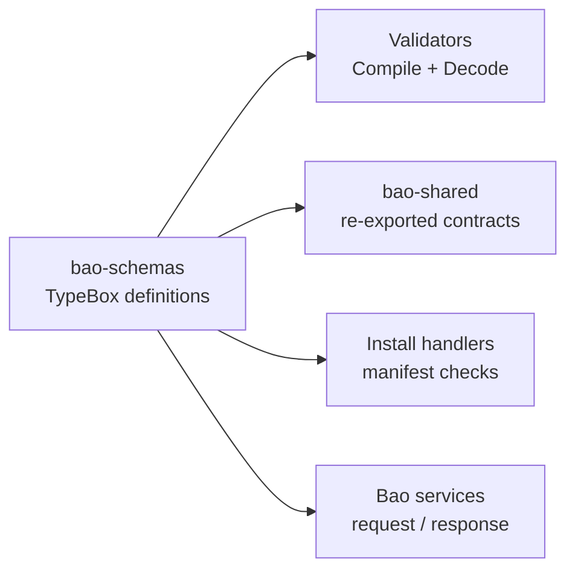

<!-- BEGIN BAOHAUS README HEADER -->
# @baohaus/bao-schemas

[](../../README.md)
[](https://bun.sh)
[](https://www.typescriptlang.org/)
[](./package.json)

## Explain Like I'm Five

This crate is the mailroom's stencil vault. Every JSON shape is cut here as a stencil, and validators trace these outlines so bad data never rides in the wrong crate.

## Architecture



## Scope

| In scope | Dependencies | Out of scope |
| --- | --- | --- |
| TypeBox/JSON schemas; Compile helpers for boundaries | Spec revisions from bao kit | HTTP handlers; Database migrations |
<!-- END BAOHAUS README HEADER -->

<!-- BEGIN BAOHAUS PACKAGE CARD -->
# @baohaus/bao-schemas

Standalone package in the Baohaus monorepo.

Source at `bao-source/bao-schemas`.

## Public Pieces

`.`, `./admin.schemas`, `./ai-device-assist-config.schemas`, `./ai-device-assist.schemas`, `./ai-embeddings.schemas`, `./ai-gateway.schemas`, `./ai-provider-health.schemas`, `./ai-provider.schemas`, `./ai-service-alignment.schemas`, `./ai-text.schemas`, `./annotation-alignment.schemas`, `./annotation-auto-ingest.schemas`, `./api-response.schemas`, `./app-config.schemas`, `./auth-sso.schemas`, `./autonomy-integration.schemas`, `./autopilot.schemas`, `./bao-archive-authoring-profile.schemas`, `./bao-archive-authoring.schemas`, `./bao-authz.schemas`, `./bao-control-plane-config.contract.schemas`, `./bao-ecosystem`, `./bao-install-primitives.schemas`, `./bao-install-sections.schemas`, `./bao-install/artifact.schemas`, `./bao-install/core.schemas`, `./bao-install/manifest-checksum`, `./bao-install/manifest.schemas`, `./bao-install/requests.schemas`, `./bao-install/runtime.schemas`, `./bao-install/source-resolution.schemas`, `./bao-install/targets.schemas`, `./bao-lock.schemas`, `./bao-observability.schemas`, `./bao-runtime-workload.schemas`, `./bao-runtime.schemas`, `./bao-status`, `./bao-target-payload-common.schemas`, `./bao-target-payload-distribution.schemas`, `./bao-target-payload-extension.schemas`, `./bao-target-payload-platform.schemas`, `./bao-target-payloads.schemas`, `./bao/bao-archive.contract`, `./baobox-enum`, `./baodown/baodown-flow.schemas`, `./baodown/baodown-graph-contract`, `./baodown/baodown-node-catalog.schemas`, `./baodown/baodown-pg-notify.schemas`, `./baodown/baodown-redis-notify.schemas`, `./basler-bunbuddy.schemas`, `./ble.schemas`, `./brand-tokens.schemas`, `./bunbuddy-capabilities-config.schemas`, `./bunbuddy-capability-snapshot.schemas`, `./bunbuddy-contracts.schemas`, `./bunbuddy-proxy.schemas`, `./bunbuddy-routing.schemas`, `./bunbuddy-runtime.schemas`, `./bunbuddy.schemas`, `./calibration.schemas`, `./capability-domain-map-api-config.schemas`, `./capability-domain-map-config.schemas`, `./capability-domain-map.schemas`, `./capability-impact.schemas`, `./capability-ownership-config.schemas`, `./capability-ownership.schemas`, `./capability-ownership/category`, `./capability-ownership/coverage`, `./capability-ownership/coverage-map`, `./capability-ownership/domain`, `./capability-ownership/entry`, `./capability-ownership/enums`, `./capability-ownership/errors`, `./capability-ownership/focus`, `./capability-ownership/group`, `./capability-ownership/highlights`, `./capability-ownership/matrix`, `./capability-ownership/mcp-surface`, `./capability-ownership/metadata`, `./capability-ownership/owner-map`, `./capability-ownership/requests`, `./capability-ownership/responses`, `./capability-ownership/segment`, `./capability-ownership/source`, `./capability-ownership/stack`, `./capability-ownership/stack-entry`, `./capability-ownership/summary`, `./capability-ownership/surface`, `./capability-portfolio.schemas`, `./capability-registry.schemas`, `./case-dashboard.schemas`, `./case.schemas`, `./chat-stream.schemas`, `./chat.schemas`, `./client-telemetry.schemas`, `./common.schemas`, `./deployment.schemas`, `./device-assignment.schemas`, `./device-diagnostics.schemas`, `./device-imager.schemas`, `./device-inventory.schemas`, `./device-lifecycle.schemas`, `./device.schemas`, `./devices-detect.schemas`, `./devices-list.schemas`, `./devices-status.schemas`, `./dicom.schemas`, `./download-config.schemas`, `./driver-registry-allowlist.schemas`, `./driver-registry.schemas`, `./drone-capability.schemas`, `./drone-history.schemas`, `./drone-mission-planner.schemas`, `./drone-ops.schemas`, `./drone-realtime.schemas`, `./drone-summary.schemas`, `./drone-training-integration.schemas`, `./fleet-alerts.schemas`, `./fleet-events.schemas`, `./fleet.schemas`, `./generated/bunbuddy-kinds.generated`, `./geospatial.schemas`, `./hardware-command.schemas`, `./hardware-config.schemas`, `./hardware-integration.schemas`, `./hardware-policy.schemas`, `./hardware-sensor.schemas`, `./hardware-state-event.schemas`, `./hardware-summary.schemas`, `./health.schemas`, `./i18n.schemas`, `./imager-arducam.schemas`, `./imager-asset.schemas`, `./imager-calibration.schemas`, `./imager-capture.schemas`, `./imager-preprocess.schemas`, `./imager-quality.schemas`, `./imager-source.schemas`, `./imager-status.schemas`, `./infrastructure-health.schemas`, `./integration-annotations.schemas`, `./integration-ownership.schemas`, `./json.schemas`, `./library-registry.schemas`, `./mavlink.schemas`, `./mcp-host-config.schemas`, `./mcp-runtime.schemas`, `./mcp.schemas`, `./minio.schemas`, `./navigation.schemas`, `./network-discovery.schemas`, `./nim.schemas`, `./onnx-integration.schemas`, `./onnx.schemas`, `./operations-packages.schemas`, `./orchestration.schemas`, `./perception.schemas`, `./platform-runtime.schemas`, `./plugin-contract.schemas`, `./pointcloud-artifact.schemas`, `./problem.schemas`, `./query-params.schemas`, `./queue-context.schemas`, `./reports.schemas`, `./robotics-capability.schemas`, `./robotics-device.schemas`, `./robotics-error.schemas`, `./robotics-localization.schemas`, `./robotics-mission.schemas`, `./robotics-motion.schemas`, `./robotics-policy.schemas`, `./robotics-telemetry.schemas`, `./robotics-training-integration.schemas`, `./route-response-builders`, `./route-response.schemas`, `./rpa-generate.schemas`, `./rpa.schemas`, `./scanner-bunbuddy.schemas`, `./scanner-config.schemas`, `./secrets.schemas`, `./sensor.schemas`, `./setup-wizard.schemas`, `./splatbao-anchors.schemas`, `./splatbao-dumpling.schemas`, `./splatbao-measurement.schemas`, `./splatbao-model-library.schemas`, `./splatbao-perception.schemas`, `./splatbao-steamer.schemas`, `./splatbao-training.schemas`, `./splatbao-waypoint-activity.schemas`, `./storage.schemas`, `./streaming.schemas`, `./system-context.schemas`, `./system-health.schemas`, `./tenancy.schemas`, `./tile-tileset.schemas`, `./training-integration.schemas`, `./training.schemas`, `./uav-capability-registry`, `./usd-annotations.schemas`, `./usd.schemas`, `./user-directory.schemas`, `./user-self-service.schemas`, `./user.schemas`, `./web-vitals.schemas`, `./xr-composition.schemas`, `./xr-experience-ops.schemas`, `./xr-experience.schemas`, `./xr-review.schemas`, `./xr-runtime.schemas`, `./xr-session.schemas`

## Proof Commands

Run from `bao-source/bao-schemas`:

- `bun run typecheck`
- `bun run test`
- `bun run lint`
<!-- END BAOHAUS PACKAGE CARD -->

<!-- BEGIN BAOHAUS PACKAGE MANUAL -->
## Quick start

From `bao-source/bao-schemas`:

```bash
bun install
bun run typecheck
bun run test
bun run build
bun run lint
bun run bao:build
bun run bao:validate
bun run verify
```

## Capability

@baohaus/bao-schemas is a Baohaus .bao crate at `bao-source/bao-schemas`.

## Subpaths

| Subpath | Purpose |
| --- | --- |
| `.` | Main entry — typed surface from this .bao crate |
| `./admin.schemas` | Admin.schemas — shared schemas |
| `./ai-device-assist-config.schemas` | Ai device assist config.schemas — shared schemas |
| `./ai-device-assist.schemas` | Ai device assist.schemas — shared schemas |
| `./ai-embeddings.schemas` | Ai embeddings.schemas — shared schemas |
| `./ai-gateway.schemas` | Ai gateway.schemas — shared schemas |
| `./ai-provider-health.schemas` | Ai provider health.schemas — shared schemas |
| `./ai-provider.schemas` | Ai provider.schemas — shared schemas |
| `./ai-service-alignment.schemas` | Ai service alignment.schemas — shared schemas |
| `./ai-text.schemas` | Ai text.schemas — shared schemas |
| `./annotation-alignment.schemas` | Annotation alignment.schemas — shared schemas |
| `./annotation-auto-ingest.schemas` | Annotation auto ingest.schemas — shared schemas |
| _…_ | _194 more export(s) in package.json_ |

## Integration

Source: `bao-source/bao-schemas`. Import published subpaths only; do not deep-link into `dist/`.

## Registry

Catalog id `bao-schemas` → OCI `baohaus/bao-schemas`.

## Reference

### Subpaths

| Subpath | Purpose |
| --- | --- |
| `.` | Main entry — typed surface from this .bao crate |
| `./admin.schemas` | Admin.schemas — shared schemas |
| `./ai-device-assist-config.schemas` | Ai device assist config.schemas — shared schemas |
| `./ai-device-assist.schemas` | Ai device assist.schemas — shared schemas |
| `./ai-embeddings.schemas` | Ai embeddings.schemas — shared schemas |
| `./ai-gateway.schemas` | Ai gateway.schemas — shared schemas |
| `./ai-provider-health.schemas` | Ai provider health.schemas — shared schemas |
| `./ai-provider.schemas` | Ai provider.schemas — shared schemas |
| `./ai-service-alignment.schemas` | Ai service alignment.schemas — shared schemas |
| `./ai-text.schemas` | Ai text.schemas — shared schemas |
| `./annotation-alignment.schemas` | Annotation alignment.schemas — shared schemas |
| `./annotation-auto-ingest.schemas` | Annotation auto ingest.schemas — shared schemas |
| _…_ | _194 more in `package.json#exports`_ |
<!-- END BAOHAUS PACKAGE MANUAL -->
