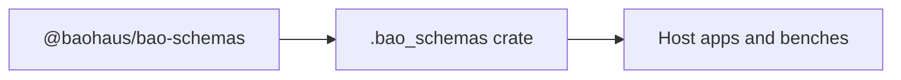

<!-- BEGIN BAOHAUS README HEADER -->
# @baohaus/bao-schemas

## Explain Like I'm Five

bao-schemas: This workbench is the stencil vault for JSON shapes. Validators trace these outlines so bad data never rides the conveyor belt.

## Architecture



## Scope

| In scope | Dependencies | Out of scope |
| --- | --- | --- |
| TypeBox/JSON schemas; Compile helpers for boundaries | Spec revisions from bao kit | HTTP handlers; Database migrations |
<!-- END BAOHAUS README HEADER -->

<!-- BEGIN BAOHAUS PACKAGE CARD -->
# @baohaus/bao-schemas

Standalone Baohaus package. Catalog identity `bao-schemas`. Source at `bao-source/bao-schemas`. Publishes to `baohaus/bao-schemas`. Canonical archive: `bao-source/bao-schemas/dist/bao/bao-schemas.bao`.

Cross-app contract and the full principles list live at the repo-root [README](../../README.md#principles).

## Package Facts

| Field | Value |
| --- | --- |
| Package | `@baohaus/bao-schemas` |
| Catalog id | `bao-schemas` |
| Source path | `bao-source/bao-schemas` |
| OCI repository | `baohaus/bao-schemas` |
| Channel | `public` |
| Visibility | `public` |
| Kind | `library` |
| Runtime installable | `yes` |
| Publish gate | `standard` |

## Public Pieces

`.`, `./admin.schemas`, `./ai-device-assist-config.schemas`, `./ai-device-assist.schemas`, `./ai-embeddings.schemas`, `./ai-gateway.schemas`, `./ai-provider-health.schemas`, `./ai-provider.schemas`, `./ai-service-alignment.schemas`, `./ai-text.schemas`, `./annotation-alignment.schemas`, `./annotation-auto-ingest.schemas`, `./api-response.schemas`, `./app-config.schemas`, `./auth-sso.schemas`, `./autonomy-integration.schemas`, `./autopilot.schemas`, `./bao-archive-authoring-profile.schemas`, plus 188 more.

## Proof Commands

Run from `bao-source/bao-schemas`:

- `bun run build`
- `bun run typecheck`
- `bun run test`
- `bun run lint`
- `bun run bao:build`
- `bun run bao:validate`
- `bun run verify`

## Publishing Path

`@baohaus/bao-schemas` publishes to `baohaus/bao-schemas` through the canonical `.bao` registry distribution path. Local overrides are development-only; installable content resolves through the registry and the checked catalog/governance/lock path.
<!-- END BAOHAUS PACKAGE CARD -->

<!-- BEGIN BAOHAUS PACKAGE MANUAL -->
## Quick start

From `bao-source/bao-schemas`:

```bash
bun install
bun run typecheck
bun run test
bun run build
bun run lint
bun run bao:build
bun run bao:validate
bun run verify
```

## Capability

@baohaus/bao-schemas is a Baohaus workbench package at `bao-source/bao-schemas`.

## Subpaths

| Subpath | Purpose |
| --- | --- |
| `.` | Main entry — typed surface from this workbench |
| `./admin.schemas` | Admin.schemas — shared schemas |
| `./ai-device-assist-config.schemas` | Ai device assist config.schemas — shared schemas |
| `./ai-device-assist.schemas` | Ai device assist.schemas — shared schemas |
| `./ai-embeddings.schemas` | Ai embeddings.schemas — shared schemas |
| `./ai-gateway.schemas` | Ai gateway.schemas — shared schemas |
| `./ai-provider-health.schemas` | Ai provider health.schemas — shared schemas |
| `./ai-provider.schemas` | Ai provider.schemas — shared schemas |
| `./ai-service-alignment.schemas` | Ai service alignment.schemas — shared schemas |
| `./ai-text.schemas` | Ai text.schemas — shared schemas |
| `./annotation-alignment.schemas` | Annotation alignment.schemas — shared schemas |
| `./annotation-auto-ingest.schemas` | Annotation auto ingest.schemas — shared schemas |
| _…_ | _194 more export(s) in package.json_ |

## Integration

Source: `bao-source/bao-schemas`. Import published subpaths only; do not deep-link into `dist/`.

## Registry

Catalog id `bao-schemas` → OCI `baohaus/bao-schemas`.

## Reference

### Subpaths

| Subpath | Purpose |
| --- | --- |
| `.` | Main entry — typed surface from this workbench |
| `./admin.schemas` | Admin.schemas — shared schemas |
| `./ai-device-assist-config.schemas` | Ai device assist config.schemas — shared schemas |
| `./ai-device-assist.schemas` | Ai device assist.schemas — shared schemas |
| `./ai-embeddings.schemas` | Ai embeddings.schemas — shared schemas |
| `./ai-gateway.schemas` | Ai gateway.schemas — shared schemas |
| `./ai-provider-health.schemas` | Ai provider health.schemas — shared schemas |
| `./ai-provider.schemas` | Ai provider.schemas — shared schemas |
| `./ai-service-alignment.schemas` | Ai service alignment.schemas — shared schemas |
| `./ai-text.schemas` | Ai text.schemas — shared schemas |
| `./annotation-alignment.schemas` | Annotation alignment.schemas — shared schemas |
| `./annotation-auto-ingest.schemas` | Annotation auto ingest.schemas — shared schemas |
| _…_ | _194 more in `package.json#exports`_ |
<!-- END BAOHAUS PACKAGE MANUAL -->
