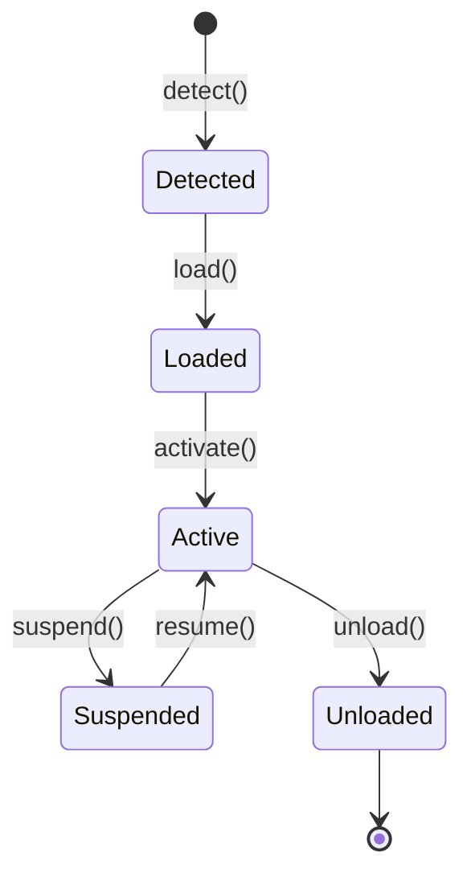

<!-- BEGIN BAOHAUS README HEADER -->
# @baohaus/bao-sdk

[](../../README.md)
[](https://bun.sh)
[](https://www.typescriptlang.org/)
[](./package.json)

## Explain Like I'm Five

This crate is the mailroom's training manual for hosts. It teaches apps how to adopt and retire crates -- detect, load, activate, suspend, unload -- like a goose checking each one on and off the shelf.

## Architecture



## Scope

| In scope | Dependencies | Out of scope |
| --- | --- | --- |
| .bao lifecycle state machine; Host capability contracts | Registry metadata; Typed manifest envelopes | Individual extension business logic; OCI build pipelines |
<!-- END BAOHAUS README HEADER -->

<!-- BEGIN BAOHAUS PACKAGE CARD -->
# @baohaus/bao-sdk

Host-context contract types and CAS-resolver primitives for building independent .bao packages

Source at `bao-source/bao-sdk`.

## Public Pieces

`.`, `./archive`, `./cas-resolver`, `./client/bao-ai-gateway`, `./client/bao-runtime`, `./client/forge`, `./client/registry`, `./extension`, `./host-context`, `./install-target-handler`, `./lifecycle`, `./lifecycle-executor`, `./manifest`, `./orchestrator`, `./target-handler`, `./target-handler-registry`, `./target-kinds`

## Proof Commands

Run from `bao-source/bao-sdk`:

- `bun run typecheck`
- `bun run test`
- `bun run lint`
<!-- END BAOHAUS PACKAGE CARD -->

<!-- BEGIN BAOHAUS PACKAGE MANUAL -->
## Quick start

From `bao-source/bao-sdk`:

```bash
bun install
bun run typecheck
bun run test
bun run build
bun run lint
bun run bao:build
bun run bao:validate
bun run verify
```

## Capability

Host-context contract types and CAS-resolver primitives for building independent .bao packages

## Subpaths

| Subpath | Purpose |
| --- | --- |
| `.` | Main entry — typed surface from this .bao crate |
| `./cas-resolver` | Cas resolver — typed surface from this .bao crate |
| `./host-context` | Host context — typed surface from this .bao crate |
| `./install-target-handler` | Install target handler — typed surface from this .bao crate |
| `./target-handler-registry` | Target handler registry — typed surface from this .bao crate |

## Integration

Source: `bao-source/bao-sdk`. Import published subpaths only; do not deep-link into `dist/`.

## Registry

Catalog id `bao-sdk` → OCI `baohaus/bao-sdk`.

## Reference

### Subpaths

| Subpath | Purpose |
| --- | --- |
| `.` | Main entry — typed surface from this .bao crate |
| `./cas-resolver` | Cas resolver — content-addressed archive resolution |
| `./host-context` | Host context — host lifecycle context types |
| `./install-target-handler` | Install target handler — .bao install target handlers |
| `./target-handler-registry` | Target handler registry — .bao install target handlers |
<!-- END BAOHAUS PACKAGE MANUAL -->
