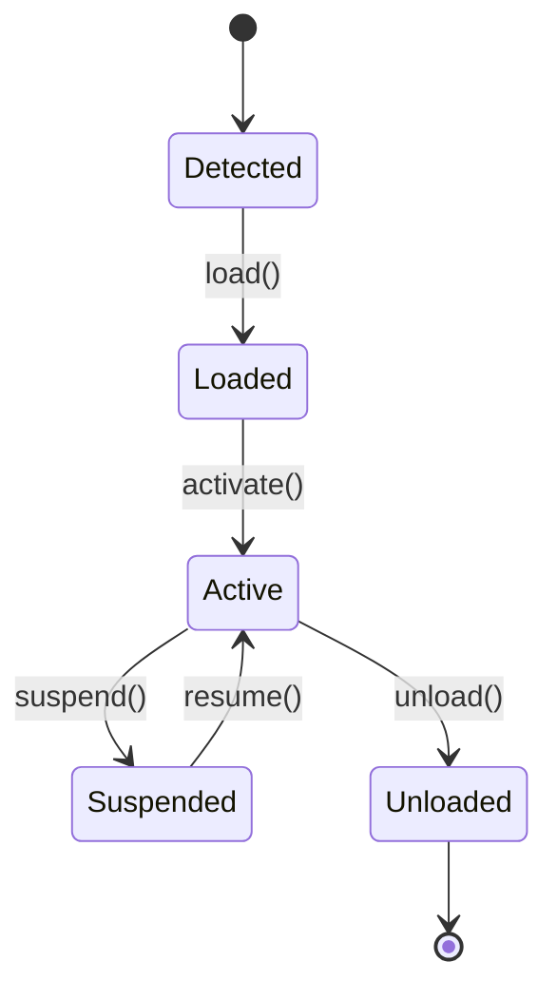

<!-- BEGIN BAOHAUS README HEADER -->
# @baohaus/bao-sdk

## Explain Like I'm Five

bao-sdk: This workbench teaches hosts how to adopt and retire .bao tiles. Detect, load, activate, suspend, unload — like a conveyor belt manager that never leaves a half-attached part on the line.

## Architecture



## Scope

| In scope | Dependencies | Out of scope |
| --- | --- | --- |
| .bao lifecycle state machine; Host capability contracts | Registry metadata; Typed manifest envelopes | Individual extension business logic; OCI build pipelines |
<!-- END BAOHAUS README HEADER -->

<!-- BEGIN BAOHAUS PACKAGE CARD -->
# @baohaus/bao-sdk

Standalone Baohaus package. Catalog identity `bao-sdk`. Source at `bao-source/bao-sdk`. Publishes to `baohaus/bao-sdk`. Canonical archive: `bao-source/bao-sdk/dist/bao/bao-sdk.bao`.

Cross-app contract and the full principles list live at the repo-root [README](../../README.md#principles).

## Package Facts

| Field | Value |
| --- | --- |
| Package | `@baohaus/bao-sdk` |
| Catalog id | `bao-sdk` |
| Source path | `bao-source/bao-sdk` |
| OCI repository | `baohaus/bao-sdk` |
| Channel | `public` |
| Visibility | `public` |
| Kind | `library` |
| Runtime installable | `yes` |
| Publish gate | `standard` |

## Public Pieces

`.`, `./cas-resolver`, `./host-context`, `./install-target-handler`, `./target-handler-registry`.

## Proof Commands

Run from `bao-source/bao-sdk`:

- `bun run build`
- `bun run typecheck`
- `bun run test`
- `bun run lint`
- `bun run bao:build`
- `bun run bao:validate`
- `bun run verify`

## Publishing Path

`@baohaus/bao-sdk` publishes to `baohaus/bao-sdk` through the canonical `.bao` registry distribution path. Local overrides are development-only; installable content resolves through the registry and the checked catalog/governance/lock path.
<!-- END BAOHAUS PACKAGE CARD -->

<!-- BEGIN BAOHAUS PACKAGE MANUAL -->
## Quick start

From `bao-source/bao-sdk`:

```bash
bun install
bun run typecheck
bun run test
bun run build
bun run lint
bun run bao:build
bun run bao:validate
bun run verify
```

## Capability

Host-context contract types and CAS-resolver primitives for building independent .bao packages

## Subpaths

| Subpath | Purpose |
| --- | --- |
| `.` | Main entry — typed surface from this workbench |
| `./cas-resolver` | Cas resolver — typed surface from this workbench |
| `./host-context` | Host context — typed surface from this workbench |
| `./install-target-handler` | Install target handler — typed surface from this workbench |
| `./target-handler-registry` | Target handler registry — typed surface from this workbench |

## Integration

Source: `bao-source/bao-sdk`. Import published subpaths only; do not deep-link into `dist/`.

## Registry

Catalog id `bao-sdk` → OCI `baohaus/bao-sdk`.

## Reference

### Subpaths

| Subpath | Purpose |
| --- | --- |
| `.` | Main entry — typed surface from this workbench |
| `./cas-resolver` | Cas resolver — content-addressed archive resolution |
| `./host-context` | Host context — host lifecycle context types |
| `./install-target-handler` | Install target handler — .bao install target handlers |
| `./target-handler-registry` | Target handler registry — .bao install target handlers |
<!-- END BAOHAUS PACKAGE MANUAL -->
