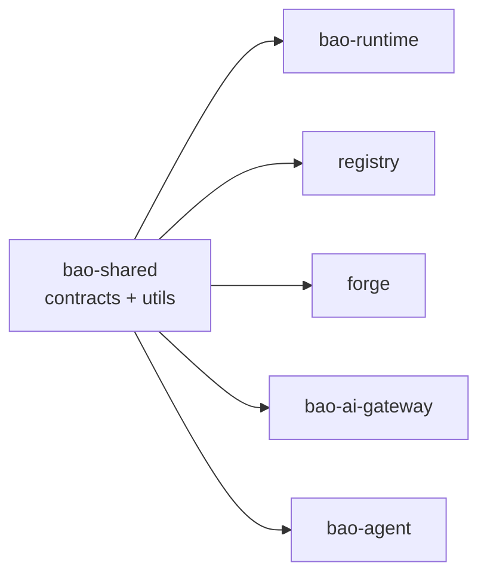

<!-- BEGIN BAOHAUS README HEADER -->
# @baohaus/bao-shared

[](../../README.md)
[](https://bun.sh)
[](https://www.typescriptlang.org/)
[](./package.json)

## Explain Like I'm Five

This crate is the mailroom's shared supply closet. Common architecture patterns and contracts that several crates need sit here on one shelf so nobody makes a private copy.

## Architecture



## Scope

| In scope | Dependencies | Out of scope |
| --- | --- | --- |
| Public contract for `@baohaus/bao-shared` | @baohaus/bao-config; @baohaus/bao-constants; @baohaus/bao-contracts; @baohaus/bao-core; @baohaus/bao-schemas; @baohaus/bao-types | Other .bao crate domains; bao-runtime host lifecycle |
<!-- END BAOHAUS README HEADER -->

<!-- BEGIN BAOHAUS PACKAGE CARD -->
# @baohaus/bao-shared

Standalone package in the Baohaus monorepo.

Source at `bao-source/bao-shared`.

## Public Pieces

`./api-envelopes`, `./architecture/bunbuddy-contract-integration`, `./architecture/capability-registry`, `./architecture/domain-module.contract`, `./architecture/domain-service-definitions`, `./architecture/graph-violation`, `./architecture/module-contract-registry`, `./architecture/module-host`, `./auth/drone-permissions`, `./auth/error-codes`, `./auth/error-messages`, `./auth/permissions`, `./auth/session`, `./bao-control-plane/component-inventory.reader`, `./bao-control-plane/provider-state-parser`, `./bao-control-plane/provider-state.types`, `./bao-control-plane/remote-build-session-projection`, `./bao-control-plane/remote-build-session-summary.reader`, `./bao-extension/extension-contract`, `./bao/bao-archive.contract`, `./baodown/baodown-graph-contract`, `./baodown/native-editor`, `./brand`, `./collaboration`, `./config`, `./config/baodown-defaults`, `./config/baofire-defaults`, `./config/drone-training-defaults`, `./config/drone.defaults`, `./config/env-boolean`, `./config/happydumpling-defaults`, `./config/htmx-events`, `./config/index`, `./config/robotics-training-defaults`, `./config/robotics.defaults`, `./config/setup-wizard-actions`, `./config/wrapture-defaults`, `./constants/ai-provider-paths`, `./constants/alignment`, `./constants/api-explorer`, `./constants/bao-control-plane-gate-env`, `./constants/bao-control-plane-secrets`, `./constants/bao-control-plane-status`, `./constants/bao-manifest-policies`, `./constants/bao-plugin-groups`, `./constants/bao-plugin-groups.generated`, `./constants/bao-runtime`, `./constants/bao-runtime-limits`, `./constants/baodown-connection-validation`, `./constants/build-paths`, `./constants/cache`, `./constants/capability-integration`, `./constants/capability-matrix-paths`, `./constants/capability-ownership`, `./constants/client-telemetry`, `./constants/container-runtime`, `./constants/database-defaults`, `./constants/drone`, `./constants/external-endpoints`, `./constants/htmx-error-boundary`, `./constants/http-status`, `./constants/imager-config`, `./constants/infrastructure-api-paths`, `./constants/loopback-hosts`, `./constants/metrics-annotations`, `./constants/mime-types`, `./constants/network`, `./constants/pagination`, `./constants/pipeline-constraints`, `./constants/pipeline-inputs`, `./constants/pipeline-resources`, `./constants/plugin-contract`, `./constants/realtime-topics`, `./constants/resource-labels`, `./constants/retries`, `./constants/rpa-defaults`, `./constants/scanner-bunbuddy`, `./constants/status-core`, `./constants/status-unified`, `./constants/system-health`, `./constants/time`, `./constants/timeouts`, `./constants/websocket`, `./constants/xr-experience`, `./constants/xr-experience.options`, `./constants/xr-share`, `./contracts/ai-bun.contract`, `./contracts/bunbuddy-routing-contracts`, `./contracts/snapshots/schema-snapshot`, `./contracts/snapshots/v1.contracts`, `./contracts/validation`, `./contracts/versions/v1/ai-device-assist-config.contract`, `./contracts/versions/v1/ai-device-assist.contract`, `./contracts/versions/v1/ai-service-alignment.contract`, `./contracts/versions/v1/ai-text.contract`, `./contracts/versions/v1/annotation-alignment.contract`, `./contracts/versions/v1/annotation-auto-ingest.contract`, `./contracts/versions/v1/autonomy-integration.contract`, `./contracts/versions/v1/bao-install.contract`, `./contracts/versions/v1/bao-observability.contract`, `./contracts/versions/v1/bao-runtime.contract`, `./contracts/versions/v1/baodown-integration.contract`, `./contracts/versions/v1/baodown-mcp.contract`, `./contracts/versions/v1/baodown/definitions`, `./contracts/versions/v1/baodown/integration`, `./contracts/versions/v1/baodown/runs`, `./contracts/versions/v1/baodown/schedules`, `./contracts/versions/v1/baodown/shared`, `./contracts/versions/v1/baodown/triggers`, `./contracts/versions/v1/baodown/versions`, `./contracts/versions/v1/baodown/webhooks`, `./contracts/versions/v1/bunbuddy-capabilities.contract`, `./contracts/versions/v1/bunbuddy-devices.contract`, `./contracts/versions/v1/bunbuddy-health.contract`, `./contracts/versions/v1/bunbuddy-routing.contract`, `./contracts/versions/v1/calibration.contract`, `./contracts/versions/v1/capability-impact.contract`, `./contracts/versions/v1/capability-ownership.contract`, `./contracts/versions/v1/capability-registry-list.contract`, `./contracts/versions/v1/capability/core`, `./contracts/versions/v1/capability/registry`, `./contracts/versions/v1/capability/routes-ai-chat`, `./contracts/versions/v1/capability/routes-hardware`, `./contracts/versions/v1/capability/routes-pipelines`, `./contracts/versions/v1/capability/routes-services`, `./contracts/versions/v1/chat-run.contract`, `./contracts/versions/v1/chat-tools.contract`, `./contracts/versions/v1/device-inventory-refresh.contract`, `./contracts/versions/v1/driver-registry.contract`, `./contracts/versions/v1/drone-capability.contract`, `./contracts/versions/v1/drone-commands.contract`, `./contracts/versions/v1/drone-history.contract`, `./contracts/versions/v1/drone-mission-planner.contract`, `./contracts/versions/v1/drone-realtime.contract`, `./contracts/versions/v1/drone-summary.contract`, `./contracts/versions/v1/drone-training-integration.contract`, `./contracts/versions/v1/error-envelope.contract`, `./contracts/versions/v1/fleet.contract`, `./contracts/versions/v1/hardware-integration.contract`, `./contracts/versions/v1/hardware-summary.contract`, `./contracts/versions/v1/imager-status.contract`, `./contracts/versions/v1/library-registry.contract`, `./contracts/versions/v1/library-route-hints`, `./contracts/versions/v1/mcp.contract`, `./contracts/versions/v1/network-discovery.contract`, `./contracts/versions/v1/rag.contract`, `./contracts/versions/v1/reports.contract`, `./contracts/versions/v1/robotics-capability.contract`, `./contracts/versions/v1/robotics-commands.contract`, `./contracts/versions/v1/robotics-devices.contract`, `./contracts/versions/v1/robotics-localization.contract`, `./contracts/versions/v1/robotics-mission.contract`, `./contracts/versions/v1/robotics-motion.contract`, `./contracts/versions/v1/robotics-policy.contract`, `./contracts/versions/v1/robotics-summary.contract`, `./contracts/versions/v1/robotics-telemetry.contract`, `./contracts/versions/v1/robotics-training-integration.contract`, `./contracts/versions/v1/rpa-training.contract`, `./contracts/versions/v1/setup-wizard.contract`, `./contracts/versions/v1/training-jobs.contract`, `./contracts/versions/v1/usd-annotations.contract`, `./contracts/versions/v1/usd-assets.contract`, `./contracts/versions/v1/user-self-service.contract`, `./contracts/versions/v1/users.contract`, `./contracts/versions/v1/xr.contract`, `./depreciation`, `./errors`, `./errors/api-error-codes`, `./errors/bunbuddy-error-codes`, `./errors/classify-error`, `./errors/error-codes`, `./errors/error-context`, `./errors/error-taxonomy`, `./errors/index`, `./errors/ui-error-classification`, `./flatbuffers/compile-schema`, `./generated/flatbuffers/baohaus/ai/chat/v1`, `./generated/flatbuffers/baohaus/ai/chat/v1/ai-chat-stream-batch-v1`, `./generated/flatbuffers/baohaus/ai/chat/v1/ai-chat-stream-event-v1`, `./generated/flatbuffers/baohaus/ai/chat/v1/ai-provider-v1`, `./generated/flatbuffers/baohaus/ai/chat/v1/citation-v1`, `./generated/flatbuffers/baohaus/ai/chat/v1/finish-reason-v1`, `./generated/flatbuffers/baohaus/ai/chat/v1/stream-event-v1`, `./generated/flatbuffers/baohaus/ai/chat/v1/tool-call-v1`, `./generated/flatbuffers/baohaus/ai/chat/v1/usage-stats-v1`, `./generated/flatbuffers/baohaus/baodown/v1`, `./generated/flatbuffers/baohaus/baodown/v1/bao-down-payload-union`, `./generated/flatbuffers/baohaus/baodown/v1/bao-down-run-event-kind-v1`, `./generated/flatbuffers/baohaus/baodown/v1/bao-down-run-event-v1`, `./generated/flatbuffers/baohaus/baodown/v1/log-payload`, `./generated/flatbuffers/baohaus/baodown/v1/node-output-payload`, `./generated/flatbuffers/baohaus/baodown/v1/run-metadata-payload`, `./generated/flatbuffers/baohaus/baoinstall/v1`, `./generated/flatbuffers/baohaus/baoinstall/v1/bao-dependency-graph-v1`, `./generated/flatbuffers/baohaus/baoinstall/v1/bao-hardware-requirement-v1`, `./generated/flatbuffers/baohaus/baoinstall/v1/bao-install-manifest-v1`, `./generated/flatbuffers/baohaus/baoinstall/v1/bao-install-target-v1`, `./generated/flatbuffers/baohaus/baoinstall/v1/bao-lifecycle-hooks-v1`, `./generated/flatbuffers/baohaus/baoinstall/v1/bao-permission-scope`, `./generated/flatbuffers/baohaus/baoinstall/v1/bao-permission-v1`, `./generated/flatbuffers/baohaus/baoinstall/v1/dependency-edge-v1`, `./generated/flatbuffers/baohaus/baoinstall/v1/dependency-node-v1`, `./generated/flatbuffers/baohaus/baoinstall/v1/dependency-status-v1`, `./generated/flatbuffers/baohaus/baoinstall/v1/dependency-type-v1`, `./generated/flatbuffers/baohaus/cache/v1`, `./generated/flatbuffers/baohaus/cache/v1/bao-install-event-v1`, `./generated/flatbuffers/baohaus/cache/v1/bun-buddy-probe-event-v1`, `./generated/flatbuffers/baohaus/cache/v1/cache-envelope-v1`, `./generated/flatbuffers/baohaus/cache/v1/cache-value-format-v1`, `./generated/flatbuffers/baohaus/cache/v1/git-ops-sync-event-v1`, `./generated/flatbuffers/baohaus/cache/v1/module-lifecycle-event-v1`, `./generated/flatbuffers/baohaus/cache/v1/package-event-v1`, `./generated/flatbuffers/baohaus/observability/v1`, `./generated/flatbuffers/baohaus/observability/v1/observability-batch-v1`, `./generated/flatbuffers/baohaus/observability/v1/span-v1`, `./generated/flatbuffers/baohaus/onnx/v1`, `./generated/flatbuffers/baohaus/onnx/v1/batch-item-result-v1`, `./generated/flatbuffers/baohaus/onnx/v1/batch-item-v1`, `./generated/flatbuffers/baohaus/onnx/v1/execution-provider-v1`, `./generated/flatbuffers/baohaus/onnx/v1/inference-status-v1`, `./generated/flatbuffers/baohaus/onnx/v1/onnx-batch-request-v1`, `./generated/flatbuffers/baohaus/onnx/v1/onnx-batch-response-v1`, `./generated/flatbuffers/baohaus/onnx/v1/tensor-type-v1`, `./generated/flatbuffers/baohaus/onnx/v1/tensor-v1`, `./generated/flatbuffers/baohaus/perception/v1`, `./generated/flatbuffers/baohaus/perception/v1/mesh-v1`, `./generated/flatbuffers/baohaus/perception/v1/point-cloud-v1`, `./generated/flatbuffers/baohaus/rag/v1`, `./generated/flatbuffers/baohaus/rag/v1/rag-chunk-match-v1`, `./generated/flatbuffers/baohaus/rag/v1/rag-match-strategy-v1`, `./generated/flatbuffers/baohaus/rag/v1/rag-retrieval-query-v1`, `./generated/flatbuffers/baohaus/rag/v1/rag-retrieval-response-v1`, `./generated/flatbuffers/baohaus/rag/v1/rag-source-ref-v1`, `./generated/flatbuffers/baohaus/rag/v1/rag-source-summary-v1`, `./generated/flatbuffers/baohaus/rag/v1/rag-source-type-v1`, `./generated/flatbuffers/baohaus/realtime/v1`, `./generated/flatbuffers/baohaus/realtime/v1/attitude`, `./generated/flatbuffers/baohaus/realtime/v1/battery-status`, `./generated/flatbuffers/baohaus/realtime/v1/device-event-v1`, `./generated/flatbuffers/baohaus/realtime/v1/drone-realtime-v1`, `./generated/flatbuffers/baohaus/realtime/v1/gimbal-event-v1`, `./generated/flatbuffers/baohaus/realtime/v1/hardware-event-kind-v1`, `./generated/flatbuffers/baohaus/realtime/v1/hardware-state-event-v1`, `./generated/flatbuffers/baohaus/realtime/v1/position3-d`, `./generated/flatbuffers/baohaus/realtime/v1/realtime-payload-kind-v1`, `./generated/flatbuffers/baohaus/realtime/v1/scanner-progress-v1`, `./generated/flatbuffers/baohaus/realtime/v1/telemetry-payload-v1`, `./generated/flatbuffers/baohaus/realtime/v1/velocity3-d`, `./generated/flatbuffers/baohaus/realtime/v1/ws-envelope-v1`, `./generated/flatbuffers/baohaus/training/v1`, `./generated/flatbuffers/baohaus/training/v1/epoch-metrics-v1`, `./generated/flatbuffers/baohaus/training/v1/hardware-snapshot-v1`, `./generated/flatbuffers/baohaus/training/v1/loss-type-v1`, `./generated/flatbuffers/baohaus/training/v1/training-progress-batch-v1`, `./generated/flatbuffers/baohaus/training/v1/training-progress-v1`, `./generated/flatbuffers/baohaus/training/v1/training-stage-v1`, `./huggingface/error-handler/classify`, `./huggingface/error-handler/constants`, `./huggingface/error-handler/errors`, `./huggingface/error-handler/fallback`, `./huggingface/error-handler/retry`, `./huggingface/error-handler/types`, `./i18n`, `./i18n/de`, `./i18n/en`, `./i18n/es`, `./i18n/fr`, `./i18n/it`, `./i18n/pt`, `./logger`, `./logger/browser`, `./logger/index`, `./ports/port-contracts`, `./prisma/query-policy`, `./protocols/realtime-flatbuffers/constants`, `./protocols/realtime-flatbuffers/device-event`, `./protocols/realtime-flatbuffers/drone-envelope`, `./protocols/realtime-flatbuffers/envelope`, `./protocols/realtime-flatbuffers/gimbal-event`, `./protocols/realtime-flatbuffers/hardware-state`, `./protocols/realtime-flatbuffers/internals`, `./protocols/realtime-flatbuffers/scanner-progress`, `./protocols/realtime-flatbuffers/telemetry`, `./protocols/realtime-flatbuffers/types`, `./schemas/admin.schemas`, `./schemas/ai-device-assist-config.schemas`, `./schemas/ai-device-assist.schemas`, `./schemas/ai-embeddings.schemas`, `./schemas/ai-gateway.schemas`, `./schemas/ai-provider-health.schemas`, `./schemas/ai-provider.schemas`, `./schemas/ai-service-alignment.schemas`, `./schemas/ai-text.schemas`, `./schemas/annotation-alignment.schemas`, `./schemas/annotation-auto-ingest.schemas`, `./schemas/api-response.schemas`, `./schemas/app-config.schemas`, `./schemas/auth-sso.schemas`, `./schemas/autonomy-integration.schemas`, `./schemas/autopilot.schemas`, `./schemas/bao-install/artifact.schemas`, `./schemas/bao-install/core.schemas`, `./schemas/bao-install/manifest.schemas`, `./schemas/bao-install/requests.schemas`, `./schemas/bao-install/runtime.schemas`, `./schemas/bao-install/targets.schemas`, `./schemas/bao-lock.schemas`, `./schemas/bao-observability.schemas`, `./schemas/baobox-enum`, `./schemas/baodown/baodown-flow.schemas`, `./schemas/baodown/baodown-node-catalog.schemas`, `./schemas/baodown/baodown-pg-notify.schemas`, `./schemas/baodown/baodown-redis-notify.schemas`, `./schemas/ble.schemas`, `./schemas/bunbuddy-capabilities-config.schemas`, `./schemas/bunbuddy-capability-snapshot.schemas`, `./schemas/bunbuddy-contracts.schemas`, `./schemas/bunbuddy-proxy.schemas`, `./schemas/bunbuddy-routing.schemas`, `./schemas/bunbuddy-runtime.schemas`, `./schemas/bunbuddy.schemas`, `./schemas/calibration.schemas`, `./schemas/capability-impact.schemas`, `./schemas/capability-ownership-config.schemas`, `./schemas/capability-ownership/category`, `./schemas/capability-ownership/coverage`, `./schemas/capability-ownership/coverage-map`, `./schemas/capability-ownership/domain`, `./schemas/capability-ownership/entry`, `./schemas/capability-ownership/enums`, `./schemas/capability-ownership/errors`, `./schemas/capability-ownership/focus`, `./schemas/capability-ownership/group`, `./schemas/capability-ownership/highlights`, `./schemas/capability-ownership/matrix`, `./schemas/capability-ownership/mcp-surface`, `./schemas/capability-ownership/metadata`, `./schemas/capability-ownership/owner-map`, `./schemas/capability-ownership/requests`, `./schemas/capability-ownership/responses`, `./schemas/capability-ownership/segment`, `./schemas/capability-ownership/source`, `./schemas/capability-ownership/stack`, `./schemas/capability-ownership/stack-entry`, `./schemas/capability-ownership/summary`, `./schemas/capability-ownership/surface`, `./schemas/capability-registry.schemas`, `./schemas/case-dashboard.schemas`, `./schemas/case.schemas`, `./schemas/chat-stream.schemas`, `./schemas/chat.schemas`, `./schemas/client-telemetry.schemas`, `./schemas/common.schemas`, `./schemas/deployment.schemas`, `./schemas/device-assignment.schemas`, `./schemas/device-diagnostics.schemas`, `./schemas/device-imager.schemas`, `./schemas/device-inventory.schemas`, `./schemas/device-lifecycle.schemas`, `./schemas/device.schemas`, `./schemas/devices-detect.schemas`, `./schemas/devices-list.schemas`, `./schemas/devices-status.schemas`, `./schemas/dicom.schemas`, `./schemas/download-config.schemas`, `./schemas/driver-registry-allowlist.schemas`, `./schemas/driver-registry.schemas`, `./schemas/drone-capability.schemas`, `./schemas/drone-history.schemas`, `./schemas/drone-mission-planner.schemas`, `./schemas/drone-ops.schemas`, `./schemas/drone-realtime.schemas`, `./schemas/drone-summary.schemas`, `./schemas/drone-training-integration.schemas`, `./schemas/fleet-alerts.schemas`, `./schemas/fleet-events.schemas`, `./schemas/fleet.schemas`, `./schemas/generated/bunbuddy-kinds.generated`, `./schemas/geospatial.schemas`, `./schemas/hardware-command.schemas`, `./schemas/hardware-config.schemas`, `./schemas/hardware-integration.schemas`, `./schemas/hardware-policy.schemas`, `./schemas/hardware-sensor.schemas`, `./schemas/hardware-state-event.schemas`, `./schemas/hardware-summary.schemas`, `./schemas/health.schemas`, `./schemas/i18n.schemas`, `./schemas/imager-arducam.schemas`, `./schemas/imager-asset.schemas`, `./schemas/imager-calibration.schemas`, `./schemas/imager-capture.schemas`, `./schemas/imager-preprocess.schemas`, `./schemas/imager-quality.schemas`, `./schemas/imager-source.schemas`, `./schemas/imager-status.schemas`, `./schemas/infrastructure-health.schemas`, `./schemas/integration-annotations.schemas`, `./schemas/integration-ownership.schemas`, `./schemas/json.schemas`, `./schemas/library-registry.schemas`, `./schemas/mavlink.schemas`, `./schemas/mcp-host-config.schemas`, `./schemas/mcp-runtime.schemas`, `./schemas/mcp.schemas`, `./schemas/navigation.schemas`, `./schemas/network-discovery.schemas`, `./schemas/nim.schemas`, `./schemas/onnx-integration.schemas`, `./schemas/onnx.schemas`, `./schemas/orchestration.schemas`, `./schemas/perception.schemas`, `./schemas/platform-runtime.schemas`, `./schemas/plugin-contract.schemas`, `./schemas/pointcloud-artifact.schemas`, `./schemas/problem.schemas`, `./schemas/query-params.schemas`, `./schemas/queue-context.schemas`, `./schemas/reports.schemas`, `./schemas/robotics-capability.schemas`, `./schemas/robotics-device.schemas`, `./schemas/robotics-error.schemas`, `./schemas/robotics-localization.schemas`, `./schemas/robotics-mission.schemas`, `./schemas/robotics-motion.schemas`, `./schemas/robotics-policy.schemas`, `./schemas/robotics-telemetry.schemas`, `./schemas/robotics-training-integration.schemas`, `./schemas/route-response-builders`, `./schemas/route-response.schemas`, `./schemas/rpa-generate.schemas`, `./schemas/rpa.schemas`, `./schemas/scanner-bunbuddy.schemas`, `./schemas/scanner-config.schemas`, `./schemas/secrets.schemas`, `./schemas/sensor.schemas`, `./schemas/setup-wizard.schemas`, `./schemas/splatbao-anchors.schemas`, `./schemas/splatbao-dumpling.schemas`, `./schemas/splatbao-measurement.schemas`, `./schemas/splatbao-model-library.schemas`, `./schemas/splatbao-perception.schemas`, `./schemas/splatbao-steamer.schemas`, `./schemas/splatbao-training.schemas`, `./schemas/splatbao-waypoint-activity.schemas`, `./schemas/storage.schemas`, `./schemas/streaming.schemas`, `./schemas/system-health.schemas`, `./schemas/tile-tileset.schemas`, `./schemas/training-integration.schemas`, `./schemas/training.schemas`, `./schemas/usd-annotations.schemas`, `./schemas/usd.schemas`, `./schemas/user-directory.schemas`, `./schemas/user-self-service.schemas`, `./schemas/user.schemas`, `./schemas/web-vitals.schemas`, `./schemas/xr-composition.schemas`, `./schemas/xr-experience-ops.schemas`, `./schemas/xr-experience.schemas`, `./schemas/xr-review.schemas`, `./schemas/xr-runtime.schemas`, `./schemas/xr-session.schemas`, `./types/ai-error-taxonomy`, `./types/ai-providers`, `./types/ai-service-alignment`, `./types/annotation-alignment`, `./types/annotations`, `./types/api/eden`, `./types/api/http-status`, `./types/api/normalize`, `./types/api/status`, `./types/api/types`, `./types/api/validation`, `./types/bunbuddy-capabilities`, `./types/capability-impact`, `./types/capability-registry`, `./types/drone-realtime`, `./types/huggingface`, `./types/integration-context`, `./types/onnx`, `./types/queries`, `./types/robotics-summary`, `./types/scanner`, `./types/training`, `./types/training-readiness`, `./types/ui-state-machine`, `./types/usd-annotations`, `./types/usd-integration`, `./types/user-robotics-ops`, `./types/validation`, `./types/websocket/annotations`, `./types/websocket/assets`, `./types/websocket/calibration`, `./types/websocket/chat`, `./types/websocket/client`, `./types/websocket/core`, `./types/websocket/devices`, `./types/websocket/events`, `./types/websocket/gaussian`, `./types/websocket/json`, `./types/websocket/notifications`, `./types/websocket/scanner`, `./types/websocket/system`, `./types/websocket/topics`, `./types/websocket/training`, `./types/websocket/vision`, `./types/xr`, `./types/xr-capabilities`, `./types/xr-hardware`, `./ui/class-maps/badge-maps`, `./ui/class-maps/button-maps`, `./ui/class-maps/card-maps`, `./ui/class-maps/input-maps`, `./ui/class-maps/layout-maps`, `./ui/class-maps/modal-maps`, `./ui/class-maps/status-maps-core`, `./ui/class-maps/status-maps-enterprise`, `./ui/class-maps/table-maps`, `./utils/ai-service-alignment`, `./utils/bao-archive`, `./utils/bao-control-plane-failure`, `./utils/bao-control-plane-local-cluster-provider`, `./utils/bao-control-plane-platform`, `./utils/bao-control-plane-registry`, `./utils/bao-manifest-checksum`, `./utils/baodown-events`, `./utils/baodown-graph-diff`, `./utils/biome-cli`, `./utils/bun-events`, `./utils/bun-exec`, `./utils/bun-fs`, `./utils/bun-native`, `./utils/bun-net`, `./utils/bun-os`, `./utils/bun-path`, `./utils/bun-readline`, `./utils/bun-util`, `./utils/bunbuddy-capabilities`, `./utils/bunbuddy-contract-registry`, `./utils/bunbuddy-contract-requirements`, `./utils/bunbuddy-docs-contracts`, `./utils/bunbuddy-workload-registry`, `./utils/capability-ownership/focus`, `./utils/capability-ownership/internal`, `./utils/capability-ownership/maps`, `./utils/capability-ownership/summary`, `./utils/capability-ownership/surfaces`, `./utils/common`, `./utils/config-parsing`, `./utils/deterministic-dependency-order`, `./utils/device-diagnostics`, `./utils/drone-policy`, `./utils/eden-response-normalize`, `./utils/env`, `./utils/error-envelope`, `./utils/error-keys`, `./utils/extension-primitives`, `./utils/formatting/date-checks`, `./utils/formatting/dates`, `./utils/formatting/durations`, `./utils/formatting/filesizes`, `./utils/formatting/numbers`, `./utils/formatting/relative`, `./utils/global-cache`, `./utils/go-template-subset`, `./utils/go-template-yaml`, `./utils/http-client`, `./utils/icon-registry`, `./utils/idempotency`, `./utils/integration-annotations`, `./utils/integration-ownership`, `./utils/log-redaction`, `./utils/log-serializers`, `./utils/managed-process-registry`, `./utils/managed-subprocess`, `./utils/mcp`, `./utils/memory-global`, `./utils/naming-conventions`, `./utils/number`, `./utils/oci-registry`, `./utils/path-exists`, `./utils/pipeline-events`, `./utils/poll-until`, `./utils/problem`, `./utils/process-exit`, `./utils/process-liveness`, `./utils/rate-limit`, `./utils/resolved-platform-runtime`, `./utils/result-adapters`, `./utils/result-helpers`, `./utils/retry`, `./utils/retry-with-backoff`, `./utils/robotics-motion`, `./utils/robotics-policy`, `./utils/rpc-stream`, `./utils/safe-json-parse`, `./utils/schema-formats`, `./utils/setup-environment-files`, `./utils/setup-wizard-bun`, `./utils/ssr`, `./utils/stable-json`, `./utils/status/case`, `./utils/status/derivation`, `./utils/status/health`, `./utils/status/normalize`, `./utils/status/priority`, `./utils/status/ui-classes`, `./utils/status/variants`, `./utils/status/workflow`, `./utils/strict-boolean`, `./utils/string`, `./utils/tailwind-cli`, `./utils/text-format`, `./utils/timeout-signal`, `./utils/timestamp`, `./utils/type-guards`, `./utils/typed-json-guards`, `./utils/url-scheme`, `./utils/usd-annotation-roundtrip`, `./validation`, `./validation/index`, `./validation/integration`, `./validation/reports`, `./validation/schema`, `./validation/schemas`, `./validation/ui`, `./wrapture/builder-pool`, `./wrapture/config`, `./wrapture/decode-cache`, `./wrapture/decode-pool`, `./wrapture/defaults`, `./wrapture/event-coalescer`, `./wrapture/metrics`, `./wrapture/protocols/bao-install`, `./wrapture/protocols/bao-manifest`, `./wrapture/protocols/baodown`, `./wrapture/protocols/cache`, `./wrapture/protocols/hardware-state`, `./wrapture/protocols/module-lifecycle`, `./wrapture/protocols/observability`, `./wrapture/protocols/perception`, `./wrapture/transport`, `./wrapture/verifier`

## Proof Commands

Run from `bao-source/bao-shared`:

- `bun run typecheck`
- `bun run test`
- `bun run lint`
<!-- END BAOHAUS PACKAGE CARD -->

<!-- BEGIN BAOHAUS PACKAGE MANUAL -->
## Quick start

From `bao-source/bao-shared`:

```bash
bun install
bun run typecheck
bun run test
bun run build
bun run lint
bun run bao:build
bun run bao:validate
bun run verify
```

## Capability

@baohaus/bao-shared is a Baohaus .bao crate at `bao-source/bao-shared`.

## Subpaths

| Subpath | Purpose |
| --- | --- |
| `./api-envelopes` | Api envelopes — typed surface from this .bao crate |
| `./architecture/bunbuddy-contract-integration` | Architecture/bunbuddy contract integration — typed surface from this .bao crate |
| `./architecture/capability-registry` | Architecture/capability registry — typed surface from this .bao crate |
| `./architecture/domain-module.contract` | Architecture/domain module.contract — typed surface from this .bao crate |
| `./architecture/domain-service-definitions` | Architecture/domain service definitions — typed surface from this .bao crate |
| `./architecture/graph-violation` | Architecture/graph violation — typed surface from this .bao crate |
| `./architecture/module-contract-registry` | Architecture/module contract registry — typed surface from this .bao crate |
| `./architecture/module-host` | Architecture/module host — typed surface from this .bao crate |
| `./auth/drone-permissions` | Auth/drone permissions — auth/session contracts |
| `./auth/error-codes` | Auth/error codes — auth/session contracts |
| `./auth/error-messages` | Auth/error messages — auth/session contracts |
| `./auth/permissions` | Auth/permissions — auth/session contracts |
| _…_ | _685 more export(s) in package.json_ |

## Integration

Source: `bao-source/bao-shared`. Import published subpaths only; do not deep-link into `dist/`.

## Registry

Catalog id `bao-shared` → OCI `baohaus/bao-shared`.

## Reference

### Subpaths

| Subpath | Purpose |
| --- | --- |
| `./api-envelopes` | Api envelopes — typed surface from this .bao crate |
| `./architecture/bunbuddy-contract-integration` | Architecture/bunbuddy contract integration — typed surface from this .bao crate |
| `./architecture/capability-registry` | Architecture/capability registry — typed surface from this .bao crate |
| `./architecture/domain-module.contract` | Architecture/domain module.contract — typed surface from this .bao crate |
| `./architecture/domain-service-definitions` | Architecture/domain service definitions — typed surface from this .bao crate |
| `./architecture/graph-violation` | Architecture/graph violation — typed surface from this .bao crate |
| `./architecture/module-contract-registry` | Architecture/module contract registry — typed surface from this .bao crate |
| `./architecture/module-host` | Architecture/module host — typed surface from this .bao crate |
| `./auth/drone-permissions` | Auth/drone permissions — auth/session contracts |
| `./auth/error-codes` | Auth/error codes — auth/session contracts |
| `./auth/error-messages` | Auth/error messages — auth/session contracts |
| `./auth/permissions` | Auth/permissions — auth/session contracts |
| _…_ | _685 more in `package.json#exports`_ |
<!-- END BAOHAUS PACKAGE MANUAL -->
