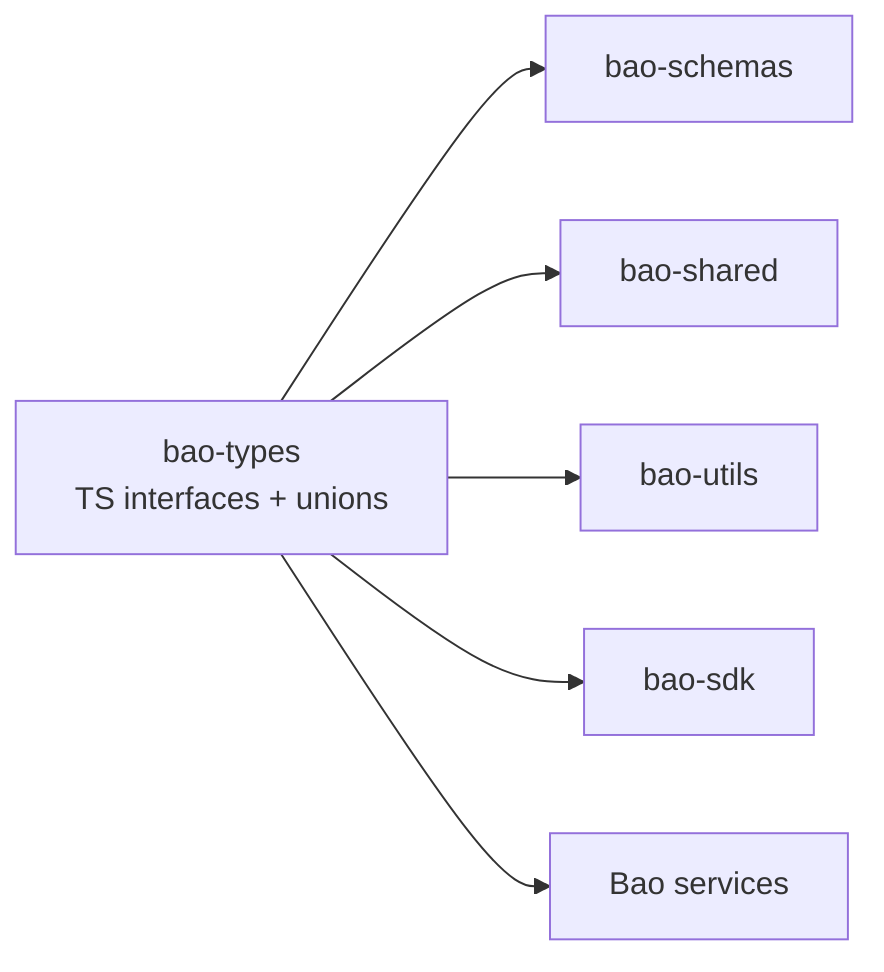

<!-- BEGIN BAOHAUS README HEADER -->
# @baohaus/bao-types

[](../../README.md)
[](https://bun.sh)
[](https://www.typescriptlang.org/)
[](./package.json)

## Explain Like I'm Five

This crate is the mailroom's name-tag drawer. TypeScript types live here so every crate knows the exact shape of data it should expect -- no surprises.

## Architecture



## Scope

| In scope | Dependencies | Out of scope |
| --- | --- | --- |
| Shared TypeScript type definitions for . | @baohaus/bao-config; @baohaus/bao-constants; @baohaus/bao-schemas; @baohaus/baobox | Other .bao crate domains; bao-runtime host lifecycle |
<!-- END BAOHAUS README HEADER -->

<!-- BEGIN BAOHAUS PACKAGE CARD -->
# @baohaus/bao-types

Shared TypeScript type definitions for .bao packages

Source at `bao-source/bao-types`.

## Public Pieces

`./ai-autonomy`, `./ai-error-taxonomy`, `./ai-gateway`, `./ai-provider-health`, `./ai-providers`, `./ai-service-alignment`, `./annotation-alignment`, `./annotations`, `./api`, `./bao-install-validation`, `./baodown`, `./bluetooth-capabilities`, `./bunbuddy-capabilities`, `./bunbuddy-contracts`, `./capability-impact`, `./capability-ownership`, `./capability-registry`, `./cases`, `./chat`, `./commerce`, `./common`, `./correlation`, `./deep-partial`, `./device-lifecycle`, `./devices-status`, `./drone-history`, `./drone-ops`, `./drone-realtime`, `./drone-realtime-status`, `./drone-summary`, `./feature-flags`, `./feature-health`, `./fhir`, `./hardware-integration`, `./hardware-policy`, `./hardware-summary`, `./health`, `./help-center`, `./huggingface`, `./imager-pipeline`, `./integration-context`, `./library-registry`, `./mcp`, `./models`, `./mylittledumpling`, `./notifications`, `./onnx`, `./onnx-integration`, `./orchestration`, `./package-descriptor`, `./pipeline-integration`, `./prisma.types`, `./queries`, `./rag`, `./ramalama`, `./responses`, `./robotics-localization`, `./robotics-mission`, `./robotics-motion`, `./robotics-policy`, `./robotics-summary`, `./robotics-telemetry`, `./rpa`, `./rpa-integration`, `./rpa-training-cohesion`, `./scanner`, `./spatial-geospatial-tile-integration`, `./three`, `./three-capabilities`, `./three-integration`, `./training`, `./training-integration`, `./training-readiness`, `./ui-state-machine`, `./usd`, `./usd-annotations`, `./usd-integration`, `./user-robotics-ops`, `./users`, `./validation`, `./ws-types-ai`, `./ws-types-devices`, `./ws-types-system`, `./xr`, `./xr-capabilities`, `./xr-composition`, `./xr-hardware`, `./xr-review`, `./xr-session`

## Proof Commands

Run from `bao-source/bao-types`:

- `bun run typecheck`
- `bun run test`
- `bun run lint`
<!-- END BAOHAUS PACKAGE CARD -->

<!-- BEGIN BAOHAUS PACKAGE MANUAL -->
## Quick start

From `bao-source/bao-types`:

```bash
bun install
bun run typecheck
bun run test
bun run build
bun run lint
bun run bao:build
bun run bao:validate
bun run verify
```

## Capability

Shared TypeScript type definitions for .bao packages

## Subpaths

| Subpath | Purpose |
| --- | --- |
| `./ai-autonomy` | Ai autonomy — typed surface from this .bao crate |
| `./ai-error-taxonomy` | Ai error taxonomy — typed surface from this .bao crate |
| `./ai-gateway` | Ai gateway — typed surface from this .bao crate |
| `./ai-provider-health` | Ai provider health — typed surface from this .bao crate |
| `./ai-providers` | Ai providers — typed surface from this .bao crate |
| `./ai-service-alignment` | Ai service alignment — typed surface from this .bao crate |
| `./annotation-alignment` | Annotation alignment — typed surface from this .bao crate |
| `./annotations` | Annotations — typed surface from this .bao crate |
| `./api` | Api — typed surface from this .bao crate |
| `./bao-install-validation` | Bao install validation — typed surface from this .bao crate |
| `./baodown` | Baodown — typed surface from this .bao crate |
| `./bluetooth-capabilities` | Bluetooth capabilities — typed surface from this .bao crate |
| _…_ | _76 more export(s) in package.json_ |

## Integration

Source: `bao-source/bao-types`. Import published subpaths only; do not deep-link into `dist/`.

## Registry

Catalog id `bao-types` → OCI `baohaus/bao-types`.

## Reference

### Subpaths

| Subpath | Purpose |
| --- | --- |
| `./ai-autonomy` | Ai autonomy — typed surface from this .bao crate |
| `./ai-error-taxonomy` | Ai error taxonomy — typed surface from this .bao crate |
| `./ai-gateway` | Ai gateway — typed surface from this .bao crate |
| `./ai-provider-health` | Ai provider health — typed surface from this .bao crate |
| `./ai-providers` | Ai providers — typed surface from this .bao crate |
| `./ai-service-alignment` | Ai service alignment — typed surface from this .bao crate |
| `./annotation-alignment` | Annotation alignment — typed surface from this .bao crate |
| `./annotations` | Annotations — typed surface from this .bao crate |
| `./api` | Api — typed surface from this .bao crate |
| `./bao-install-validation` | Bao install validation — typed surface from this .bao crate |
| `./baodown` | Baodown — typed surface from this .bao crate |
| `./bluetooth-capabilities` | Bluetooth capabilities — typed surface from this .bao crate |
| _…_ | _76 more in `package.json#exports`_ |
<!-- END BAOHAUS PACKAGE MANUAL -->
