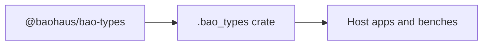

<!-- BEGIN BAOHAUS README HEADER -->
# @baohaus/bao-types

## Explain Like I'm Five

Shared TypeScript type definitions for .bao packages. Import subpaths like `./ai-autonomy`, `./ai-error-taxonomy`, `./ai-gateway`, `./ai-provider-health` when you wire this crate in.

## Architecture



## Scope

| In scope | Dependencies | Out of scope |
| --- | --- | --- |
| Shared TypeScript type definitions for . | @baohaus/bao-config; @baohaus/bao-constants; @baohaus/bao-schemas; @baohaus/baobox | Other workbench domains; bao-runtime host lifecycle |
<!-- END BAOHAUS README HEADER -->

<!-- BEGIN BAOHAUS PACKAGE CARD -->
# @baohaus/bao-types

Standalone Baohaus package. Catalog identity `bao-types`. Source at `bao-source/bao-types`. Publishes to `baohaus/bao-types`. Canonical archive: `bao-source/bao-types/dist/bao/bao-types.bao`.

Cross-app contract and the full principles list live at the repo-root [README](../../README.md#principles).

## Package Facts

| Field | Value |
| --- | --- |
| Package | `@baohaus/bao-types` |
| Catalog id | `bao-types` |
| Source path | `bao-source/bao-types` |
| OCI repository | `baohaus/bao-types` |
| Channel | `public` |
| Visibility | `public` |
| Kind | `library` |
| Runtime installable | `yes` |
| Publish gate | `standard` |

## Public Pieces

`./ai-autonomy`, `./ai-error-taxonomy`, `./ai-gateway`, `./ai-provider-health`, `./ai-providers`, `./ai-service-alignment`, `./annotation-alignment`, `./annotations`, `./api`, `./bao-install-validation`, `./baodown`, `./bluetooth-capabilities`, `./bunbuddy-capabilities`, `./bunbuddy-contracts`, `./capability-impact`, `./capability-ownership`, `./capability-registry`, `./cases`, plus 70 more.

## Proof Commands

Run from `bao-source/bao-types`:

- `bun run build`
- `bun run typecheck`
- `bun run test`
- `bun run lint`
- `bun run bao:build`
- `bun run bao:validate`
- `bun run verify`

## Publishing Path

`@baohaus/bao-types` publishes to `baohaus/bao-types` through the canonical `.bao` registry distribution path. Local overrides are development-only; installable content resolves through the registry and the checked catalog/governance/lock path.
<!-- END BAOHAUS PACKAGE CARD -->

<!-- BEGIN BAOHAUS PACKAGE MANUAL -->
## Quick start

From `bao-source/bao-types`:

```bash
bun install
bun run typecheck
bun run test
bun run build
bun run lint
bun run bao:build
bun run bao:validate
bun run verify
```

## Capability

Shared TypeScript type definitions for .bao packages

## Subpaths

| Subpath | Purpose |
| --- | --- |
| `./ai-autonomy` | Ai autonomy — typed surface from this workbench |
| `./ai-error-taxonomy` | Ai error taxonomy — typed surface from this workbench |
| `./ai-gateway` | Ai gateway — typed surface from this workbench |
| `./ai-provider-health` | Ai provider health — typed surface from this workbench |
| `./ai-providers` | Ai providers — typed surface from this workbench |
| `./ai-service-alignment` | Ai service alignment — typed surface from this workbench |
| `./annotation-alignment` | Annotation alignment — typed surface from this workbench |
| `./annotations` | Annotations — typed surface from this workbench |
| `./api` | Api — typed surface from this workbench |
| `./bao-install-validation` | Bao install validation — typed surface from this workbench |
| `./baodown` | Baodown — typed surface from this workbench |
| `./bluetooth-capabilities` | Bluetooth capabilities — typed surface from this workbench |
| _…_ | _76 more export(s) in package.json_ |

## Integration

Source: `bao-source/bao-types`. Import published subpaths only; do not deep-link into `dist/`.

## Registry

Catalog id `bao-types` → OCI `baohaus/bao-types`.

## Reference

### Subpaths

| Subpath | Purpose |
| --- | --- |
| `./ai-autonomy` | Ai autonomy — typed surface from this workbench |
| `./ai-error-taxonomy` | Ai error taxonomy — typed surface from this workbench |
| `./ai-gateway` | Ai gateway — typed surface from this workbench |
| `./ai-provider-health` | Ai provider health — typed surface from this workbench |
| `./ai-providers` | Ai providers — typed surface from this workbench |
| `./ai-service-alignment` | Ai service alignment — typed surface from this workbench |
| `./annotation-alignment` | Annotation alignment — typed surface from this workbench |
| `./annotations` | Annotations — typed surface from this workbench |
| `./api` | Api — typed surface from this workbench |
| `./bao-install-validation` | Bao install validation — typed surface from this workbench |
| `./baodown` | Baodown — typed surface from this workbench |
| `./bluetooth-capabilities` | Bluetooth capabilities — typed surface from this workbench |
| _…_ | _76 more in `package.json#exports`_ |
<!-- END BAOHAUS PACKAGE MANUAL -->
