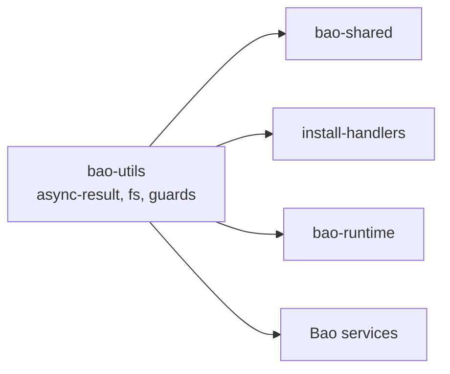

<!-- BEGIN BAOHAUS README HEADER -->
# @baohaus/bao-utils

[](../../README.md)
[](https://bun.sh)
[](https://www.typescriptlang.org/)
[](./package.json)

## Explain Like I'm Five

This crate is the mailroom's shared toolbox drawer. Async results, small helpers, and typed utilities live here so no crate smuggles duplicate tools.

## Architecture



## Scope

| In scope | Dependencies | Out of scope |
| --- | --- | --- |
| Cross-package utilities; Async-result helpers | bao-contracts | App routes; UI components |
<!-- END BAOHAUS README HEADER -->

<!-- BEGIN BAOHAUS PACKAGE CARD -->
# @baohaus/bao-utils

Bun-native utility functions for .bao packages — async-result, path, fs, type-guards, and more

Source at `bao-source/bao-utils`.

## Public Pieces

`./ai-service-alignment`, `./annotation-utils`, `./async-result`, `./bao-authz-client`, `./bao-bundle`, `./bao-control-plane-failure`, `./bao-control-plane-local-cluster-provider`, `./bao-control-plane-platform`, `./bao-control-plane-registry`, `./bao-manifest-checksum`, `./baodown-events`, `./baodown-graph-diff`, `./biome-cli`, `./bun-events`, `./bun-exec`, `./bun-fs`, `./bun-native`, `./bun-net`, `./bun-os`, `./bun-path`, `./bun-readline`, `./bun-util`, `./bunbuddy-capabilities`, `./bunbuddy-contract-registry`, `./bunbuddy-contract-requirements`, `./bunbuddy-docs-contracts`, `./bunbuddy-workload-registry`, `./canonical/bao-archive`, `./canonical/bao-archive-payload`, `./canonical/bao-archive-tar`, `./canonical/bao-archive.types`, `./canonical/bao-canonical-signing`, `./canonical/bao-error`, `./canonical/bao-error-api`, `./canonical/bao-error-helpers`, `./canonical/bao-manifest-attestor`, `./canonical/bao-manifest-attestor.types`, `./canonical/bao-manifest-bin`, `./canonical/bao-manifest-checksum`, `./canonical/bao-manifest-signer`, `./canonical/bao-manifest-validator`, `./canonical/bao-manifest-validator-gates`, `./canonical/bao-manifest-validator-payload`, `./canonical/bao-manifest-validator.types`, `./canonical/bao-manifest-wrapture`, `./canonical/bao-semver-range`, `./canonical/bao-target-graph`, `./canonical/bao-target-payload`, `./canonical/result`, `./canonical/typebox-runtime`, `./capability-ownership-focus`, `./capability-ownership-maps`, `./capability-ownership-summary`, `./capability-ownership-surfaces`, `./common`, `./config-parsing`, `./correlation-id`, `./daisyui-badge`, `./data-result`, `./deterministic-dependency-order`, `./device-diagnostics`, `./drone-policy`, `./eden-response-normalize`, `./env`, `./error-envelope`, `./error-keys`, `./error-severity`, `./extension-primitives`, `./formatting`, `./global-cache`, `./go-template-subset`, `./go-template-yaml`, `./http-client`, `./icon-registry`, `./idempotency`, `./integration-annotations`, `./integration-ownership`, `./log-redaction`, `./log-serializers`, `./logger-browser`, `./managed-interval`, `./managed-polling-lifecycle`, `./managed-process-registry`, `./managed-subprocess`, `./markdown/render`, `./mcp`, `./memory-global`, `./naming-conventions`, `./number`, `./oci-registry`, `./pagination-query`, `./path-exists`, `./pipeline-events`, `./poll-until`, `./problem`, `./process-exit`, `./process-liveness`, `./provider-color-tokens`, `./rate-limit`, `./recovery-strategy`, `./resolved-platform-runtime`, `./result-helpers`, `./retry`, `./retry-with-backoff`, `./robotics-motion`, `./robotics-policy`, `./rpc-stream`, `./safe-decode-uri`, `./safe-json-parse`, `./schema-formats`, `./schema-validation`, `./seeded-prng`, `./setup-environment-files`, `./setup-wizard-bun`, `./ssr`, `./stable-json`, `./status`, `./storage-safe`, `./strict-boolean`, `./string`, `./tailwind-cli`, `./text-format`, `./timeout-signal`, `./timestamp`, `./ttl-cache`, `./type-guards`, `./typed-json-guards`, `./url-scheme`, `./usd-annotation-roundtrip`, `./vector`

## Proof Commands

Run from `bao-source/bao-utils`:

- `bun run typecheck`
- `bun run test`
- `bun run lint`
<!-- END BAOHAUS PACKAGE CARD -->

<!-- BEGIN BAOHAUS PACKAGE MANUAL -->
## Quick start

From `bao-source/bao-utils`:

```bash
bun install
bun run typecheck
bun run test
bun run build
bun run lint
bun run bao:build
bun run bao:validate
bun run verify
```

## Capability

Bun-native utility functions for .bao packages — async-result, path, fs, type-guards, and more

## Subpaths

| Subpath | Purpose |
| --- | --- |
| `./ai-service-alignment` | Ai service alignment — typed surface from this .bao crate |
| `./annotation-utils` | Annotation utils — typed surface from this .bao crate |
| `./async-result` | Async result — typed surface from this .bao crate |
| `./bao-authz-client` | Bao authz client — auth/session contracts |
| `./bao-bundle` | Bao bundle — typed surface from this .bao crate |
| `./bao-control-plane-failure` | Bao control plane failure — typed surface from this .bao crate |
| `./bao-control-plane-local-cluster-provider` | Bao control plane local cluster provider — typed surface from this .bao crate |
| `./bao-control-plane-platform` | Bao control plane platform — typed surface from this .bao crate |
| `./bao-control-plane-registry` | Bao control plane registry — typed surface from this .bao crate |
| `./bao-manifest-checksum` | Bao manifest checksum — typed surface from this .bao crate |
| `./baodown-events` | Baodown events — typed surface from this .bao crate |
| `./baodown-graph-diff` | Baodown graph diff — typed surface from this .bao crate |
| _…_ | _106 more export(s) in package.json_ |

## Integration

Source: `bao-source/bao-utils`. Import published subpaths only; do not deep-link into `dist/`.

## Registry

Catalog id `bao-utils` → OCI `baohaus/bao-utils`.

## Reference

### Subpaths

| Subpath | Purpose |
| --- | --- |
| `./ai-service-alignment` | Ai service alignment — typed surface from this .bao crate |
| `./annotation-utils` | Annotation utils — typed surface from this .bao crate |
| `./async-result` | Async result — typed surface from this .bao crate |
| `./bao-authz-client` | Bao authz client — auth/session contracts |
| `./bao-bundle` | Bao bundle — typed surface from this .bao crate |
| `./bao-control-plane-failure` | Bao control plane failure — typed surface from this .bao crate |
| `./bao-control-plane-local-cluster-provider` | Bao control plane local cluster provider — typed surface from this .bao crate |
| `./bao-control-plane-platform` | Bao control plane platform — typed surface from this .bao crate |
| `./bao-control-plane-registry` | Bao control plane registry — typed surface from this .bao crate |
| `./bao-manifest-checksum` | Bao manifest checksum — typed surface from this .bao crate |
| `./baodown-events` | Baodown events — typed surface from this .bao crate |
| `./baodown-graph-diff` | Baodown graph diff — typed surface from this .bao crate |
| _…_ | _106 more in `package.json#exports`_ |
<!-- END BAOHAUS PACKAGE MANUAL -->
