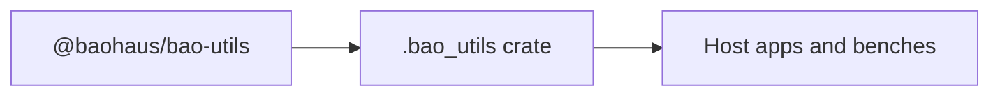

<!-- BEGIN BAOHAUS README HEADER -->
# @baohaus/bao-utils

## Explain Like I'm Five

This workbench is the shared toolbox drawer. Async results, small helpers, and typed utilities live here so no bench smuggles duplicate screwdrivers into their crate.

## Architecture



## Scope

| In scope | Dependencies | Out of scope |
| --- | --- | --- |
| Cross-package utilities; Async-result helpers | bao-contracts | App routes; UI components |
<!-- END BAOHAUS README HEADER -->

<!-- BEGIN BAOHAUS PACKAGE CARD -->
# @baohaus/bao-utils

Standalone Baohaus package. Catalog identity `bao-utils`. Source at `bao-source/bao-utils`. Publishes to `baohaus/bao-utils`. Canonical archive: `bao-source/bao-utils/dist/bao/bao-utils.bao`.

Cross-app contract and the full principles list live at the repo-root [README](../../README.md#principles).

## Package Facts

| Field | Value |
| --- | --- |
| Package | `@baohaus/bao-utils` |
| Catalog id | `bao-utils` |
| Source path | `bao-source/bao-utils` |
| OCI repository | `baohaus/bao-utils` |
| Channel | `public` |
| Visibility | `public` |
| Kind | `library` |
| Runtime installable | `yes` |
| Publish gate | `standard` |

## Public Pieces

`./ai-service-alignment`, `./annotation-utils`, `./async-result`, `./bao-authz-client`, `./bao-bundle`, `./bao-control-plane-failure`, `./bao-control-plane-local-cluster-provider`, `./bao-control-plane-platform`, `./bao-control-plane-registry`, `./bao-manifest-checksum`, `./baodown-events`, `./baodown-graph-diff`, `./biome-cli`, `./bun-events`, `./bun-exec`, `./bun-fs`, `./bun-native`, `./bun-net`, plus 100 more.

## Proof Commands

Run from `bao-source/bao-utils`:

- `bun run build`
- `bun run typecheck`
- `bun run test`
- `bun run lint`
- `bun run bao:build`
- `bun run bao:validate`
- `bun run verify`

## Publishing Path

`@baohaus/bao-utils` publishes to `baohaus/bao-utils` through the canonical `.bao` registry distribution path. Local overrides are development-only; installable content resolves through the registry and the checked catalog/governance/lock path.
<!-- END BAOHAUS PACKAGE CARD -->

<!-- BEGIN BAOHAUS PACKAGE MANUAL -->
## Quick start

From `bao-source/bao-utils`:

```bash
bun install
bun run typecheck
bun run test
bun run build
bun run lint
bun run bao:build
bun run bao:validate
bun run verify
```

## Capability

Bun-native utility functions for .bao packages — async-result, path, fs, type-guards, and more

## Subpaths

| Subpath | Purpose |
| --- | --- |
| `./ai-service-alignment` | Ai service alignment — typed surface from this workbench |
| `./annotation-utils` | Annotation utils — typed surface from this workbench |
| `./async-result` | Async result — typed surface from this workbench |
| `./bao-authz-client` | Bao authz client — auth/session contracts |
| `./bao-bundle` | Bao bundle — typed surface from this workbench |
| `./bao-control-plane-failure` | Bao control plane failure — typed surface from this workbench |
| `./bao-control-plane-local-cluster-provider` | Bao control plane local cluster provider — typed surface from this workbench |
| `./bao-control-plane-platform` | Bao control plane platform — typed surface from this workbench |
| `./bao-control-plane-registry` | Bao control plane registry — typed surface from this workbench |
| `./bao-manifest-checksum` | Bao manifest checksum — typed surface from this workbench |
| `./baodown-events` | Baodown events — typed surface from this workbench |
| `./baodown-graph-diff` | Baodown graph diff — typed surface from this workbench |
| _…_ | _106 more export(s) in package.json_ |

## Integration

Source: `bao-source/bao-utils`. Import published subpaths only; do not deep-link into `dist/`.

## Registry

Catalog id `bao-utils` → OCI `baohaus/bao-utils`.

## Reference

### Subpaths

| Subpath | Purpose |
| --- | --- |
| `./ai-service-alignment` | Ai service alignment — typed surface from this workbench |
| `./annotation-utils` | Annotation utils — typed surface from this workbench |
| `./async-result` | Async result — typed surface from this workbench |
| `./bao-authz-client` | Bao authz client — auth/session contracts |
| `./bao-bundle` | Bao bundle — typed surface from this workbench |
| `./bao-control-plane-failure` | Bao control plane failure — typed surface from this workbench |
| `./bao-control-plane-local-cluster-provider` | Bao control plane local cluster provider — typed surface from this workbench |
| `./bao-control-plane-platform` | Bao control plane platform — typed surface from this workbench |
| `./bao-control-plane-registry` | Bao control plane registry — typed surface from this workbench |
| `./bao-manifest-checksum` | Bao manifest checksum — typed surface from this workbench |
| `./baodown-events` | Baodown events — typed surface from this workbench |
| `./baodown-graph-diff` | Baodown graph diff — typed surface from this workbench |
| _…_ | _106 more in `package.json#exports`_ |
<!-- END BAOHAUS PACKAGE MANUAL -->
