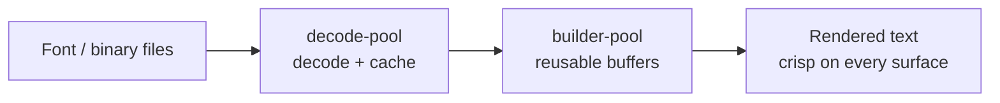

<!-- BEGIN BAOHAUS README HEADER -->
# @baohaus/bao-wrapture

[](../../README.md)
[](https://bun.sh)
[](https://www.typescriptlang.org/)
[](./package.json)

## Explain Like I'm Five

This crate is the mailroom's font workshop. It decodes, caches, and pools font files so text looks crisp everywhere without loading the same font twice.

## Architecture



## Scope

| In scope | Dependencies | Out of scope |
| --- | --- | --- |
| Public contract for `@baohaus/bao-wrapture` | @baohaus/bao-config; @baohaus/bao-core; @baohaus/bao-schemas; @baohaus/bao-utils; @baohaus/flatbuf-bao | Other .bao crate domains; bao-runtime host lifecycle |
<!-- END BAOHAUS README HEADER -->

<!-- BEGIN BAOHAUS PACKAGE CARD -->
# @baohaus/bao-wrapture

Standalone package in the Baohaus monorepo.

Source at `bao-source/bao-wrapture`.

## Public Pieces

`.`, `./builder-pool`, `./config`, `./decode-cache`, `./decode-pool`, `./defaults`, `./event-coalescer`, `./metrics`, `./protocols/bao-install`, `./protocols/bao-manifest`, `./protocols/baodown`, `./protocols/cache`, `./protocols/hardware-state`, `./protocols/module-lifecycle`, `./protocols/observability`, `./protocols/perception`, `./transport`, `./verifier`

## Proof Commands

Run from `bao-source/bao-wrapture`:

- `bun run typecheck`
- `bun run test`
- `bun run lint`
<!-- END BAOHAUS PACKAGE CARD -->

<!-- BEGIN BAOHAUS PACKAGE MANUAL -->
## Quick start

From `bao-source/bao-wrapture`:

```bash
bun install
bun run typecheck
bun run test
bun run build
bun run lint
bun run bao:build
bun run bao:validate
bun run verify
```

## Capability

@baohaus/bao-wrapture is a Baohaus .bao crate at `bao-source/bao-wrapture`.

## Subpaths

| Subpath | Purpose |
| --- | --- |
| `.` | Main entry — typed surface from this .bao crate |
| `./builder-pool` | Builder pool — typed surface from this .bao crate |
| `./config` | Config — typed surface from this .bao crate |
| `./decode-cache` | Decode cache — typed surface from this .bao crate |
| `./decode-pool` | Decode pool — typed surface from this .bao crate |
| `./defaults` | Defaults — typed surface from this .bao crate |
| `./event-coalescer` | Event coalescer — typed surface from this .bao crate |
| `./metrics` | Metrics — typed surface from this .bao crate |
| `./protocols/bao-install` | Protocols/bao install — typed surface from this .bao crate |
| `./protocols/bao-manifest` | Protocols/bao manifest — typed surface from this .bao crate |
| `./protocols/baodown` | Protocols/baodown — typed surface from this .bao crate |
| `./protocols/cache` | Protocols/cache — typed surface from this .bao crate |
| _…_ | _6 more export(s) in package.json_ |

## Integration

Source: `bao-source/bao-wrapture`. Import published subpaths only; do not deep-link into `dist/`.

## Registry

Catalog id `bao-wrapture` → OCI `baohaus/bao-wrapture`.

## Reference

### Subpaths

| Subpath | Purpose |
| --- | --- |
| `.` | Main entry — typed surface from this .bao crate |
| `./builder-pool` | Builder pool — typed surface from this .bao crate |
| `./config` | Config — typed surface from this .bao crate |
| `./decode-cache` | Decode cache — typed surface from this .bao crate |
| `./decode-pool` | Decode pool — typed surface from this .bao crate |
| `./defaults` | Defaults — typed surface from this .bao crate |
| `./event-coalescer` | Event coalescer — typed surface from this .bao crate |
| `./metrics` | Metrics — typed surface from this .bao crate |
| `./protocols/bao-install` | Protocols/bao install — typed surface from this .bao crate |
| `./protocols/bao-manifest` | Protocols/bao manifest — typed surface from this .bao crate |
| `./protocols/baodown` | Protocols/baodown — typed surface from this .bao crate |
| `./protocols/cache` | Protocols/cache — typed surface from this .bao crate |
| _…_ | _6 more in `package.json#exports`_ |
<!-- END BAOHAUS PACKAGE MANUAL -->
