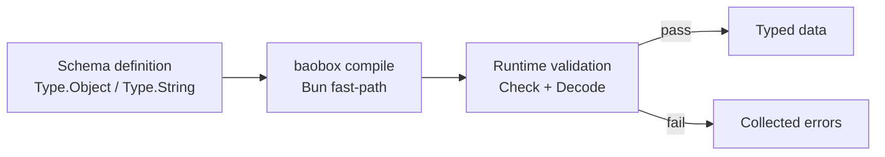

<!-- BEGIN BAOHAUS README HEADER -->
# @baohaus/baobox

[](../../README.md)
[](https://bun.sh)
[](https://www.typescriptlang.org/)
[](./package.json)

## Explain Like I'm Five

This crate is the mailroom's custom ruler. A fast, Bun-first schema library that measures and checks data shapes at full speed -- like a ruler that never bends.

## Architecture



## Scope

| In scope | Dependencies | Out of scope |
| --- | --- | --- |
| TypeScript-native schema library optimised for Bun — a lean, Bun-first reimagining of TypeBox; Exported API: Any, Array, AsyncIterator, Awaited, Base, … | Shared @baohaus contracts | Other .bao crate domains; bao-runtime host lifecycle |
<!-- END BAOHAUS README HEADER -->

<!-- BEGIN BAOHAUS PACKAGE CARD -->
# @baohaus/baobox

TypeScript-native schema library optimised for Bun — a lean, Bun-first reimagining of TypeBox

Source at `bao-source/baobox`.

## Public Pieces

`.`, `./cli`, `./cli/index`, `./cli/migrate`, `./cli/path`, `./cli/report`, `./cli/transforms/api-calls`, `./cli/transforms/imports`, `./compile`, `./compile/bun-fast-path`, `./compile/emit`, `./compile/index`, `./elysia`, `./elysia/index`, `./error`, `./error/catalog-types`, `./error/collector`, `./error/collector/advanced`, `./error/collector/collections`, `./error/collector/collections-basic`, `./error/collector/collections-derived`, `./error/collector/collections-parameters`, `./error/collector/primitives`, `./error/collector/shared`, `./error/errors`, `./error/locales/de`, `./error/locales/en`, `./error/locales/es`, `./error/locales/fr`, `./error/locales/ja`, `./error/locales/ko`, `./error/locales/pt`, `./error/locales/shared`, `./error/locales/zh`, `./error/messages`, `./format/format`, `./guard/guard`, `./interop/typebox`, `./locale`, `./locale/index`, `./package-descriptor`, `./registries/format`, `./registries/policy`, `./registries/settings`, `./registries/type`, `./schema/build`, `./schema/check`, `./schema/compile`, `./schema/core`, `./schema/core-keywords`, `./schema/emitter`, `./schema/emitter-base`, `./schema/emitter-derived`, `./schema/emitter-reference`, `./schema/emitter-special-kinds`, `./schema/emitter-types`, `./schema/engine`, `./schema/error-collector`, `./schema/errors`, `./schema/parse`, `./schema/pointer`, `./schema/predicates`, `./schema/resolve`, `./schema/runtime-keywords`, `./schema/shared`, `./script`, `./script/generic`, `./script/index`, `./script/literals`, `./script/shared`, `./shared/bytes`, `./shared/format-constants`, `./shared/format-validators`, `./shared/locale`, `./shared/object-utils`, `./shared/regex-json`, `./shared/registries`, `./shared/runtime-context`, `./shared/runtime-guards`, `./shared/schema-access`, `./shared/symbols`, `./shared/url-like`, `./standard`, `./standard/index`, `./system/system`, `./type/actions`, `./type/base-types`, `./type/codec-builtins`, `./type/combinator-core`, `./type/combinator-functions`, `./type/combinator-objects`, `./type/composite-types`, `./type/containers`, `./type/containers-types`, `./type/extends`, `./type/extensions`, `./type/guards`, `./type/higher-order-types`, `./type/instantiation`, `./type/kind`, `./type/narrow-types`, `./type/primitives`, `./type/primitives-types`, `./type/root-constants`, `./type/root-cyclic`, `./type/root-deferred`, `./type/root-guards`, `./type/root-helpers`, `./type/root-instantiate`, `./type/root-shared`, `./type/root-template`, `./type/schema`, `./type/schema-options`, `./type/static-const-types`, `./type/static-shared-types`, `./type/static-types`, `./type/string-action-types`, `./type/transform-types`, `./type/uint8array-codec`, `./value`, `./value/assert`, `./value/check`, `./value/check-collections`, `./value/check-collections-derived`, `./value/check-extensions`, `./value/check-primitives`, `./value/clean`, `./value/clone`, `./value/convert`, `./value/create`, `./value/decode`, `./value/default`, `./value/diff`, `./value/encode`, `./value/equal`, `./value/has-codec`, `./value/hash`, `./value/index`, `./value/mutate`, `./value/parse`, `./value/patch`, `./value/pipeline`, `./value/pointer`, `./value/repair`, `./value/result`, `./value/value-errors`

## Proof Commands

Run from `bao-source/baobox`:

- `bun run typecheck`
- `bun run test`
- `bun run lint`
<!-- END BAOHAUS PACKAGE CARD -->

<!-- BEGIN BAOHAUS PACKAGE MANUAL -->
## Quick start

From `bao-source/baobox`:

```bash
bun install
bun run typecheck
bun run test
bun run build
bun run lint
bun run bao:build
bun run bao:validate
bun run verify
```

## Capability

TypeScript-native schema library optimised for Bun — a lean, Bun-first reimagining of TypeBox

## Subpaths

| Subpath | Purpose |
| --- | --- |
| `./cli` | Cli — typed surface from this .bao crate |
| `./cli/index` | Cli/index — typed surface from this .bao crate |
| `./cli/migrate` | Cli/migrate — typed surface from this .bao crate |
| `./cli/path` | Cli/path — typed surface from this .bao crate |
| `./cli/report` | Cli/report — typed surface from this .bao crate |
| `./cli/transforms/api-calls` | Cli/transforms/api calls — typed surface from this .bao crate |
| `./cli/transforms/imports` | Cli/transforms/imports — typed surface from this .bao crate |
| `./compile` | Compile — typed surface from this .bao crate |
| `./compile/bun-fast-path` | Compile/bun fast path — typed surface from this .bao crate |
| `./compile/emit` | Compile/emit — typed surface from this .bao crate |
| `./compile/index` | Compile/index — typed surface from this .bao crate |
| `./elysia` | Elysia — typed surface from this .bao crate |
| _…_ | _128 more export(s) in package.json_ |

## Primary symbols

- `Any`
- `Array`
- `AsyncIterator`
- `Awaited`
- `Base`
- `Base64`
- `BigInt`
- `BigIntCodec`
- `Boolean`
- `Call`
- `Capitalize`
- `Clone`

## Integration

Source: `bao-source/baobox` (`src/index.ts`). Import published subpaths only; do not deep-link into `dist/`.

## Registry

Catalog id `baobox` → OCI `baohaus/baobox`.

## Reference

### Subpaths

| Subpath | Purpose |
| --- | --- |
| `./cli` | Cli — typed surface from this .bao crate |
| `./cli/index` | Cli/index — typed surface from this .bao crate |
| `./cli/migrate` | Cli/migrate — typed surface from this .bao crate |
| `./cli/path` | Cli/path — typed surface from this .bao crate |
| `./cli/report` | Cli/report — port contracts for adapters |
| `./cli/transforms/api-calls` | Cli/transforms/api calls — typed surface from this .bao crate |
| `./cli/transforms/imports` | Cli/transforms/imports — port contracts for adapters |
| `./compile` | Compile — typed surface from this .bao crate |
| `./compile/bun-fast-path` | Compile/bun fast path — typed surface from this .bao crate |
| `./compile/emit` | Compile/emit — typed surface from this .bao crate |
| `./compile/index` | Compile/index — typed surface from this .bao crate |
| `./elysia` | Elysia — typed surface from this .bao crate |
| _…_ | _128 more in `package.json#exports`_ |

### Symbols

- `Any`
- `Array`
- `AsyncIterator`
- `Awaited`
- `Base`
- `Base64`
- `BigInt`
- `BigIntCodec`
- `Boolean`
- `Call`
- `Capitalize`
- `Clone`
<!-- END BAOHAUS PACKAGE MANUAL -->
