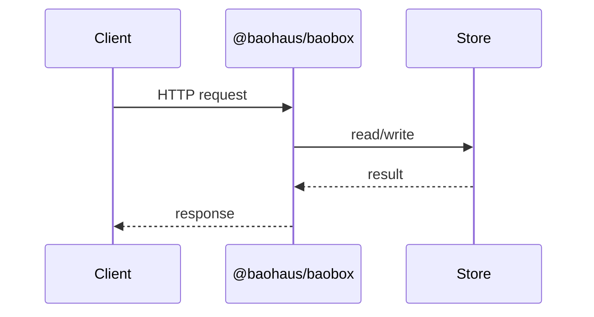

<!-- BEGIN BAOHAUS README HEADER -->
# @baohaus/baobox

## Explain Like I'm Five

TypeScript-native schema library optimised for Bun — a lean, Bun-first reimagining of TypeBox Apps use exports such as `Any`, `Array`, `AsyncIterator` from `@baohaus/baobox`. It is part of the Baohaus .bao factory line.

## Architecture



## Scope

| In scope | Dependencies | Out of scope |
| --- | --- | --- |
| TypeScript-native schema library optimised for Bun — a lean, Bun-first reimagining of TypeBox; Exported API: Any, Array, AsyncIterator, Awaited, Base, … | bao-governance.json; bao.lock; catalog row | Other workbench domains; bao-runtime host lifecycle |
<!-- END BAOHAUS README HEADER -->

<!-- BEGIN BAOHAUS PACKAGE CARD -->
# @baohaus/baobox

Standalone Baohaus package. Catalog identity `baobox`. Source at `bao-source/baobox`. Publishes to `baohaus/baobox`. Canonical archive: `bao-source/baobox/dist/bao/baobox.bao`.

Cross-app contract and the full principles list live at the repo-root [README](../../README.md#principles).

## Package Facts

| Field | Value |
| --- | --- |
| Package | `@baohaus/baobox` |
| Catalog id | `baobox` |
| Source path | `bao-source/baobox` |
| OCI repository | `baohaus/baobox` |
| Channel | `public` |
| Visibility | `public` |
| Kind | `library` |
| Runtime installable | `yes` |
| Publish gate | `standard` |

## Public Pieces

`./cli`, `./cli/index`, `./cli/migrate`, `./cli/path`, `./cli/report`, `./cli/transforms/api-calls`, `./cli/transforms/imports`, `./compile`, `./compile/bun-fast-path`, `./compile/emit`, `./compile/index`, `./elysia`, `./elysia/index`, `./elysia/symbols`, `./error`, `./error/catalog-types`, `./error/collector`, `./error/collector/advanced`, plus 123 more.

## Proof Commands

Run from `bao-source/baobox`:

- `bun run build`
- `bun run typecheck`
- `bun run test`
- `bun run lint`
- `bun run bao:build`
- `bun run bao:validate`
- `bun run verify`

## Publishing Path

`@baohaus/baobox` publishes to `baohaus/baobox` through the canonical `.bao` registry distribution path. Local overrides are development-only; installable content resolves through the registry and the checked catalog/governance/lock path.
<!-- END BAOHAUS PACKAGE CARD -->

<!-- BEGIN BAOHAUS PACKAGE MANUAL -->
## Quick start

From `bao-source/baobox`:

```bash
bun install
bun run typecheck
bun run test
bun run build
bun run lint
bun run bao:build
bun run bao:validate
bun run verify
```

## Capability

TypeScript-native schema library optimised for Bun — a lean, Bun-first reimagining of TypeBox

## Subpaths

| Subpath | Purpose |
| --- | --- |
| `./cli` | Cli — typed surface from this workbench |
| `./cli/index` | Cli/index — typed surface from this workbench |
| `./cli/migrate` | Cli/migrate — typed surface from this workbench |
| `./cli/path` | Cli/path — typed surface from this workbench |
| `./cli/report` | Cli/report — typed surface from this workbench |
| `./cli/transforms/api-calls` | Cli/transforms/api calls — typed surface from this workbench |
| `./cli/transforms/imports` | Cli/transforms/imports — typed surface from this workbench |
| `./compile` | Compile — typed surface from this workbench |
| `./compile/bun-fast-path` | Compile/bun fast path — typed surface from this workbench |
| `./compile/emit` | Compile/emit — typed surface from this workbench |
| `./compile/index` | Compile/index — typed surface from this workbench |
| `./elysia` | Elysia — typed surface from this workbench |
| _…_ | _128 more export(s) in package.json_ |

## Primary symbols

- `Any`
- `Array`
- `AsyncIterator`
- `Awaited`
- `Base`
- `Base64`
- `BigInt`
- `BigIntCodec`
- `Boolean`
- `Call`
- `Capitalize`
- `Clone`

## Integration

Source: `bao-source/baobox` (`src/index.ts`). Import published subpaths only; do not deep-link into `dist/`.

## Registry

Catalog id `baobox` → OCI `baohaus/baobox`.

## Reference

### Subpaths

| Subpath | Purpose |
| --- | --- |
| `./cli` | Cli — typed surface from this workbench |
| `./cli/index` | Cli/index — typed surface from this workbench |
| `./cli/migrate` | Cli/migrate — typed surface from this workbench |
| `./cli/path` | Cli/path — typed surface from this workbench |
| `./cli/report` | Cli/report — port contracts for adapters |
| `./cli/transforms/api-calls` | Cli/transforms/api calls — typed surface from this workbench |
| `./cli/transforms/imports` | Cli/transforms/imports — port contracts for adapters |
| `./compile` | Compile — typed surface from this workbench |
| `./compile/bun-fast-path` | Compile/bun fast path — typed surface from this workbench |
| `./compile/emit` | Compile/emit — typed surface from this workbench |
| `./compile/index` | Compile/index — typed surface from this workbench |
| `./elysia` | Elysia — typed surface from this workbench |
| _…_ | _128 more in `package.json#exports`_ |

### Symbols

- `Any`
- `Array`
- `AsyncIterator`
- `Awaited`
- `Base`
- `Base64`
- `BigInt`
- `BigIntCodec`
- `Boolean`
- `Call`
- `Capitalize`
- `Clone`
<!-- END BAOHAUS PACKAGE MANUAL -->
