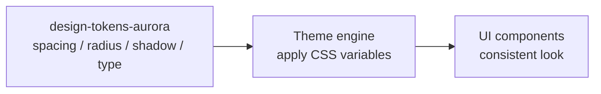

<!-- BEGIN BAOHAUS README HEADER -->
# @baohaus/baohaus-design-tokens-aurora-bao

[](../../README.md)
[](https://bun.sh)
[](https://www.typescriptlang.org/)
[](./package.json)

## Explain Like I'm Five

This crate is the mailroom's paint swatch book. Spacing, corner roundness, shadows, and font sizes are all recorded here so every surface looks like it belongs.

## Architecture



## Scope

| In scope | Dependencies | Out of scope |
| --- | --- | --- |
| Aurora design-tokens .; Exported API: BAOHAUS_AURORA_DESIGN_TOKENS, BaohausAuroraDesignTokens | Shared @baohaus contracts | Host boot order; Registry catalog authoring |
<!-- END BAOHAUS README HEADER -->

<!-- BEGIN BAOHAUS PACKAGE CARD -->
# @baohaus/baohaus-design-tokens-aurora-bao

Aurora design-tokens .bao — Apple HIG 2026 aligned spacing/radius/shadow/typography token bundle. Pairs with the baohaus-aurora-light theme-pack; installs via the canonical design-tokens install-target handler.

Source at `bao-source/baohaus-design-tokens-aurora-bao`.

## Public Pieces

`.`

## Proof Commands

Run from `bao-source/baohaus-design-tokens-aurora-bao`:

- `bun run typecheck`
- `bun run test`
- `bun run lint`
<!-- END BAOHAUS PACKAGE CARD -->

<!-- BEGIN BAOHAUS PACKAGE MANUAL -->
## Quick start

From `bao-source/baohaus-design-tokens-aurora-bao`:

```bash
bun install
bun run typecheck
bun run test
bun run build
bun run lint
bun run bao:build
bun run bao:validate
bun run verify
```

## Capability

Aurora design-tokens .bao — Apple HIG 2026 aligned spacing/radius/shadow/typography token bundle. Pairs with the baohaus-aurora-light theme-pack; installs via the canonical design-tokens install-target handler.

## Integration

Source lives at `bao-source/baohaus-design-tokens-aurora-bao`. Import through the package exports; do not deep-link into `dist/` or private paths.

## Registry

Catalog id `baohaus-design-tokens-aurora-bao` publishes to `baohaus/baohaus-design-tokens-aurora-bao`.

## Subpaths

| Subpath | Purpose |
| --- | --- |
| `.` | Main entry — typed surface from this .bao crate |

## Primary symbols

- `BAOHAUS_AURORA_DESIGN_TOKENS`
- `BaohausAuroraDesignTokens`

## Reference

### Subpaths

| Subpath | Purpose |
| --- | --- |
| `.` | Main entry — typed surface from this .bao crate |

### Symbols

- `BAOHAUS_AURORA_DESIGN_TOKENS`
- `BaohausAuroraDesignTokens`
<!-- END BAOHAUS PACKAGE MANUAL -->
