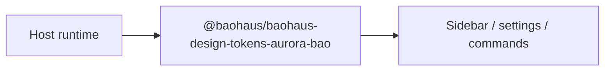

<!-- BEGIN BAOHAUS README HEADER -->
# @baohaus/baohaus-design-tokens-aurora-bao

## Explain Like I'm Five

Think of baohaus design tokens aurora bao as an add-on tile that plugs into the host sidebar, settings, or command list. Aurora design-tokens .bao — Apple HIG 2026 aligned spacing/radius/shadow/typography token bundle. Pairs with the baohaus-aurora-light theme-pack; installs via the canonical design-tokens install-target handler. Apps use exports such as `BAOHAUS_AURORA_DESIGN_TOKENS`, `BaohausAuroraDesignTokens` from `@baohaus/baohaus-design-tokens-aurora-bao`.

## Architecture



## Scope

| In scope | Dependencies | Out of scope |
| --- | --- | --- |
| Aurora design-tokens .; Exported API: BAOHAUS_AURORA_DESIGN_TOKENS, BaohausAuroraDesignTokens | bao-governance.json; bao.lock; catalog row | Host boot order; Registry catalog authoring |
<!-- END BAOHAUS README HEADER -->

<!-- BEGIN BAOHAUS PACKAGE CARD -->
# @baohaus/baohaus-design-tokens-aurora-bao

Standalone Baohaus package. Catalog identity `baohaus-design-tokens-aurora-bao`. Source at `bao-source/baohaus-design-tokens-aurora-bao`. Publishes to `baohaus/baohaus-design-tokens-aurora-bao`. Canonical archive: `bao-source/baohaus-design-tokens-aurora-bao/dist/bao/baohaus-design-tokens-aurora-bao.bao`.

Cross-app contract and the full principles list live at the repo-root [README](../../README.md#principles).

## Package Facts

| Field | Value |
| --- | --- |
| Package | `@baohaus/baohaus-design-tokens-aurora-bao` |
| Catalog id | `baohaus-design-tokens-aurora-bao` |
| Source path | `bao-source/baohaus-design-tokens-aurora-bao` |
| OCI repository | `baohaus/baohaus-design-tokens-aurora-bao` |
| Channel | `public` |
| Visibility | `public` |
| Kind | `extension` |
| Runtime installable | `yes` |
| Publish gate | `standard` |

## Public Pieces

`.`.

## Proof Commands

Run from `bao-source/baohaus-design-tokens-aurora-bao`:

- `bun run build`
- `bun run typecheck`
- `bun run test`
- `bun run lint`
- `bun run bao:build`
- `bun run bao:validate`
- `bun run verify`

## Publishing Path

`@baohaus/baohaus-design-tokens-aurora-bao` publishes to `baohaus/baohaus-design-tokens-aurora-bao` through the canonical `.bao` registry distribution path. Local overrides are development-only; installable content resolves through the registry and the checked catalog/governance/lock path.
<!-- END BAOHAUS PACKAGE CARD -->

<!-- BEGIN BAOHAUS PACKAGE MANUAL -->
## Quick start

From `bao-source/baohaus-design-tokens-aurora-bao`:

```bash
bun install
bun run typecheck
bun run test
bun run build
bun run lint
bun run bao:build
bun run bao:validate
bun run verify
```

## Capability

Aurora design-tokens .bao — Apple HIG 2026 aligned spacing/radius/shadow/typography token bundle. Pairs with the baohaus-aurora-light theme-pack; installs via the canonical design-tokens install-target handler.

## Integration

Source lives at `bao-source/baohaus-design-tokens-aurora-bao`. Import through the package exports; do not deep-link into `dist/` or private paths.

## Registry

Catalog id `baohaus-design-tokens-aurora-bao` publishes to `baohaus/baohaus-design-tokens-aurora-bao`.

## Subpaths

| Subpath | Purpose |
| --- | --- |
| `.` | Main entry — typed surface from this workbench |

## Primary symbols

- `BAOHAUS_AURORA_DESIGN_TOKENS`
- `BaohausAuroraDesignTokens`

## Reference

### Subpaths

| Subpath | Purpose |
| --- | --- |
| `.` | Main entry — typed surface from this workbench |

### Symbols

- `BAOHAUS_AURORA_DESIGN_TOKENS`
- `BaohausAuroraDesignTokens`
<!-- END BAOHAUS PACKAGE MANUAL -->
