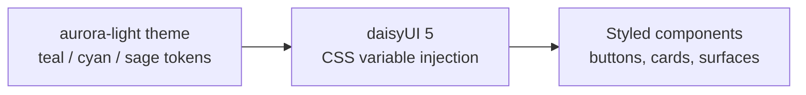

<!-- BEGIN BAOHAUS README HEADER -->
# @baohaus/baohaus-theme-aurora-light-bao

[](../../README.md)
[](https://bun.sh)
[](https://www.typescriptlang.org/)
[](./package.json)

## Explain Like I'm Five

This crate is the mailroom's daytime color palette. It paints every surface with soft teal and cyan accents so the mailroom glows on a sunny day.

## Architecture



## Scope

| In scope | Dependencies | Out of scope |
| --- | --- | --- |
| Aurora-tinted light daisyUI 5 theme variant — Apple HIG 2026 aligned teal/cyan/sage accent layer over the platform-canonical light surface.; Exported API: BAOHAUS_AURORA_LIGHT_THEME, BaohausAuroraLightTheme | Shared @baohaus contracts | Host boot order; Registry catalog authoring |
<!-- END BAOHAUS README HEADER -->

<!-- BEGIN BAOHAUS PACKAGE CARD -->
# @baohaus/baohaus-theme-aurora-light-bao

Aurora-tinted light daisyUI 5 theme variant — Apple HIG 2026 aligned teal/cyan/sage accent layer over the platform-canonical light surface. Shipped as an installable .bao theme-pack alongside the boot-zero baohaus-light default.

Source at `bao-source/baohaus-theme-aurora-light-bao`.

## Public Pieces

`.`

## Proof Commands

Run from `bao-source/baohaus-theme-aurora-light-bao`:

- `bun run typecheck`
- `bun run test`
- `bun run lint`
<!-- END BAOHAUS PACKAGE CARD -->

<!-- BEGIN BAOHAUS PACKAGE MANUAL -->
## Quick start

From `bao-source/baohaus-theme-aurora-light-bao`:

```bash
bun install
bun run typecheck
bun run test
bun run build
bun run lint
bun run bao:build
bun run bao:validate
bun run verify
```

# @baohaus/baohaus-theme-aurora-light-bao

Aurora-tinted light daisyUI 5 theme variant shipped as an installable `.bao` `theme-pack` target. Layers a teal/cyan/sage accent palette over the platform-canonical light surface — Apple HIG 2026 deference + clarity principles (low-saturation base with ≥7:1 semantic accent contrast).

The canonical `baohaus-light` default lives in `@baohaus/happydumpling/assets/styles/daisyui.css` for boot-zero appearance. This package adds a runtime-installable aurora variant consumed via the `ThemePackTargetHandler` in `@baohaus/bao-install-handlers-bao`.

## Installable target

- `kind`: `theme-pack`
- `themeId`: `baohaus-aurora-light`
- `colorScheme`: `light`
- `daisyUiVersionRange`: `>=5.0.0 <6.0.0`
- `stylesheet`: `assets/baohaus-aurora-light.css`

## Build

```bash
bun run bao:build
```

Produces `dist/bao/baohaus-theme-aurora-light-bao.bao` ready for registry publish.

## Subpaths

| Subpath | Purpose |
| --- | --- |
| `.` | Main entry — typed surface from this .bao crate |

## Primary symbols

- `BAOHAUS_AURORA_LIGHT_THEME`
- `BaohausAuroraLightTheme`

## Reference

### Subpaths

| Subpath | Purpose |
| --- | --- |
| `.` | Main entry — typed surface from this .bao crate |

### Symbols

- `BAOHAUS_AURORA_LIGHT_THEME`
- `BaohausAuroraLightTheme`
<!-- END BAOHAUS PACKAGE MANUAL -->
