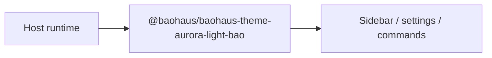

<!-- BEGIN BAOHAUS README HEADER -->
# @baohaus/baohaus-theme-aurora-light-bao

## Explain Like I'm Five

Think of baohaus theme aurora light bao as an add-on tile that plugs into the host sidebar, settings, or command list. Aurora-tinted light daisyUI 5 theme variant — Apple HIG 2026 aligned teal/cyan/sage accent layer over the platform-canonical light surface. Shipped as an installable .bao theme-pack alongside the boot-zero baohaus-light default. Apps use exports such as `BAOHAUS_AURORA_LIGHT_THEME`, `BaohausAuroraLightTheme` from `@baohaus/baohaus-theme-aurora-light-bao`.

## Architecture



## Scope

| In scope | Dependencies | Out of scope |
| --- | --- | --- |
| Aurora-tinted light daisyUI 5 theme variant — Apple HIG 2026 aligned teal/cyan/sage accent layer over the platform-canonical light surface.; Exported API: BAOHAUS_AURORA_LIGHT_THEME, BaohausAuroraLightTheme | bao-governance.json; bao.lock; catalog row | Host boot order; Registry catalog authoring |
<!-- END BAOHAUS README HEADER -->

<!-- BEGIN BAOHAUS PACKAGE CARD -->
# @baohaus/baohaus-theme-aurora-light-bao

Standalone Baohaus package. Catalog identity `baohaus-theme-aurora-light-bao`. Source at `bao-source/baohaus-theme-aurora-light-bao`. Publishes to `baohaus/baohaus-theme-aurora-light-bao`. Canonical archive: `bao-source/baohaus-theme-aurora-light-bao/dist/bao/baohaus-theme-aurora-light-bao.bao`.

Cross-app contract and the full principles list live at the repo-root [README](../../README.md#principles).

## Package Facts

| Field | Value |
| --- | --- |
| Package | `@baohaus/baohaus-theme-aurora-light-bao` |
| Catalog id | `baohaus-theme-aurora-light-bao` |
| Source path | `bao-source/baohaus-theme-aurora-light-bao` |
| OCI repository | `baohaus/baohaus-theme-aurora-light-bao` |
| Channel | `public` |
| Visibility | `public` |
| Kind | `extension` |
| Runtime installable | `yes` |
| Publish gate | `standard` |

## Public Pieces

`.`.

## Proof Commands

Run from `bao-source/baohaus-theme-aurora-light-bao`:

- `bun run build`
- `bun run typecheck`
- `bun run test`
- `bun run lint`
- `bun run bao:build`
- `bun run bao:validate`
- `bun run verify`

## Publishing Path

`@baohaus/baohaus-theme-aurora-light-bao` publishes to `baohaus/baohaus-theme-aurora-light-bao` through the canonical `.bao` registry distribution path. Local overrides are development-only; installable content resolves through the registry and the checked catalog/governance/lock path.
<!-- END BAOHAUS PACKAGE CARD -->

<!-- BEGIN BAOHAUS PACKAGE MANUAL -->
## Quick start

From `bao-source/baohaus-theme-aurora-light-bao`:

```bash
bun install
bun run typecheck
bun run test
bun run build
bun run lint
bun run bao:build
bun run bao:validate
bun run verify
```

# @baohaus/baohaus-theme-aurora-light-bao

Aurora-tinted light daisyUI 5 theme variant shipped as an installable `.bao` `theme-pack` target. Layers a teal/cyan/sage accent palette over the platform-canonical light surface — Apple HIG 2026 deference + clarity principles (low-saturation base with ≥7:1 semantic accent contrast).

The canonical `baohaus-light` default lives in `@baohaus/happydumpling/assets/styles/daisyui.css` for boot-zero appearance. This package adds a runtime-installable aurora variant consumed via the `ThemePackTargetHandler` in `@baohaus/bao-install-handlers-bao`.

## Installable target

- `kind`: `theme-pack`
- `themeId`: `baohaus-aurora-light`
- `colorScheme`: `light`
- `daisyUiVersionRange`: `>=5.0.0 <6.0.0`
- `stylesheet`: `assets/baohaus-aurora-light.css`

## Build

```bash
bun run bao:build
```

Produces `dist/bao/baohaus-theme-aurora-light-bao.bao` ready for registry publish.

## Subpaths

| Subpath | Purpose |
| --- | --- |
| `.` | Main entry — typed surface from this workbench |

## Primary symbols

- `BAOHAUS_AURORA_LIGHT_THEME`
- `BaohausAuroraLightTheme`

## Reference

### Subpaths

| Subpath | Purpose |
| --- | --- |
| `.` | Main entry — typed surface from this workbench |

### Symbols

- `BAOHAUS_AURORA_LIGHT_THEME`
- `BaohausAuroraLightTheme`
<!-- END BAOHAUS PACKAGE MANUAL -->
