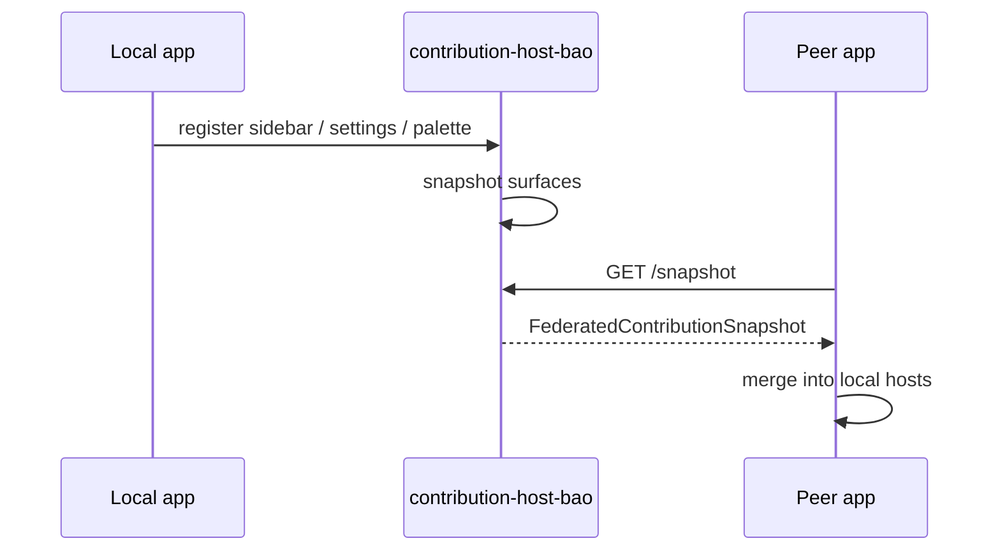
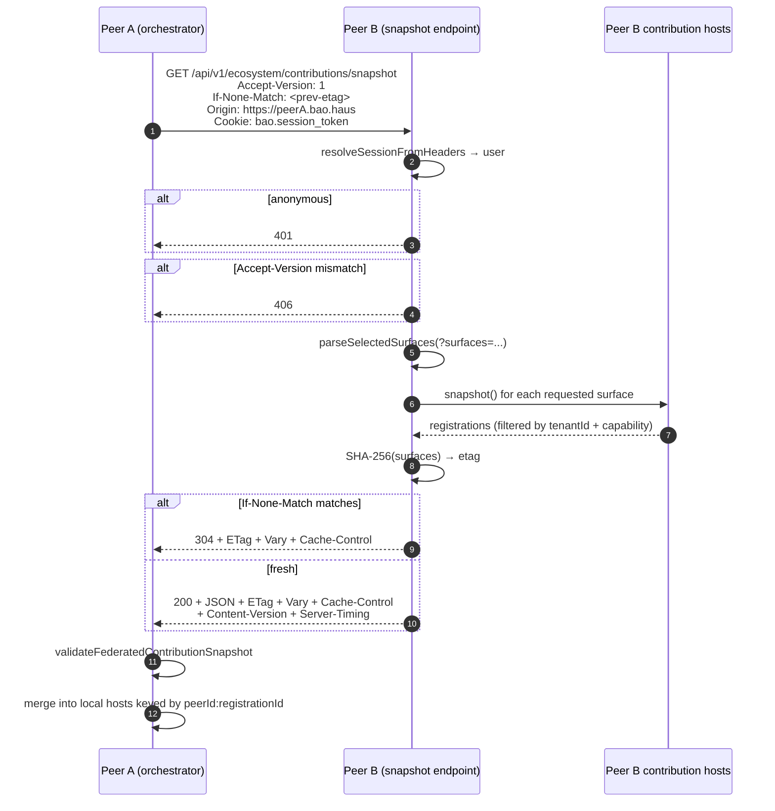

<!-- BEGIN BAOHAUS README HEADER -->
# @baohaus/contribution-host-bao

[](../../README.md)
[](https://bun.sh)
[](https://www.typescriptlang.org/)
[](./package.json)

## Explain Like I'm Five

This crate is the mailroom’s guest desk. Each app lists its sidebar and settings tiles here, then trades signed snapshot cards with friend sites so menus stay in sync.

## Architecture



## Scope

| In scope | Dependencies | Out of scope |
| --- | --- | --- |
| Contribution host factories; Federation snapshot wire | Shared route constants; Registration schemas | Peer app databases; Registry OCI builds |
<!-- END BAOHAUS README HEADER -->

<!-- BEGIN BAOHAUS PACKAGE CARD -->
# @baohaus/contribution-host-bao

Per-app contribution host: instantiates one process-local singleton per contribution surface (sidebar / settings-tab / palette-entry-group / api-group / tile-group / ui-asset-pack) on top of the canonical generic factory in @baohaus/contribution-registry-bao. Lifts bao-runtime's per-surface registry-service modules into a shared, typed factory so registry, forge, bao-ai-gateway and any future .bao app can mount the same .bao install host without re-implementing the lifecycle wiring.

Source at `bao-source/contribution-host-bao`.

## Public Pieces

`./api-group`, `./federation-orchestrator`, `./federation-pull`, `./federation-pull-service`, `./federation-service-token`, `./federation-snapshot`, `./federation-snapshot-cache`, `./federation-snapshot-parsers`, `./federation-validator`, `./federation-wire`, `./palette-entry-group`, `./settings-tab`, `./sidebar`, `./tile-group`, `./topbar`, `./ui-asset-pack`

## Proof Commands

Run from `bao-source/contribution-host-bao`:

- `bun run typecheck`
- `bun run test`
- `bun run lint`
<!-- END BAOHAUS PACKAGE CARD -->

<!-- BEGIN BAOHAUS PACKAGE MANUAL -->
## Quick start

From `bao-source/contribution-host-bao`:

```bash
bun install
bun run typecheck
bun run test
bun run build
bun run lint
bun run bao:build
bun run bao:validate
bun run verify
```

# @baohaus/contribution-host-bao

Per-app contribution host factory + L1 cross-origin federation seam.

Submodule subpaths only — no barrel:

| Subpath | Surface |
| --- | --- |
| `./sidebar` | `createSidebarHost()` — typed `SidebarRegistration` host |
| `./settings-tab` | `createSettingsTabHost()` — Settings Workbench tabs |
| `./palette-entry-group` | `createPaletteEntryGroupHost()` — Command Palette groups |
| `./api-group` | `createApiGroupHost()` — API Explorer groups |
| `./tile-group` | `createTileGroupHost()` — Dashboard tile catalogs |
| `./federation-wire` | Cross-origin wire shape + route path + header constants |
| `./federation-snapshot` | Pure async `buildFederatedSnapshot()` collector |
| `./federation-validator` | Boundary-validator with `Result` discriminator |

See root `CLAUDE.md` governance allowlist for the cross-app rule.

## Federation surface (L1 capstone)

Every Bao app (registry, bao-runtime, forge, bao-ai-gateway, bao-agent) mounts an Elysia route at the canonical `FEDERATION_SNAPSHOT_ROUTE_PATH` (`/api/v1/ecosystem/contributions/snapshot`) that returns a `FederatedContributionSnapshot` envelope built by `buildFederatedSnapshot`. Connected peers fetch each other's snapshots and merge them into local contribution-host singletons so a `.bao` install on peer A surfaces in peer B's sidebar/settings/palette/api/tile UI within an SSE round-trip.

### Wire shape

```ts
interface FederatedContributionSnapshot {
  readonly schemaVersion: 1;
  readonly peer: FederatedPeerIdentity; // peerId, displayName, origin, versionTag, capabilityTier
  readonly snapshotAt: string; // ISO-8601
  readonly etag: string; // SHA-256 hex of surfaces JSON
  readonly surfaces: {
    readonly sidebar: readonly SidebarRegistration[];
    readonly settingsTab: readonly SettingsTabRegistration[];
    readonly paletteEntryGroup: readonly PaletteEntryGroupRegistration[];
    readonly apiGroup: readonly ApiGroupRegistration[];
    readonly tileGroup: readonly TileGroupRegistration[];
  };
}
```

### Sequence — peer A fetches peer B's snapshot



### Privacy + correctness contract

| Concern | Treatment |
| --- | --- |
| Auth | Authenticated-only (`session.user` required); 401 anon |
| Tenant isolation | `tenantId === session.activeOrganizationId \|\| tenantId == null` |
| Capability leak | `capabilityRef` redacted before serialization (info-disclosure mitigation) |
| Cache pollination | `Cache-Control: private, no-cache, must-revalidate` + `Vary: Cookie, Authorization, If-None-Match` |
| Schema evolution | `Accept-Version` request / `Content-Version` response; mismatched → 406 |
| Partial fetch | `?surfaces=sidebar,settings-tab,...` filters buckets; etag includes selection |
| Observability | `Server-Timing: collect;dur=X, total;dur=Y` per response |
| Wire safety | JSON-safe by construction (readonly arrays, no class instances) — validated by round-trip test |

### SLO targets

| Phase | Target |
| --- | --- |
| Authenticated snapshot, cold | p99 < 200ms |
| Authenticated snapshot, 304 hit | p99 < 50ms |
| Anonymous 401 reject | p99 < 20ms |

### Runbook

**peer flooding snapshot endpoint** — Inspect `Server-Timing` headers in access logs. Add the peer's `peer.peerId` to per-peer rate-limit deny list. Confirm orchestrator is using `If-None-Match` for revalidation (304 path should dominate).

**etag mismatch storm** — Indicates host mutation churn. Inspect `bao-install` handler logs; identify the extension issuing repeated register/unregister. Pause the offending extension via Settings → Plugins → Disable.

**cross-tenant leak suspected** — Run `buildFederatedSnapshot({ tenantId: '<expected>' })` against the host in question. Confirm the snapshot only contains registrations where `tenantId === '<expected>' || tenantId == null`. If a registration with a different tenantId appears, file as `federation-leak` incident and revoke the offending `.bao` extension's install grant.

**stale snapshot served after install** — Snapshot is computed on every request (no cache in V0). Confirm the request is hitting a worker that loaded the new host registration. If the issue persists, restart the runtime (`bun ./src/main.ts`) so all reusePort workers reload.

## Verification

```bash
bun install --frozen-lockfile
bun run typecheck
bun run lint
bun test
bun run build
bun run bao:build
bun run bao:validate
```

## Subpaths

| Subpath | Purpose |
| --- | --- |
| `./api-group` | Api group — typed surface from this .bao crate |
| `./federation-orchestrator` | Federation orchestrator — federation wire, snapshot, or validation |
| `./federation-pull` | Federation pull — federation wire, snapshot, or validation |
| `./federation-service-token` | Federation service token — federation wire, snapshot, or validation |
| `./federation-snapshot` | Federation snapshot — federation wire, snapshot, or validation |
| `./federation-snapshot-cache` | Federation snapshot cache — federation wire, snapshot, or validation |
| `./federation-validator` | Federation validator — federation wire, snapshot, or validation |
| `./federation-wire` | Federation wire — federation wire, snapshot, or validation |
| `./palette-entry-group` | Palette entry group — host UI registration surface |
| `./settings-tab` | Settings tab — host UI registration surface |
| `./sidebar` | Sidebar — host UI registration surface |
| `./tile-group` | Tile group — typed surface from this .bao crate |
| _…_ | _1 more export(s) in package.json_ |

## Reference

### Subpaths

| Subpath | Purpose |
| --- | --- |
| `./api-group` | Api group — typed surface from this .bao crate |
| `./federation-orchestrator` | Federation orchestrator — federation wire, snapshot, or validation |
| `./federation-pull` | Federation pull — federation wire, snapshot, or validation |
| `./federation-service-token` | Federation service token — federation wire, snapshot, or validation |
| `./federation-snapshot` | Federation snapshot — federation wire, snapshot, or validation |
| `./federation-snapshot-cache` | Federation snapshot cache — federation wire, snapshot, or validation |
| `./federation-validator` | Federation validator — federation wire, snapshot, or validation |
| `./federation-wire` | Federation wire — federation wire, snapshot, or validation |
| `./palette-entry-group` | Palette entry group — host UI registration surface |
| `./settings-tab` | Settings tab — host UI registration surface |
| `./sidebar` | Sidebar — host UI registration surface |
| `./tile-group` | Tile group — typed surface from this .bao crate |
| _…_ | _1 more in `package.json#exports`_ |
<!-- END BAOHAUS PACKAGE MANUAL -->
