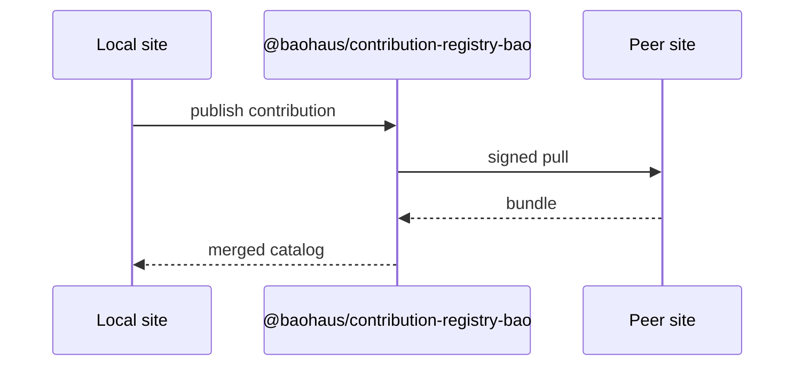

<!-- BEGIN BAOHAUS README HEADER -->
# @baohaus/contribution-registry-bao

## Explain Like I'm Five

Think of contribution registry bao as the guest desk where each app registers menus and trades signed snapshot cards with friend sites. Canonical per-surface contribution registry factory consumed by every Bao app's `.bao` install handler chain. Generalises the legacy sidebar-only registry into a typed, order-stable store that any contribution surface (sidebar / settings-tab / palette-entry-group / api-group / tile-group / ui-asset-pack) can instantiate without redeclaring l…

## Architecture



## Scope

| In scope | Dependencies | Out of scope |
| --- | --- | --- |
| Canonical per-surface contribution registry factory consumed by every Bao app's `. | @baohaus/ecosystem-events-bao | Other workbench domains; bao-runtime host lifecycle |
<!-- END BAOHAUS README HEADER -->

<!-- BEGIN BAOHAUS PACKAGE CARD -->
# @baohaus/contribution-registry-bao

Standalone Baohaus package. Catalog identity `contribution-registry-bao`. Source at `bao-source/contribution-registry-bao`. Publishes to `baohaus/contribution-registry-bao`. Canonical archive: `bao-source/contribution-registry-bao/dist/bao/contribution-registry-bao.bao`.

Cross-app contract and the full principles list live at the repo-root [README](../../README.md#principles).

## Package Facts

| Field | Value |
| --- | --- |
| Package | `@baohaus/contribution-registry-bao` |
| Catalog id | `contribution-registry-bao` |
| Source path | `bao-source/contribution-registry-bao` |
| OCI repository | `baohaus/contribution-registry-bao` |
| Channel | `public` |
| Visibility | `public` |
| Kind | `library` |
| Runtime installable | `yes` |
| Publish gate | `standard` |

## Public Pieces

`./api-group`, `./api-group-validate`, `./palette-entry-group`, `./palette-entry-group-validate`, `./registry`, `./settings-tab`, `./settings-tab-validate`, `./sidebar`, `./sidebar-validate`, `./tile-group`, `./tile-group-validate`, `./types`, `./ui-asset-pack`.

## Proof Commands

Run from `bao-source/contribution-registry-bao`:

- `bun run build`
- `bun run typecheck`
- `bun test`
- `bun run lint`
- `bun run bao:build`
- `bun run bao:validate`
- `bun run verify`

## Publishing Path

`@baohaus/contribution-registry-bao` publishes to `baohaus/contribution-registry-bao` through the canonical `.bao` registry distribution path. Local overrides are development-only; installable content resolves through the registry and the checked catalog/governance/lock path.
<!-- END BAOHAUS PACKAGE CARD -->

<!-- BEGIN BAOHAUS PACKAGE MANUAL -->
## Quick start

From `bao-source/contribution-registry-bao`:

```bash
bun install
bun run typecheck
bun test
bun run build
bun run test
bun run lint
bun run bao:build
bun run bao:validate
bun run verify
```

# `@baohaus/contribution-registry-bao`

Canonical generic per-surface contribution registry factory consumed by
every Bao app's `.bao` install handler chain.

## What this package solves

Every contribution surface (sidebar / settings-tab / palette-entry-group /
api-group / tile-group) needs the same lifecycle:

1. Register a contribution with a unique id and an owning extension.
2. Snapshot the registry in a stable order for rendering.
3. Hot-uninstall: drop every registration owned by an extension.
4. Reject duplicate-id collisions across different owners.

Before this package, the sidebar registry hand-rolled all of the above
inside `bao-runtime/`, and every other surface that wanted the same
semantics would have re-implemented it. This package extracts the
generic factory so consumers only supply the surface-specific compare
function and shape.

## Submodule subpaths

There is no barrel — every consumer imports from a specific subpath.

- `@baohaus/contribution-registry-bao/registry` — the
  `createContributionRegistry<T>(compare)` factory + the `RegistryError`
  / `RegisterResult` discriminated Result types.
- `@baohaus/contribution-registry-bao/types` — `BaseContributionRegistration`
  base interface and re-exports of `ECOSYSTEM_CONTRIBUTION_SURFACE` /
  `EcosystemContributionSurface` from
  `@baohaus/ecosystem-events-bao/types`. The contribution-surface
  discriminator lives in `ecosystem-events-bao` because the event bus
  and the registry both reference the same five surfaces — there is no
  duplicate enum.

## Result discriminator, not exceptions

`register()` returns a `RegisterResult` discriminator instead of
throwing on collision. Callers handle the `ok: false` branch to log /
roll back / surface a user-facing error. This matches the Rust /
Effect-TS-style Result pattern enforced across the Bao codebase via
`@baohaus/bao-utils/async-result` and keeps the install handler chain
exception-free.

## Per-surface shapes live with their consumers

The package intentionally does not declare `SidebarRegistration` /
`SettingsTabRegistration` / etc. Surface-specific shapes carry
app-specific fields (sidebar sections differ per app, dashboard tile
catalogs differ per app); they extend `BaseContributionRegistration`
in the consumer that owns the surface. When the surface is canonical
across every Bao app (the sidebar is, once the canonical happydumpling
sidebar partial is rendered by every app), the surface-specific shape
graduates into its own contract module.

## Subpaths

| Subpath | Purpose |
| --- | --- |
| `./api-group` | Api group — typed surface from this workbench |
| `./api-group-validate` | Api group validate — typed surface from this workbench |
| `./palette-entry-group` | Palette entry group — host UI registration surface |
| `./palette-entry-group-validate` | Palette entry group validate — host UI registration surface |
| `./registry` | Registry — typed surface from this workbench |
| `./settings-tab` | Settings tab — host UI registration surface |
| `./settings-tab-validate` | Settings tab validate — host UI registration surface |
| `./sidebar` | Sidebar — host UI registration surface |
| `./sidebar-validate` | Sidebar validate — host UI registration surface |
| `./tile-group` | Tile group — typed surface from this workbench |
| `./tile-group-validate` | Tile group validate — typed surface from this workbench |
| `./types` | Types — typed surface from this workbench |
| _…_ | _1 more export(s) in package.json_ |

## Reference

### Subpaths

| Subpath | Purpose |
| --- | --- |
| `./api-group` | Api group — typed surface from this workbench |
| `./api-group-validate` | Api group validate — typed surface from this workbench |
| `./palette-entry-group` | Palette entry group — host UI registration surface |
| `./palette-entry-group-validate` | Palette entry group validate — host UI registration surface |
| `./registry` | Registry — typed surface from this workbench |
| `./settings-tab` | Settings tab — host UI registration surface |
| `./settings-tab-validate` | Settings tab validate — host UI registration surface |
| `./sidebar` | Sidebar — host UI registration surface |
| `./sidebar-validate` | Sidebar validate — host UI registration surface |
| `./tile-group` | Tile group — typed surface from this workbench |
| `./tile-group-validate` | Tile group validate — typed surface from this workbench |
| `./types` | Types — typed surface from this workbench |
| _…_ | _1 more in `package.json#exports`_ |
<!-- END BAOHAUS PACKAGE MANUAL -->
