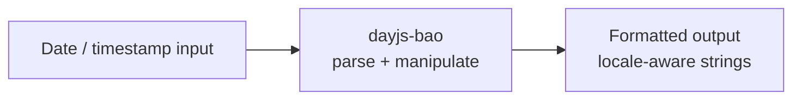

<!-- BEGIN BAOHAUS README HEADER -->
# @baohaus/dayjs-bao

[](../../README.md)
[](https://bun.sh)
[](https://www.typescriptlang.org/)
[](./package.json)

## Explain Like I'm Five

This crate is the mailroom's wall clock. It parses dates, formats times, and speaks every locale so the goose always knows when things happened.

## Architecture



## Scope

| In scope | Dependencies | Out of scope |
| --- | --- | --- |
| Day.; Exported API: dayjsWithExtras, PACKAGE_NAME | Shared @baohaus contracts | Other .bao crate domains; bao-runtime host lifecycle |
<!-- END BAOHAUS README HEADER -->

<!-- BEGIN BAOHAUS PACKAGE CARD -->
# @baohaus/dayjs-bao

Day.js parity: parsing, manipulation, formatting, locales, plugins, duration

Source at `bao-source/dayjs-bao`.

## Public Pieces

`.`, `./duration`, `./format`, `./locale`, `./parse`

## Proof Commands

Run from `bao-source/dayjs-bao`:

- `bun run typecheck`
- `bun run test`
- `bun run lint`
<!-- END BAOHAUS PACKAGE CARD -->

<!-- BEGIN BAOHAUS PACKAGE MANUAL -->
## Quick start

From `bao-source/dayjs-bao`:

```bash
bun install
bun run typecheck
bun run test
bun run build
bun run lint
bun run bao:build
bun run bao:validate
bun run verify
```

## Capability

Day.js parity: parsing, manipulation, formatting, locales, plugins, duration

## Subpaths

| Subpath | Purpose |
| --- | --- |
| `.` | Main entry — typed surface from this .bao crate |
| `./duration` | Duration — typed surface from this .bao crate |
| `./format` | Format — typed surface from this .bao crate |
| `./locale` | Locale — typed surface from this .bao crate |
| `./parse` | Parse — typed surface from this .bao crate |

## Primary symbols

- `dayjsWithExtras`
- `PACKAGE_NAME`

## Integration

Source: `bao-source/dayjs-bao` (`src/index.ts`). Import published subpaths only; do not deep-link into `dist/`.

## Registry

Catalog id `dayjs-bao` → OCI `baohaus/dayjs-bao`.

## Reference

### Subpaths

| Subpath | Purpose |
| --- | --- |
| `.` | Main entry — typed surface from this .bao crate |
| `./duration` | Duration — typed surface from this .bao crate |
| `./format` | Format — typed surface from this .bao crate |
| `./locale` | Locale — typed surface from this .bao crate |
| `./parse` | Parse — typed surface from this .bao crate |

### Symbols

- `dayjsWithExtras`
- `PACKAGE_NAME`
<!-- END BAOHAUS PACKAGE MANUAL -->
