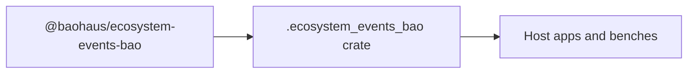

<!-- BEGIN BAOHAUS README HEADER -->
# @baohaus/ecosystem-events-bao

## Explain Like I'm Five

Canonical in-process pub/sub bus + SSE encoder + per-subscriber filter for cross-surface contribution-change signals (sidebar / settings-tab / palette-entry-group / api-group / tile-group). Consumed by every Bao app's SSE sink so a `.bao` install or capability re-evaluation fans out to every open browser tab without a page reload. Import subpaths like `./encoder`, `./filter`, `./install-boot`, `./install-boot-with-baoboss` when you wire this crate in.

## Architecture



## Scope

| In scope | Dependencies | Out of scope |
| --- | --- | --- |
| Canonical in-process pub/sub bus + SSE encoder + per-subscriber filter for cross-surface contribution-change signals (sidebar / settings-tab / palette-entry-group / api-group / tile-group).; Subpaths: ./encoder, ./filter, ./install-boot, ./install-boot-with-baoboss, ./peer-invalidation, ./service, ./sse-sink, ./types | @baohaus/bao-boss; @baohaus/bao-utils | Other workbench domains; bao-runtime host lifecycle |
<!-- END BAOHAUS README HEADER -->

<!-- BEGIN BAOHAUS PACKAGE CARD -->
# @baohaus/ecosystem-events-bao

Standalone Baohaus package. Catalog identity `ecosystem-events-bao`. Source at `bao-source/ecosystem-events-bao`. Publishes to `baohaus/ecosystem-events-bao`. Canonical archive: `bao-source/ecosystem-events-bao/dist/bao/ecosystem-events-bao.bao`.

Cross-app contract and the full principles list live at the repo-root [README](../../README.md#principles).

## Package Facts

| Field | Value |
| --- | --- |
| Package | `@baohaus/ecosystem-events-bao` |
| Catalog id | `ecosystem-events-bao` |
| Source path | `bao-source/ecosystem-events-bao` |
| OCI repository | `baohaus/ecosystem-events-bao` |
| Channel | `public` |
| Visibility | `public` |
| Kind | `library` |
| Runtime installable | `yes` |
| Publish gate | `standard` |

## Public Pieces

`./encoder`, `./filter`, `./install-boot`, `./install-boot-with-baoboss`, `./peer-invalidation`, `./service`, `./sse-sink`, `./types`.

## Proof Commands

Run from `bao-source/ecosystem-events-bao`:

- `bun run build`
- `bun run typecheck`
- `bun test`
- `bun run lint`
- `bun run bao:build`
- `bun run bao:validate`
- `bun run verify`

## Publishing Path

`@baohaus/ecosystem-events-bao` publishes to `baohaus/ecosystem-events-bao` through the canonical `.bao` registry distribution path. Local overrides are development-only; installable content resolves through the registry and the checked catalog/governance/lock path.
<!-- END BAOHAUS PACKAGE CARD -->

<!-- BEGIN BAOHAUS PACKAGE MANUAL -->
## Quick start

From `bao-source/ecosystem-events-bao`:

```bash
bun install
bun run typecheck
bun test
bun run build
bun run test
bun run lint
bun run bao:build
bun run bao:validate
bun run verify
```

# `@baohaus/ecosystem-events-bao`

Canonical in-process pub/sub bus + SSE encoder + per-subscriber filter for
cross-surface contribution-change signals in the .bao ecosystem.

## What this package solves

When a `.bao` package is installed, uninstalled, or a user's capability set
changes, every open browser tab in the affected scope needs to re-render the
contribution surfaces (sidebar / settings-tab / palette-entry-group /
api-group / tile-group) without a page reload. This package is the single
broker every .bao app (registry, bao-runtime, forge, bao-agent, bao-desktop,
.bao AI Gateway) consumes for that fanout, so no app re-implements pub/sub +
SSE encoding + per-tenant/per-user filtering locally.

## Submodule subpaths

There is no barrel — every consumer imports from a specific subpath.

- `@baohaus/ecosystem-events-bao/service` — the `ecosystemEventBus`
  singleton (`publish`, `subscribe`, `resetForTests`, `listenerCount`).
- `@baohaus/ecosystem-events-bao/types` — `EcosystemContributionEvent`,
  the `ECOSYSTEM_CONTRIBUTION_SURFACE` / `ECOSYSTEM_CONTRIBUTION_CHANGE`
  `as-const` maps, `SubscriberScope`, `EcosystemFragmentRenderer`.
- `@baohaus/ecosystem-events-bao/filter` — `shouldDeliverEvent(event,
  scope, expectedSurface)` pure decision function used by every SSE
  sink before re-rendering.
- `@baohaus/ecosystem-events-bao/encoder` — `encodeSseFragment` and
  `encodeHeartbeatComment` for the SSE wire-format.
- `@baohaus/ecosystem-events-bao/sse-sink` —
  `createContributionSseStream(deps)` that wires bus → filter → render
  → encoder into a single `ReadableStream<Uint8Array>` you can return
  from any Elysia / Bun.serve route.

## Industry-best-practice scope rules

The bus broadcasts unconditionally; per-subscriber filtering is the SSE
sink's job. Scope rules:

- Surface match is required.
- `event.tenantId` set → only subscribers in that tenant.
- `event.userId` set → only that user's open tabs (matches the Auth0 /
  Okta / AWS IAM / Google Cloud IAM industry-best-practice of flushing
  capability changes across every session of the affected user).
- Per-session targeting is not part of the event shape — sessions
  within a single user always re-render together.

## Cross-process bridge (out of scope here)

The canonical wire-format topic for cross-instance fanout is
`ecosystem.contribution-changed` declared in
`@baohaus/queue-bao/topics`. Multi-node deployments bridge in-process
publish to that topic in a separate module; this package stays in-process
so single-node deployments incur zero broker overhead.

## Subpaths

| Subpath | Purpose |
| --- | --- |
| `./encoder` | Encoder — typed surface from this workbench |
| `./filter` | Filter — typed surface from this workbench |
| `./install-boot` | Install boot — typed surface from this workbench |
| `./install-boot-with-baoboss` | Install boot with baoboss — typed surface from this workbench |
| `./peer-invalidation` | Peer invalidation — typed surface from this workbench |
| `./service` | Service — typed surface from this workbench |
| `./sse-sink` | Sse sink — typed surface from this workbench |
| `./types` | Types — typed surface from this workbench |

## Reference

### Subpaths

| Subpath | Purpose |
| --- | --- |
| `./encoder` | Encoder — typed surface from this workbench |
| `./filter` | Filter — typed surface from this workbench |
| `./install-boot` | Install boot — typed surface from this workbench |
| `./install-boot-with-baoboss` | Install boot with baoboss — typed surface from this workbench |
| `./peer-invalidation` | Peer invalidation — typed surface from this workbench |
| `./service` | Service — typed surface from this workbench |
| `./sse-sink` | Sse sink — typed surface from this workbench |
| `./types` | Types — typed surface from this workbench |
<!-- END BAOHAUS PACKAGE MANUAL -->
