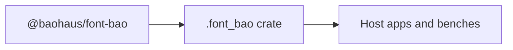

<!-- BEGIN BAOHAUS README HEADER -->
# @baohaus/font-bao

## Explain Like I'm Five

Self-hosted font packages with CSS @font-face generation and vendored woff assets Apps use exports such as `FontFace`, `FontPackage`, `generateFontFaceCSS` from `@baohaus/font-bao`. It is part of the Baohaus .bao factory line.

## Architecture



## Scope

| In scope | Dependencies | Out of scope |
| --- | --- | --- |
| Self-hosted font packages with CSS @font-face generation and vendored woff assets; Exported API: FontFace, FontPackage, generateFontFaceCSS, INTER, JETBRAINS_MONO, … | bao-governance.json; bao.lock; catalog row | Other workbench domains; bao-runtime host lifecycle |
<!-- END BAOHAUS README HEADER -->

<!-- BEGIN BAOHAUS PACKAGE CARD -->
# @baohaus/font-bao

Standalone Baohaus package. Catalog identity `font-bao`. Source at `bao-source/font-bao`. Publishes to `baohaus/font-bao`. Canonical archive: `bao-source/font-bao/dist/bao/font-bao.bao`.

Cross-app contract and the full principles list live at the repo-root [README](../../README.md#principles).

## Package Facts

| Field | Value |
| --- | --- |
| Package | `@baohaus/font-bao` |
| Catalog id | `font-bao` |
| Source path | `bao-source/font-bao` |
| OCI repository | `baohaus/font-bao` |
| Channel | `public` |
| Visibility | `public` |
| Kind | `library` |
| Runtime installable | `yes` |
| Publish gate | `standard` |

## Public Pieces

`.`, `./manifest`, `./inter`, `./jetbrains-mono`, `./dm-sans`, `./ibm-plex-mono`, `./instrument-serif`, `./playfair-display`, `./syne`.

## Proof Commands

Run from `bao-source/font-bao`:

- `bun run build`
- `bun run typecheck`
- `bun run test`
- `bun run lint`
- `bun run bao:build`
- `bun run bao:validate`
- `bun run verify`

## Publishing Path

`@baohaus/font-bao` publishes to `baohaus/font-bao` through the canonical `.bao` registry distribution path. Local overrides are development-only; installable content resolves through the registry and the checked catalog/governance/lock path.
<!-- END BAOHAUS PACKAGE CARD -->

<!-- BEGIN BAOHAUS PACKAGE MANUAL -->
## Quick start

From `bao-source/font-bao`:

```bash
bun install
bun run typecheck
bun run test
bun run build
bun run lint
bun run bao:build
bun run bao:validate
bun run verify
```

## Capability

Self-hosted font packages with CSS @font-face generation and vendored woff assets

## Subpaths

| Subpath | Purpose |
| --- | --- |
| `.` | Main entry — typed surface from this workbench |
| `./manifest` | Manifest — typed surface from this workbench |
| `./inter` | Inter — typed surface from this workbench |
| `./jetbrains-mono` | Jetbrains mono — typed surface from this workbench |
| `./dm-sans` | Dm sans — typed surface from this workbench |
| `./ibm-plex-mono` | Ibm plex mono — typed surface from this workbench |
| `./instrument-serif` | Instrument serif — typed surface from this workbench |
| `./playfair-display` | Playfair display — typed surface from this workbench |
| `./syne` | Syne — typed surface from this workbench |

## Primary symbols

- `FontFace`
- `FontPackage`
- `generateFontFaceCSS`
- `INTER`
- `JETBRAINS_MONO`
- `PACKAGE_NAME`
- `UPSTREAM_PACKAGE`

## Integration

Source: `bao-source/font-bao` (`src/index.ts`). Import published subpaths only; do not deep-link into `dist/`.

## Registry

Catalog id `font-bao` → OCI `baohaus/font-bao`.

## Reference

### Subpaths

| Subpath | Purpose |
| --- | --- |
| `.` | Main entry — typed surface from this workbench |
| `./manifest` | Manifest — typed surface from this workbench |
| `./inter` | Inter — typed surface from this workbench |
| `./jetbrains-mono` | Jetbrains mono — typed surface from this workbench |
| `./dm-sans` | Dm sans — typed surface from this workbench |
| `./ibm-plex-mono` | Ibm plex mono — typed surface from this workbench |
| `./instrument-serif` | Instrument serif — typed surface from this workbench |
| `./playfair-display` | Playfair display — typed surface from this workbench |
| `./syne` | Syne — typed surface from this workbench |

### Symbols

- `FontFace`
- `FontPackage`
- `generateFontFaceCSS`
- `INTER`
- `JETBRAINS_MONO`
- `PACKAGE_NAME`
- `UPSTREAM_PACKAGE`
<!-- END BAOHAUS PACKAGE MANUAL -->
