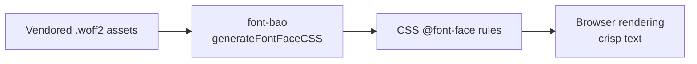

<!-- BEGIN BAOHAUS README HEADER -->
# @baohaus/font-bao

[](../../README.md)
[](https://bun.sh)
[](https://www.typescriptlang.org/)
[](./package.json)

## Explain Like I'm Five

This crate is the mailroom's type cabinet. Self-hosted font files and the CSS rules to load them live here so text always shows up in the right typeface.

## Architecture



## Scope

| In scope | Dependencies | Out of scope |
| --- | --- | --- |
| Self-hosted font packages with CSS @font-face generation and vendored woff assets; Exported API: FontFace, FontPackage, generateFontFaceCSS, INTER, JETBRAINS_MONO, … | Shared @baohaus contracts | Other .bao crate domains; bao-runtime host lifecycle |
<!-- END BAOHAUS README HEADER -->

<!-- BEGIN BAOHAUS PACKAGE CARD -->
# @baohaus/font-bao

Self-hosted font packages with CSS @font-face generation and vendored woff assets

Source at `bao-source/font-bao`.

## Public Pieces

`.`, `./dm-sans`, `./ibm-plex-mono`, `./instrument-serif`, `./inter`, `./jetbrains-mono`, `./manifest`, `./playfair-display`, `./syne`

## Proof Commands

Run from `bao-source/font-bao`:

- `bun run typecheck`
- `bun run test`
- `bun run lint`
<!-- END BAOHAUS PACKAGE CARD -->

<!-- BEGIN BAOHAUS PACKAGE MANUAL -->
## Quick start

From `bao-source/font-bao`:

```bash
bun install
bun run typecheck
bun run test
bun run build
bun run lint
bun run bao:build
bun run bao:validate
bun run verify
```

## Capability

Self-hosted font packages with CSS @font-face generation and vendored woff assets

## Subpaths

| Subpath | Purpose |
| --- | --- |
| `.` | Main entry — typed surface from this .bao crate |
| `./manifest` | Manifest — typed surface from this .bao crate |
| `./inter` | Inter — typed surface from this .bao crate |
| `./jetbrains-mono` | Jetbrains mono — typed surface from this .bao crate |
| `./dm-sans` | Dm sans — typed surface from this .bao crate |
| `./ibm-plex-mono` | Ibm plex mono — typed surface from this .bao crate |
| `./instrument-serif` | Instrument serif — typed surface from this .bao crate |
| `./playfair-display` | Playfair display — typed surface from this .bao crate |
| `./syne` | Syne — typed surface from this .bao crate |

## Primary symbols

- `FontFace`
- `FontPackage`
- `generateFontFaceCSS`
- `INTER`
- `JETBRAINS_MONO`
- `PACKAGE_NAME`
- `UPSTREAM_PACKAGE`

## Integration

Source: `bao-source/font-bao` (`src/index.ts`). Import published subpaths only; do not deep-link into `dist/`.

## Registry

Catalog id `font-bao` → OCI `baohaus/font-bao`.

## Reference

### Subpaths

| Subpath | Purpose |
| --- | --- |
| `.` | Main entry — typed surface from this .bao crate |
| `./manifest` | Manifest — typed surface from this .bao crate |
| `./inter` | Inter — typed surface from this .bao crate |
| `./jetbrains-mono` | Jetbrains mono — typed surface from this .bao crate |
| `./dm-sans` | Dm sans — typed surface from this .bao crate |
| `./ibm-plex-mono` | Ibm plex mono — typed surface from this .bao crate |
| `./instrument-serif` | Instrument serif — typed surface from this .bao crate |
| `./playfair-display` | Playfair display — typed surface from this .bao crate |
| `./syne` | Syne — typed surface from this .bao crate |

### Symbols

- `FontFace`
- `FontPackage`
- `generateFontFaceCSS`
- `INTER`
- `JETBRAINS_MONO`
- `PACKAGE_NAME`
- `UPSTREAM_PACKAGE`
<!-- END BAOHAUS PACKAGE MANUAL -->
