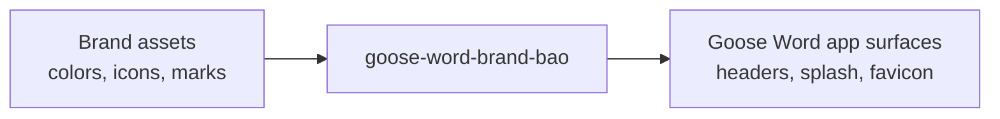

<!-- BEGIN BAOHAUS README HEADER -->
# @baohaus/goose-word-brand-bao

[](../../README.md)
[](https://bun.sh)
[](https://www.typescriptlang.org/)
[](./package.json)

## Explain Like I'm Five

This crate is the mailroom's logo stamp. Brand colors, icons, and identity marks for Goose Word live here so the app always looks like itself.

## Architecture



## Scope

| In scope | Dependencies | Out of scope |
| --- | --- | --- |
| Public contract for `@baohaus/goose-word-brand-bao` | Shared @baohaus contracts | Other .bao crate domains; bao-runtime host lifecycle |
<!-- END BAOHAUS README HEADER -->

<!-- BEGIN BAOHAUS PACKAGE CARD -->
# @baohaus/goose-word-brand-bao

Standalone package in the Baohaus monorepo.

Source at `bao-source/goose-word-brand-bao`.

## Public Pieces

_None declared._

## Proof Commands

Run from `bao-source/goose-word-brand-bao`:

- `bun run typecheck`
- `bun run test`
- `bun run lint`
<!-- END BAOHAUS PACKAGE CARD -->

<!-- BEGIN BAOHAUS PACKAGE MANUAL -->
## Quick start

From `bao-source/goose-word-brand-bao`:

```bash
bun install
bun run typecheck
bun run test
bun run lint
bun run build
bun run bao:build
bun run bao:validate
bun run verify
```

## Reference

## Integration

Source tree: `bao-source/goose-word-brand-bao`.
Import only documented subpaths from the package card; do not deep-link into `dist/`.
<!-- END BAOHAUS PACKAGE MANUAL -->
