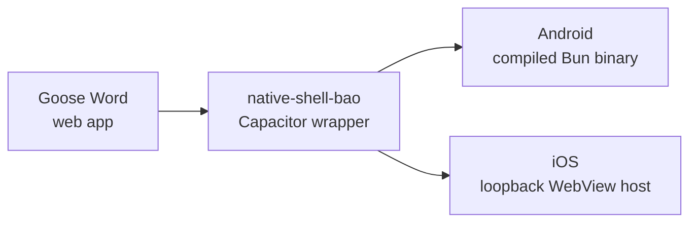

<!-- BEGIN BAOHAUS README HEADER -->
# @baohaus/goose-word-native-shell-bao

[](../../README.md)
[](https://bun.sh)
[](https://www.typescriptlang.org/)
[](./package.json)

## Explain Like I'm Five

This crate is the mailroom's mobile delivery van. It wraps Goose Word into an Android or iOS app so the goose can deliver documents to phones and tablets.

## Architecture



## Scope

| In scope | Dependencies | Out of scope |
| --- | --- | --- |
| Capacitor native shell for Goose Word (Android compiled Bun binary, iOS in-process loopback host). | Shared @baohaus contracts | Other .bao crate domains; bao-runtime host lifecycle |
<!-- END BAOHAUS README HEADER -->

<!-- BEGIN BAOHAUS PACKAGE CARD -->
# @baohaus/goose-word-native-shell-bao

Capacitor native shell for Goose Word (Android compiled Bun binary, iOS in-process loopback host).

Source at `bao-source/goose-word-native-shell-bao`.

## Public Pieces

_None declared._

## Proof Commands

Run from `bao-source/goose-word-native-shell-bao`:

- `bun run typecheck`
- `bun run test`
- `bun run lint`
<!-- END BAOHAUS PACKAGE CARD -->

<!-- BEGIN BAOHAUS PACKAGE MANUAL -->
## Quick start

From `bao-source/goose-word-native-shell-bao`:

```bash
bun install
bun run typecheck
bun run test
bun run lint
bun run build
bun run bao:build
bun run bao:validate
bun run verify
```

# goose-word-native-shell-bao

Capacitor native shell for Goose Word (`.bao` `native-mobile-shell` targets).

## Allowlist

- **Capacitor** — industry-standard WebView shell (local packages only).
- **Kotlin / Swift lifecycle** — platform boundary for embedded server start/stop, not application-layer shims.

## Android

1. `cd ../../goose-word && bun run mobile:server:android`
2. Copy binary into `android/app/src/main/assets/goose-word-android-arm64`
3. `npm install` in this package (or copy `node_modules` from a Capacitor init scratch dir)
4. `bun run android:assemble` → `android/app/build/outputs/apk/debug/app-debug.apk`

## iOS

See `../../goose-word/docs/ios-embed-spike.md`. In-process loopback host: `ios/App/App/Plugins/GooseWordLoopbackHost.swift`.

`bun run ios:archive` requires Xcode + CocoaPods.

## Loopback

WebView loads `http://127.0.0.1:8080/docs` with cleartext permitted for localhost.
<!-- END BAOHAUS PACKAGE MANUAL -->
