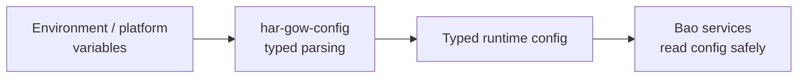

<!-- BEGIN BAOHAUS README HEADER -->
# @baohaus/har-gow-config

[](../../README.md)
[](https://bun.sh)
[](https://www.typescriptlang.org/)
[](./package.json)

## Explain Like I'm Five

This crate is the mailroom's typed checklist. It defines what every Bun service needs to know about its environment -- ports, URLs, feature flags -- in one tidy list.

## Architecture



## Scope

| In scope | Dependencies | Out of scope |
| --- | --- | --- |
| Typed Baohaus runtime configuration for Bun services and packages.; Subpaths: ., ./assistant-runtime, ./env-core, ./env-platform, ./env-server, ./routes, ./workflow-execute-auth | @baohaus/baobox | Other .bao crate domains; bao-runtime host lifecycle |
<!-- END BAOHAUS README HEADER -->

<!-- BEGIN BAOHAUS PACKAGE CARD -->
# @baohaus/har-gow-config

Typed Baohaus runtime configuration for Bun services and packages.

Source at `bao-source/har-gow-config`.

## Public Pieces

`.`, `./assistant-runtime`, `./env-core`, `./env-platform`, `./env-server`, `./routes`, `./workflow-execute-auth`

## Proof Commands

Run from `bao-source/har-gow-config`:

- `bun run typecheck`
- `bun run test`
- `bun run lint`
<!-- END BAOHAUS PACKAGE CARD -->

<!-- BEGIN BAOHAUS PACKAGE MANUAL -->
## Quick start

From `bao-source/har-gow-config`:

```bash
bun install
bun run typecheck
bun run test
bun run build
bun run lint
bun run bao:build
bun run bao:validate
bun run verify
```

## Capability

Typed Baohaus runtime configuration for Bun services and packages.

## Subpaths

| Subpath | Purpose |
| --- | --- |
| `.` | Main entry — typed surface from this .bao crate |
| `./assistant-runtime` | Assistant runtime — typed surface from this .bao crate |
| `./env-core` | Env core — typed surface from this .bao crate |
| `./env-platform` | Env platform — typed surface from this .bao crate |
| `./env-server` | Env server — typed surface from this .bao crate |
| `./routes` | Routes — HTTP handlers |
| `./workflow-execute-auth` | Workflow execute auth — auth/session contracts |

## Integration

Source: `bao-source/har-gow-config`. Import published subpaths only; do not deep-link into `dist/`.

## Registry

Catalog id `har-gow-config` → OCI `baohaus/har-gow-config`.

## Reference

### Subpaths

| Subpath | Purpose |
| --- | --- |
| `.` | Main entry — typed surface from this .bao crate |
| `./assistant-runtime` | Assistant runtime — typed surface from this .bao crate |
| `./env-core` | Env core — typed surface from this .bao crate |
| `./env-platform` | Env platform — typed surface from this .bao crate |
| `./env-server` | Env server — typed surface from this .bao crate |
| `./routes` | Routes — HTTP handlers |
| `./workflow-execute-auth` | Workflow execute auth — auth/session contracts |
<!-- END BAOHAUS PACKAGE MANUAL -->
