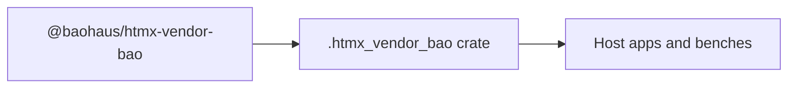

<!-- BEGIN BAOHAUS README HEADER -->
# @baohaus/htmx-vendor-bao

## Explain Like I'm Five

Think of htmx vendor bao as swap-in HTML panels: buttons fetch fresh pieces from the server without a heavy client app. Pinned HTMX core + official extension browser assets for Bun generate/static-bao pipelines. Single boundary owner for htmx.org npm packages. Import subpaths like `./manifest`, `./runtime`, `./side-effect` when you wire this crate in.

## Architecture



## Scope

| In scope | Dependencies | Out of scope |
| --- | --- | --- |
| Pinned HTMX core + official extension browser assets for Bun generate/static-bao pipelines.; Subpaths: ./manifest, ./runtime, ./side-effect | bao-governance.json; bao.lock; catalog row | Other workbench domains; bao-runtime host lifecycle |
<!-- END BAOHAUS README HEADER -->

<!-- BEGIN BAOHAUS PACKAGE CARD -->
# @baohaus/htmx-vendor-bao

Standalone Baohaus package. Catalog identity `htmx-vendor-bao`. Source at `bao-source/htmx-vendor-bao`. Publishes to `baohaus/htmx-vendor-bao`. Canonical archive: ``.

Cross-app contract and the full principles list live at the repo-root [README](../../README.md#principles).

## Package Facts

| Field | Value |
| --- | --- |
| Package | `@baohaus/htmx-vendor-bao` |
| Catalog id | `htmx-vendor-bao` |
| Source path | `bao-source/htmx-vendor-bao` |
| OCI repository | `baohaus/htmx-vendor-bao` |
| Channel | `public` |
| Visibility | `public` |
| Kind | `library` |
| Runtime installable | `no` |
| Publish gate | `standard` |

## Public Pieces

`./manifest`, `./runtime`, `./side-effect`.

## Proof Commands

Run from `bao-source/htmx-vendor-bao`:

- `bun run build`
- `bun run typecheck`
- `bun run test`
- `bun run lint`
- `echo 'htmx-vendor-bao: vendor assets only — no .bao archive'`
- `bun run bao:validate`
- `bun run verify`

## Publishing Path

`@baohaus/htmx-vendor-bao` publishes to `baohaus/htmx-vendor-bao` through the canonical `.bao` registry distribution path. Local overrides are development-only; installable content resolves through the registry and the checked catalog/governance/lock path.
<!-- END BAOHAUS PACKAGE CARD -->

<!-- BEGIN BAOHAUS PACKAGE MANUAL -->
## Quick start

From `bao-source/htmx-vendor-bao`:

```bash
bun install
bun run typecheck
bun run test
bun run build
bun run lint
bun run bao:build
bun run bao:validate
bun run verify
```

## Capability

Pinned HTMX core + official extension browser assets for Bun generate/static-bao pipelines. Single boundary owner for htmx.org npm packages.

## Integration

Source lives at `bao-source/htmx-vendor-bao`. Import through the package exports; do not deep-link into `dist/` or private paths.

## Registry

Catalog id `htmx-vendor-bao` publishes to `baohaus/htmx-vendor-bao`.

## Subpaths

| Subpath | Purpose |
| --- | --- |
| `./manifest` | Manifest — typed surface from this workbench |
| `./runtime` | Runtime — typed surface from this workbench |
| `./side-effect` | Side effect — typed surface from this workbench |

## Reference

### Subpaths

| Subpath | Purpose |
| --- | --- |
| `./manifest` | Manifest — typed surface from this workbench |
| `./runtime` | Runtime — typed surface from this workbench |
| `./side-effect` | Side effect — typed surface from this workbench |
<!-- END BAOHAUS PACKAGE MANUAL -->
