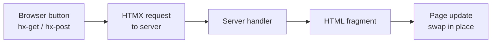

<!-- BEGIN BAOHAUS README HEADER -->
# @baohaus/htmx-vendor-bao

[](../../README.md)
[](https://bun.sh)
[](https://www.typescriptlang.org/)
[](./package.json)

## Explain Like I'm Five

This crate is the mailroom's magic buttons. With HTMX inside, page buttons can ask the server for fresh HTML without reloading the whole page -- like passing a note instead of getting a new book.

## Architecture



## Scope

| In scope | Dependencies | Out of scope |
| --- | --- | --- |
| Pinned HTMX core + official extension browser assets for Bun generate/static-bao pipelines.; Subpaths: ./manifest, ./runtime, ./side-effect | Shared @baohaus contracts | Other .bao crate domains; bao-runtime host lifecycle |
<!-- END BAOHAUS README HEADER -->

<!-- BEGIN BAOHAUS PACKAGE CARD -->
# @baohaus/htmx-vendor-bao

Pinned HTMX core + official extension browser assets for Bun generate/static-bao pipelines. Single boundary owner for htmx.org npm packages.

Source at `bao-source/htmx-vendor-bao`.

## Public Pieces

`./manifest`, `./runtime`, `./side-effect`

## Proof Commands

Run from `bao-source/htmx-vendor-bao`:

- `bun run typecheck`
- `bun run test`
- `bun run lint`
<!-- END BAOHAUS PACKAGE CARD -->

<!-- BEGIN BAOHAUS PACKAGE MANUAL -->
## Quick start

From `bao-source/htmx-vendor-bao`:

```bash
bun install
bun run typecheck
bun run test
bun run build
bun run lint
bun run bao:build
bun run bao:validate
bun run verify
```

## Capability

Pinned HTMX core + official extension browser assets for Bun generate/static-bao pipelines. Single boundary owner for htmx.org npm packages.

## Integration

Source lives at `bao-source/htmx-vendor-bao`. Import through the package exports; do not deep-link into `dist/` or private paths.

## Registry

Catalog id `htmx-vendor-bao` publishes to `baohaus/htmx-vendor-bao`.

## Subpaths

| Subpath | Purpose |
| --- | --- |
| `./manifest` | Manifest — typed surface from this .bao crate |
| `./runtime` | Runtime — typed surface from this .bao crate |
| `./side-effect` | Side effect — typed surface from this .bao crate |

## Reference

### Subpaths

| Subpath | Purpose |
| --- | --- |
| `./manifest` | Manifest — typed surface from this .bao crate |
| `./runtime` | Runtime — typed surface from this .bao crate |
| `./side-effect` | Side effect — typed surface from this .bao crate |
<!-- END BAOHAUS PACKAGE MANUAL -->
