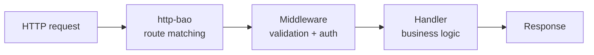

<!-- BEGIN BAOHAUS README HEADER -->
# @baohaus/http-bao

[](../../README.md)
[](https://bun.sh)
[](https://www.typescriptlang.org/)
[](./package.json)

## Explain Like I'm Five

This crate is the mailroom's delivery route map. It declares which paths lead where, what checks happen on the way, and how WebSocket connections stay open.

## Architecture



## Scope

| In scope | Dependencies | Out of scope |
| --- | --- | --- |
| Bao HTTP framework parity: declarative routes, middleware, validation, WebSocket, type inference; Exported API: PACKAGE_NAME, UPSTREAM_PACKAGE | Shared @baohaus contracts | Other .bao crate domains; bao-runtime host lifecycle |
<!-- END BAOHAUS README HEADER -->

<!-- BEGIN BAOHAUS PACKAGE CARD -->
# @baohaus/http-bao

Bao HTTP framework parity: declarative routes, middleware, validation, WebSocket, type inference

Source at `bao-source/http-bao`.

## Public Pieces

`.`, `./app`, `./context`, `./handler`, `./validator`, `./websocket`

## Proof Commands

Run from `bao-source/http-bao`:

- `bun run typecheck`
- `bun run test`
- `bun run lint`
<!-- END BAOHAUS PACKAGE CARD -->

<!-- BEGIN BAOHAUS PACKAGE MANUAL -->
## Quick start

From `bao-source/http-bao`:

```bash
bun install
bun run typecheck
bun run test
bun run build
bun run lint
bun run bao:build
bun run bao:validate
bun run verify
```

## Capability

Bao HTTP framework parity: declarative routes, middleware, validation, WebSocket, type inference

## Subpaths

| Subpath | Purpose |
| --- | --- |
| `.` | Main entry — typed surface from this .bao crate |
| `./app` | App — typed surface from this .bao crate |
| `./context` | Context — typed surface from this .bao crate |
| `./handler` | Handler — typed surface from this .bao crate |
| `./validator` | Validator — typed surface from this .bao crate |
| `./websocket` | Websocket — typed surface from this .bao crate |

## Primary symbols

- `PACKAGE_NAME`
- `UPSTREAM_PACKAGE`

## Integration

Source: `bao-source/http-bao` (`src/index.ts`). Import published subpaths only; do not deep-link into `dist/`.

## Registry

Catalog id `http-bao` → OCI `baohaus/http-bao`.

## Reference

### Subpaths

| Subpath | Purpose |
| --- | --- |
| `.` | Main entry — typed surface from this .bao crate |
| `./app` | App — typed surface from this .bao crate |
| `./context` | Context — typed surface from this .bao crate |
| `./handler` | Handler — .bao install target handlers |
| `./validator` | Validator — typed surface from this .bao crate |
| `./websocket` | Websocket — typed surface from this .bao crate |

### Symbols

- `PACKAGE_NAME`
- `UPSTREAM_PACKAGE`
<!-- END BAOHAUS PACKAGE MANUAL -->
