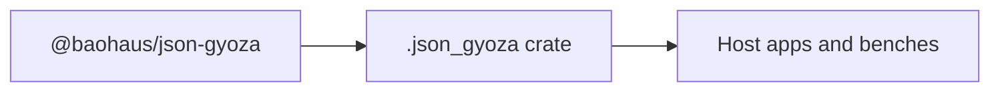

<!-- BEGIN BAOHAUS README HEADER -->
# @baohaus/json-gyoza

## Explain Like I'm Five

Tiny JSON value helpers for Baohaus transport internals. Apps use exports such as `asJsonArray`, `asJsonBoolean`, `asJsonNumber` from `@baohaus/json-gyoza`.

## Architecture



## Scope

| In scope | Dependencies | Out of scope |
| --- | --- | --- |
| Tiny JSON value helpers for Baohaus transport internals.; Exported API: asJsonArray, asJsonBoolean, asJsonNumber, asJsonObject, asJsonString, … | @baohaus/bao-json-safe; @baohaus/bao-utils | Other workbench domains; bao-runtime host lifecycle |
<!-- END BAOHAUS README HEADER -->

<!-- BEGIN BAOHAUS PACKAGE CARD -->
# @baohaus/json-gyoza

Standalone Baohaus package. Catalog identity `json-gyoza`. Source at `bao-source/json-gyoza`. Publishes to `baohaus/json-gyoza`. Canonical archive: `bao-source/json-gyoza/dist/bao/json-gyoza.bao`.

Cross-app contract and the full principles list live at the repo-root [README](../../README.md#principles).

## Package Facts

| Field | Value |
| --- | --- |
| Package | `@baohaus/json-gyoza` |
| Catalog id | `json-gyoza` |
| Source path | `bao-source/json-gyoza` |
| OCI repository | `baohaus/json-gyoza` |
| Channel | `public` |
| Visibility | `public` |
| Kind | `library` |
| Runtime installable | `yes` |
| Publish gate | `standard` |

## Public Pieces

`.`, `./package-descriptor`.

## Proof Commands

Run from `bao-source/json-gyoza`:

- `bun run build`
- `bun run typecheck`
- `bun run test`
- `bun run lint`
- `bun run bao:build`
- `bun run bao:validate`
- `bun run verify`

## Publishing Path

`@baohaus/json-gyoza` publishes to `baohaus/json-gyoza` through the canonical `.bao` registry distribution path. Local overrides are development-only; installable content resolves through the registry and the checked catalog/governance/lock path.
<!-- END BAOHAUS PACKAGE CARD -->

<!-- BEGIN BAOHAUS PACKAGE MANUAL -->
## Quick start

From `bao-source/json-gyoza`:

```bash
bun install
bun run typecheck
bun run test
bun run build
bun run lint
bun run bao:build
bun run bao:validate
bun run verify
```

## Capability

Tiny JSON value helpers for Baohaus transport internals.

## Subpaths

| Subpath | Purpose |
| --- | --- |
| `.` | Main entry — typed surface from this workbench |
| `./package-descriptor` | Package descriptor — typed surface from this workbench |

## Primary symbols

- `asJsonArray`
- `asJsonBoolean`
- `asJsonNumber`
- `asJsonObject`
- `asJsonString`
- `isJsonValue`
- `JsonPrimitive`
- `JsonValue`
- `parseJsonValue`
- `renderJsonValue`

## Integration

Source: `bao-source/json-gyoza` (`src/index.ts`). Import published subpaths only; do not deep-link into `dist/`.

## Registry

Catalog id `json-gyoza` → OCI `baohaus/json-gyoza`.

## Reference

### Subpaths

| Subpath | Purpose |
| --- | --- |
| `.` | Main entry — typed surface from this workbench |
| `./package-descriptor` | Package descriptor — typed surface from this workbench |

### Symbols

- `asJsonArray`
- `asJsonBoolean`
- `asJsonNumber`
- `asJsonObject`
- `asJsonString`
- `isJsonValue`
- `JsonPrimitive`
- `JsonValue`
- `parseJsonValue`
- `renderJsonValue`
<!-- END BAOHAUS PACKAGE MANUAL -->
